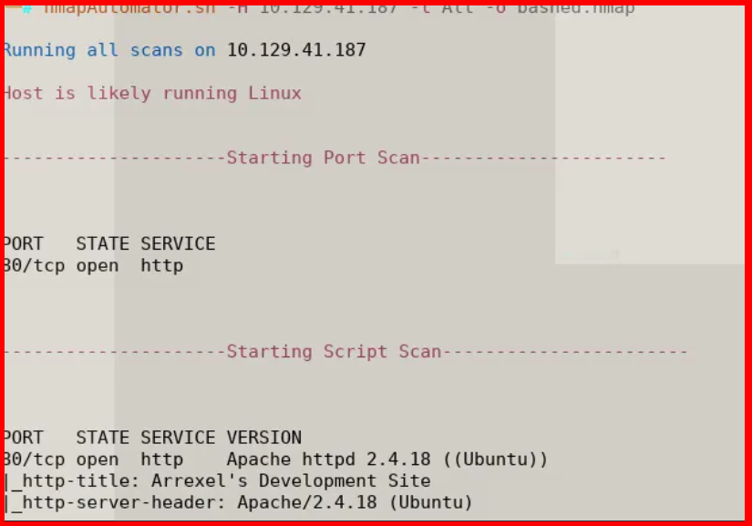
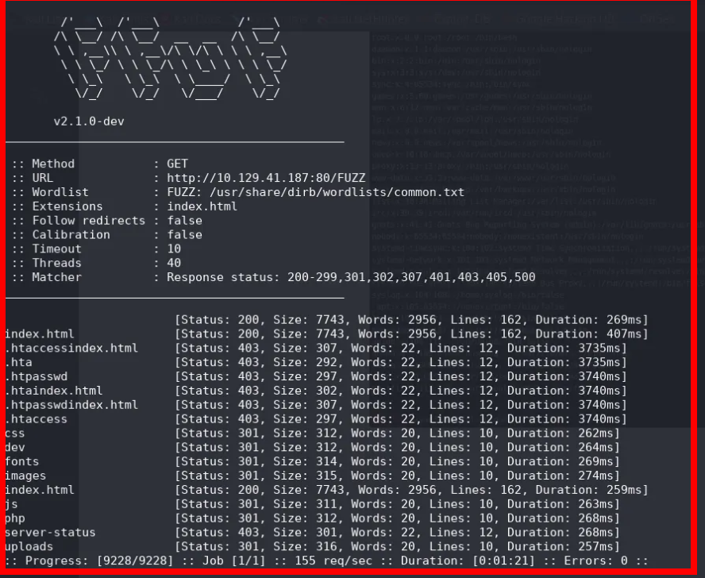
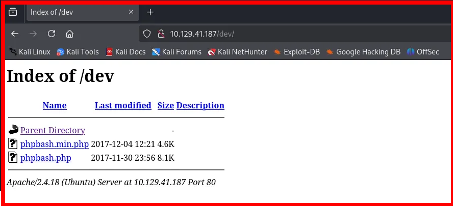
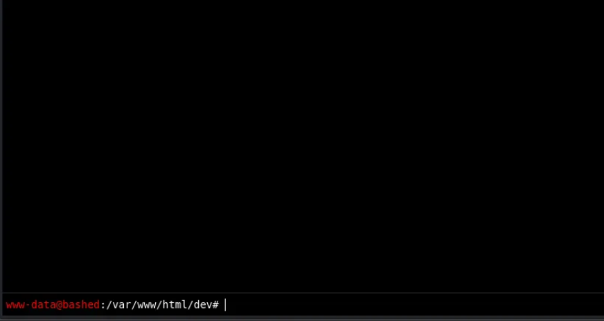
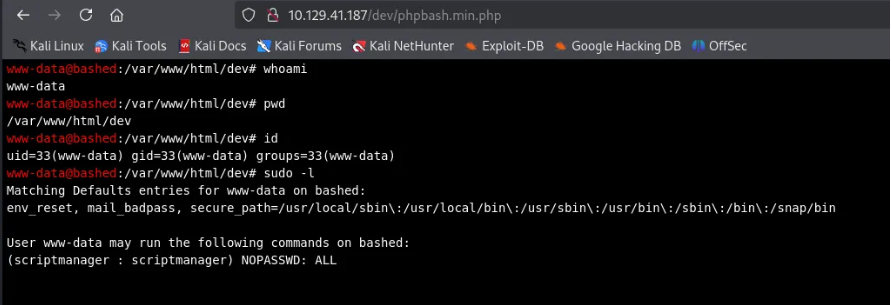

<div align="left">


</div>

## Bashed — Hack The Box Write-Up

<div align="left">

<br>
<br>


## </div>

---

## 📌 Overview

This machine demonstrates how **exposed development resources** and **unsafe web tooling** can lead directly to **remote command execution** and an initial foothold on a Linux system.

> _In this write‑up, we cover_

- Network service enumeration
- Web application reconnaissance
- Directory discovery
- Abuse of an exposed PHP web shell

---

## 🛠 Tools

The following tools and techniques were used during this assessment:

```
Nmap / nmapAutomator → Network and service enumeration
Directory fuzzing    → Hidden path discovery
Web browser          → Manual application interaction
Linux commands       → Environment and privilege validation
```

---

## 🔍 Enumeration

We begin with a full automated scan to identify exposed services on the target.

```bash
nmapAutomator.sh -H 10.129.41.187 -t All -o bashed.nmap
```

### Open Ports



The scan reveals **a single open port**:

- **80/tcp** — Apache HTTP Server

The web application title is **“Arrexel’s Development Site”**, suggesting a development or testing environment.

---

## 📁 Directory Discovery

Reviewing the directory fuzzing results generated by **nmapAutomator**, one directory immediately stands out:

```
/dev
```



Exposed development directories are often high‑risk, so this path is explored further.

---

## 🌐 Web Enumeration

### Main Application

Browsing the root web page confirms a development‑oriented site with no authentication barriers.

### `/dev` Directory

Accessing:

```
http://10.129.41.187/dev
```



reveals multiple development files. One file is especially critical:

```
phpbash.min.php
```

---

## Web Shell Abuse

Opening **phpbash.min.php** presents a **fully interactive PHP‑based web shell**, allowing arbitrary command execution on the server.



This represents a direct **remote command execution** vulnerability due to unsafe exposure of development tooling.

---

## Validation

To validate the level of access obtained, several standard Linux commands are executed:

```bash
whoami
```

```
www-data
```

```bash
pwd
```

```
/var/www/html/dev
```

```bash
id
```

```
uid=33(www-data) gid=33(www-data) groups=33(www-data)
```



### Findings

- Commands execute as the **www-data** user
- Shell operates inside the web root
- A stable initial foothold is established

So we Are we just need to cat user.txt

---

## 🧠 What This Assessment Teaches

- Development tools should **never** be exposed in production environments
- Web shells provide immediate, high‑impact compromise
- Minimal service exposure does **not** equal security
- Directory enumeration is critical, even when only one port is open
- Misconfigurations can be more dangerous than unpatched vulnerabilities

---

## 📌 Conclusion

This machine highlights how **a single exposed development file** can completely undermine system security.

By chaining **service enumeration**, **directory discovery**, and **web shell abuse**, we successfully gained command execution as the web server user.

> _Security failures often begin with convenience — leaving development tools accessible without considering attacker impact._

This work is part of **FuzzRaiders’ structured hands-on training and research program**, where every lab, project, and technical study is formally documented, reviewed, and validated to ensure real-world applicability, methodological rigor, and real-world security execution

Happy hacking 🚀

# Author: Z4B0 [LinkedIn](https://www.linkedin.com/in/mahamud-abdirahman-151493375/)
