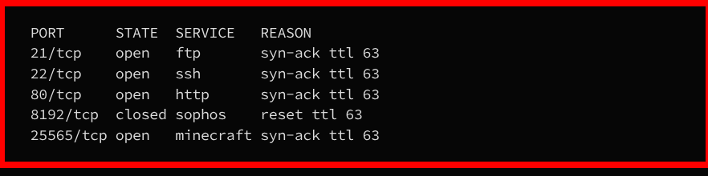
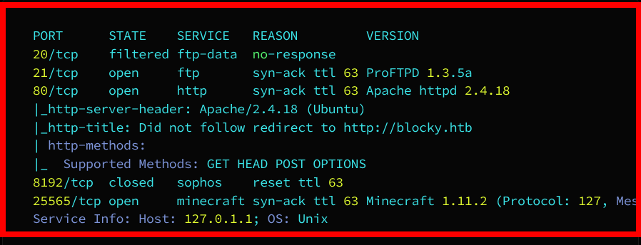
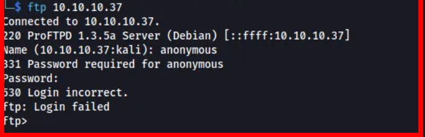
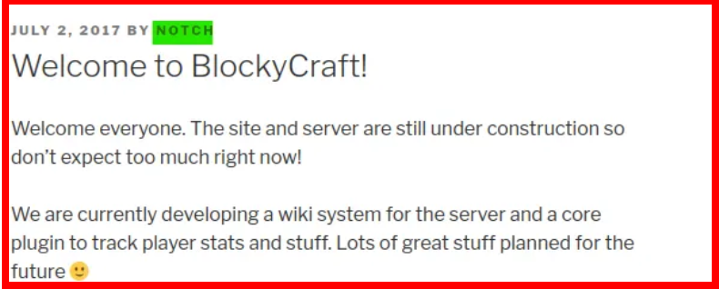
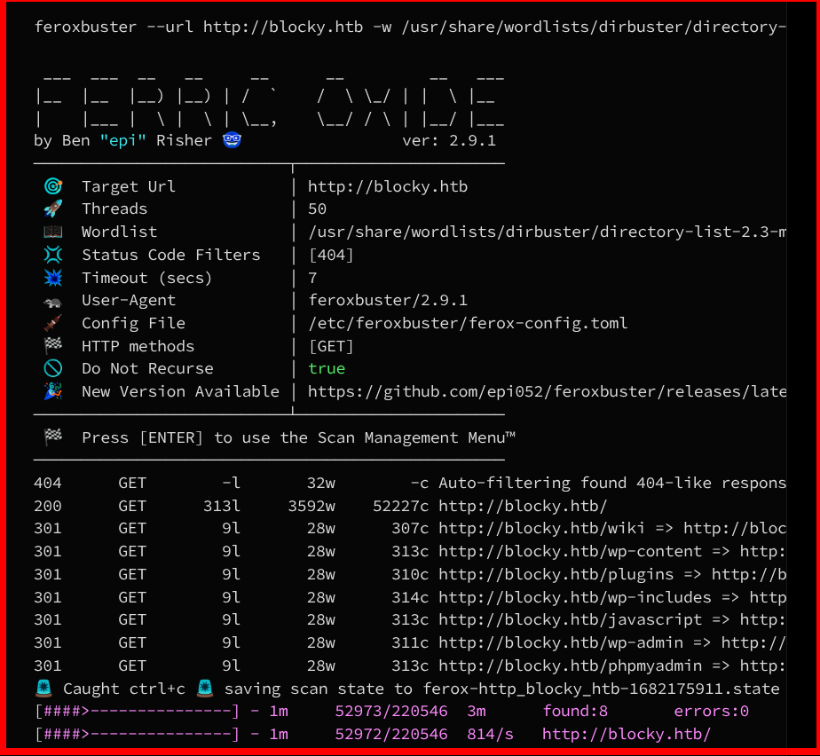
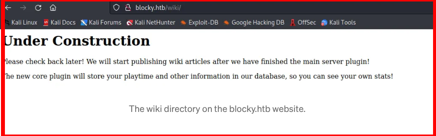
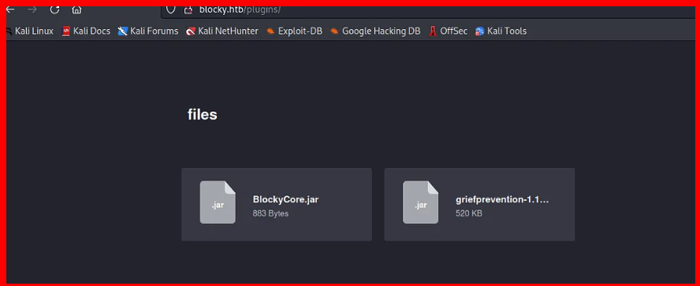
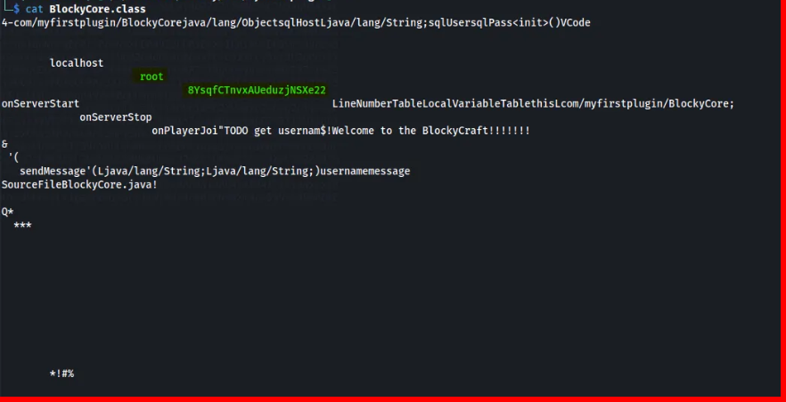
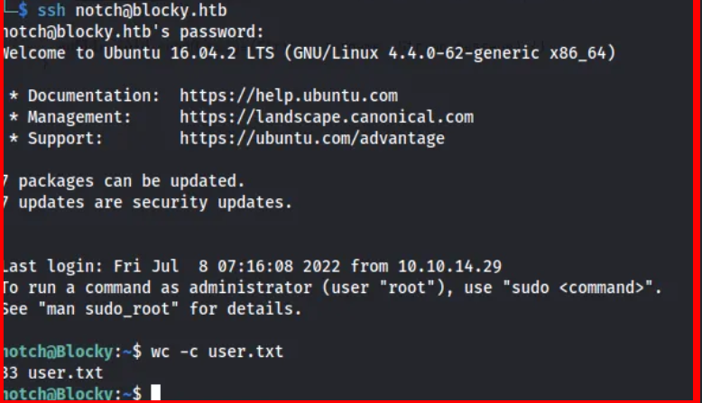

<div align="left">


</div>

## Blocky — Hack The Box Write-Up

<div align="left">

<br>
<br>


## </div>

## 📌 Overview

This machine demonstrates a **real‑world attack chain combining service enumeration, web application analysis, exposed application components, and credential reuse** to achieve authenticated access on a Linux system.

> _In this write‑up, we cover_

- Network service enumeration with Nmap
- Web application discovery and hostname mapping
- WordPress user enumeration
- Directory brute‑forcing for hidden resources

## 🛠 Tools

The following tools and techniques were used during this assessment:

```
Nmap               → Network service enumeration
WPScan             → WordPress user enumeration
Feroxbuster        → Directory and file brute‑forcing
Web browser        → Manual application interaction
Linux utilities    → File analysis and credential extraction
SSH                → Authenticated system access
```

## Enumeration

We start with a full TCP port scan to identify exposed services on the target.

```bash
sudo nmap -p- -T4 --min-rate 2500 10.10.10.37
```

### Open Ports



A more detailed scan provides version information:

```bash
sudo nmap -sC -sV -p21,22,80,25565 10.10.10.37
```

Key findings:



- **FTP:** ProFTPD 1.3.5a
- **HTTP:** Apache 2.4.18 (Ubuntu)
- **Minecraft:** Version 1.11.2
- HTTP redirects to `http://blocky.htb`

---

## FTP Enumeration

Since FTP is open, anonymous login is tested first.

```bash
ftp 10.10.10.37
```



Anonymous authentication is **not allowed**, so we move on to web enumeration.

---

## Web Enumeration (Port 80)

Nmap reveals a hostname redirect, so we update our hosts file:

```bash
sudo nano /etc/hosts
```

Add the following entry:


Now we can access the website at:

```
http://blocky.htb
```

The site footer indicates that the application is **powered by WordPress**, making it a strong candidate for WordPress‑specific enumeration.

---

## WordPress Enumeration

We run **WPScan** to enumerate users.


### Results

- Discovered WordPress user: **notch**

The same username can also be identified manually by inspecting blog posts on the site.

Password brute‑forcing via WPScan did not yield valid credentials, so we continue enumerating the web surface.

---

## Directory Bruteforcing

We use **Feroxbuster** to discover hidden directories and files.



### Interesting Findings

| Path        | Description                   |
| ----------- | ----------------------------- |
| /wiki       | Internal wiki page            |
| /plugins    | Exposed plugin directory      |
| /phpmyadmin | Database management interface |

The `/wiki` page references a custom plugin, which leads us to investigate further.


---

## Plugin Analysis

Browsing the `/plugins` directory reveals two `.jar` files related to a Minecraft plugin.

These files are downloaded locally for analysis.

After extracting **BlockyCore.jar**, we find a `BlockyCore.class` file. Inspecting the contents reveals hardcoded credentials.

Using `cat` or a Java decompiler such as **jd‑gui**, we identify:


- A **username reference**
- A **clear‑text password string**

This confirms sensitive information disclosure through exposed plugin files.

---

## Credential Reuse Attempt

We successfully authenticate to the system via SSH using the recovered credentials:

```bash
ssh notch@10.10.10.37
```



This grants us an initial shell on the target machine as the **notch** user.
and we find the user flag there

---

## 🧠 What This Assessment Teaches

- Publicly accessible plugin and asset directories can expose **internal application components**
- Hardcoded credentials inside compiled files remain a **critical security flaw**
- WordPress security issues often stem from **misconfiguration and exposed resources**, not only vulnerabilities
- Directory brute‑forcing is essential for uncovering **non‑linked but sensitive paths**
- Credential reuse across services (application → SSH) greatly increases impact
- Static analysis of backend components is a powerful technique when source code or binaries are unintentionally exposed

---

## 📌 Conclusion

This assessment highlights how **information disclosure through exposed backend files** can be just as dangerous as a direct vulnerability.

By chaining **thorough enumeration**, **directory discovery**, and **static analysis**, sensitive credentials were recovered and successfully reused to gain **authenticated SSH access** to the system.

> _Security failures are often the result of small oversights — exposed files, reused credentials, and trusted internal components._

This work is part of **FuzzRaiders’ structured hands-on training and research program**, where every lab, project, and technical study is formally documented, reviewed, and validated to ensure real-world applicability, methodological rigor, and real-world security execution

Happy hacking 🚀

# Author: Z4B0 [LinkedIn](https://www.linkedin.com/in/mahamud-abdirahman-151493375/)
