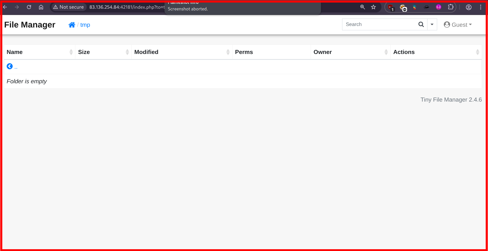
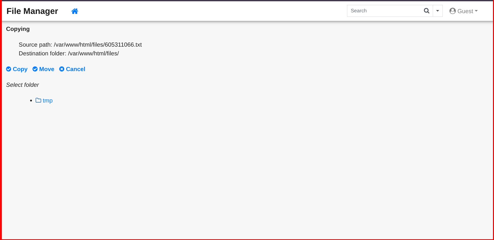
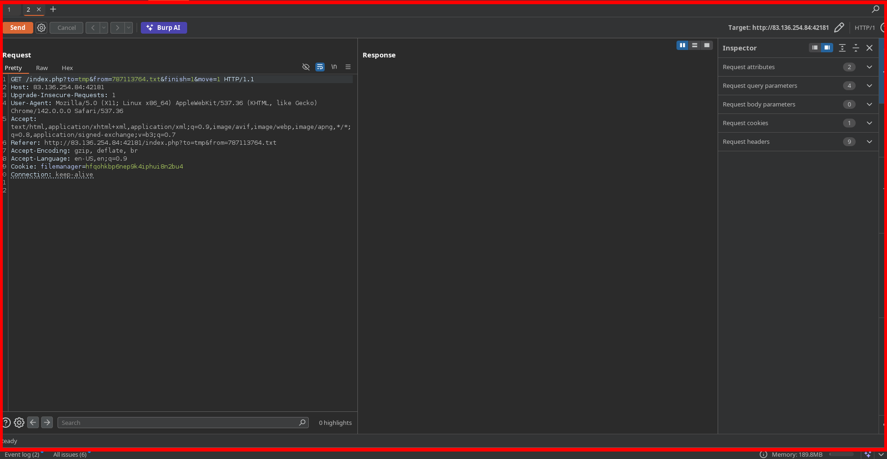
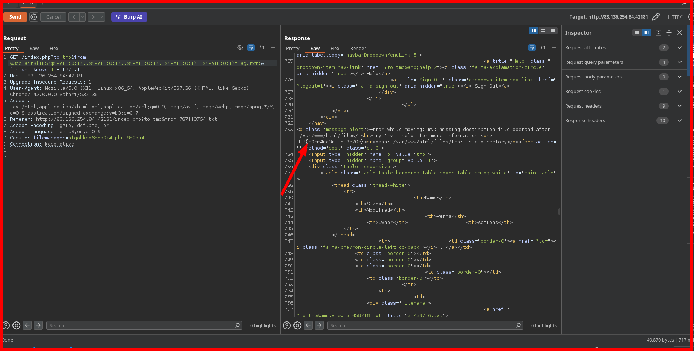

# Hack The Box – Command Injection (Skills Assessment)

<br>
<br>


---

## 📌 Overview

This skills assessment focuses on **real-world command injection vulnerabilities** commonly found in web applications that rely on backend system commands for file management operations.

The target application exposed a file handling interface where **user-supplied input was passed directly into operating system commands without proper sanitization**, allowing arbitrary command execution on the server.

Through this weakness, it was possible to access **restricted system files** outside the intended application scope.

> _In this write-up, we cover_

- Authenticated web application access
- File management feature analysis
- Backend command execution patterns
- Command injection via file operations
- Directory traversal abuse
- Sensitive file disclosure

---

## 🛠 Tools

The following tools and techniques were used:

```
Burp Suite        → Request interception & modification
Web browser       → Application interaction
Linux utilities   → Command behavior analysis
Manual payloads   → Command injection testing
```

---

## 🧭 Walkthrough

### 1️⃣ Authentication & Application Access

The application required authentication before granting access to the file management interface.

Valid credentials were provided:

```
Username: guest
Password: guest
```


Once authenticated, the user was presented with a web-based file manager supporting several file operations.

---

### 2️⃣ File Management Interface Analysis

After login, the application displayed:

- A directory listing resembling `ls -l`
- Multiple files in a working directory
  
- An empty `tmp` directory
  
- File operations including:
  - View
  - Copy
  - Move
  - Download
    

- Search and advanced search functionality

These features strongly suggested that **system commands were being executed on the backend** to perform file operations.

---

### 3️⃣ Identifying the Injection Point

Testing each file operation revealed that the **file move functionality** failed to properly sanitize user input.


By intercepting the request with **Burp Suite**, it was observed that a user-controlled parameter was directly embedded into a system command.



---

## 💥 Command Injection Exploitation

### 4️⃣ Payload Injection

A command separator was injected into the vulnerable parameter to break out of the original command context.

**Payload used:**

```
%3bc'a't${IFS}${PATH:0:1}..${PATH:0:1}..${PATH:0:1}..${PATH:0:1}..${PATH:0:1}flag.txt;
```

---

### Payload Explanation

- `;` → Terminates the intended system command
- `cat /../../../flag.txt` → Executes a new command to read a restricted file
- `../../../` → Traverses directories to reach the filesystem root

This payload forced the backend to execute an unintended command.

---

### 5️⃣ Command Execution Result

The injected command executed successfully, and the contents of `/flag.txt` were returned in the server response.



---

## 🏁 Flag

```
HTB{c0mm4**************r}
```

---

## 🧠 What This Assessment Teaches

- File operation features are **high-risk** when backed by OS commands
- Input sanitization failures often exist in “utility” functionality
- Command injection remains highly exploitable in legacy execution patterns
- Directory traversal combined with command injection amplifies impact
- Backend services must avoid shell execution whenever possible

---

## 📌 Conclusion

This skills assessment demonstrates how a **single unsanitized input field** in a file operation can lead to **full command execution** and sensitive data disclosure.

> _Command injection is not a legacy issue — it remains a real threat when applications trust user input._

Strong defenses require strict input validation, proper command parameterization, and least-privilege execution.

---

## Author: Z4B0

## [LinkedIn](https://www.linkedin.com/in/mahamud-abdirahman-151493375/)
