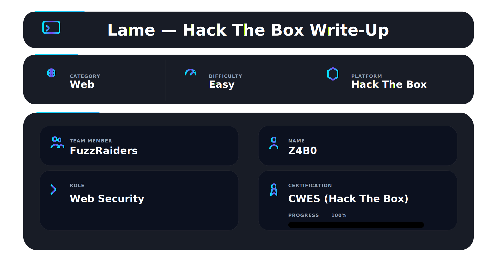

Lame is a classic Linux machine that rewards **clean enumeration and version-driven exploitation**. The path is simple but teaches a key skill: **don’t get stuck on one vector**—validate, pivot, and hit the real weakness.

---

## 🛠 Tools

```
nmap            → service discovery & version detection
ftp             → anonymous login validation
msfconsole      → exploit execution
bash            → post-exploitation navigation
```

---

## 🔍 Enumeration

First, I mapped the target to a hostname for clean tooling and logs.

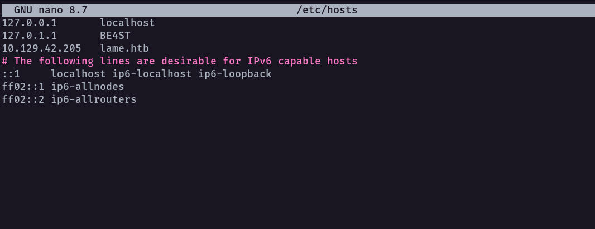

```bash
sudo nano /etc/hosts
```

```
10.10.10.X   lame.htb
```

Then I ran an Nmap scan to identify open services and versions.

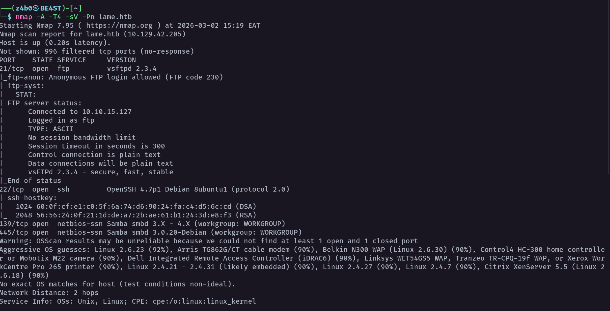

The scan immediately highlighted two interesting attack surfaces:

- **FTP (vsftpd 2.3.4)** with **anonymous login allowed**
- **SMB (Samba 3.0.20-Debian)** — a legacy version known for serious vulnerabilities

I also reviewed additional script output to confirm SMB visibility and fingerprinting details.

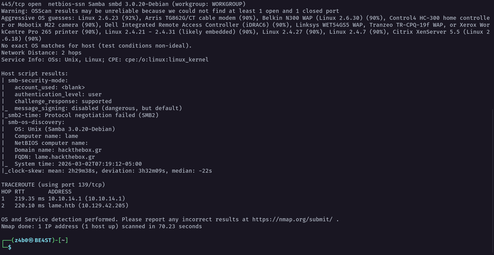

At this stage, the plan was clear: test FTP quickly (because anonymous access can leak creds/files), and if it’s a dead end, pivot straight to SMB.

---

## 📂 FTP Analysis (Anonymous Login)

I tried FTP first since anonymous login was allowed.

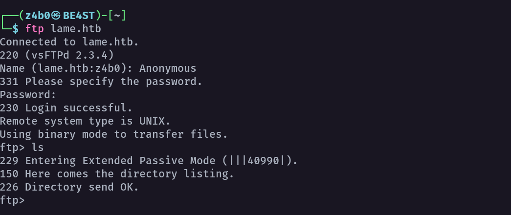

After logging in and listing directories, there was no useful content (no credentials, no writable upload path, no sensitive files). FTP was present, but it wasn’t giving an immediate foothold.

This is the exact moment you should **stop forcing FTP** and move to the next best lead.

---

## 💣 Attempted Exploitation — vsftpd 2.3.4 (No Session)

Because the version was **vsftpd 2.3.4**, I attempted the well-known Metasploit module.

First I searched the framework:

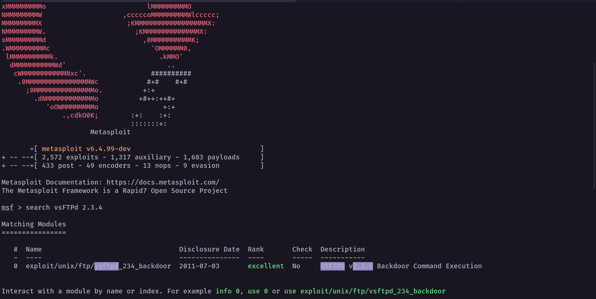

Then I selected the vsftpd backdoor module:

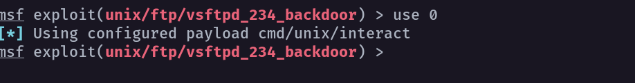

I verified the module configuration and set the target:

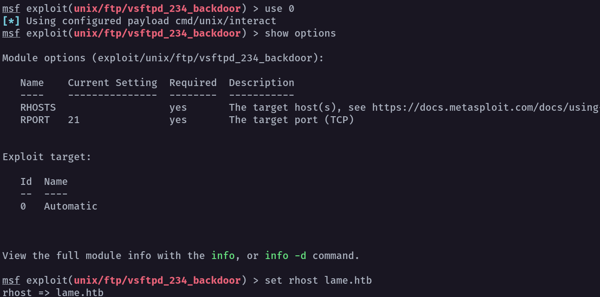

Finally, I ran the exploit.

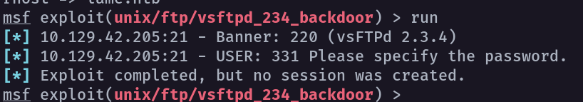

Even though the module executed, it ended with:

> **Exploit completed, but no session was created.**

That’s a hard stop. No session = no confirmed compromise. I pivoted immediately to SMB, which was the stronger version-based lead.

---

## 🎯 Real Attack Surface — Samba (SMB)

I remembered the Samba version from Nmap and switched focus to SMB exploitation.

I searched for Samba exploits and found the classic `usermap_script` module.

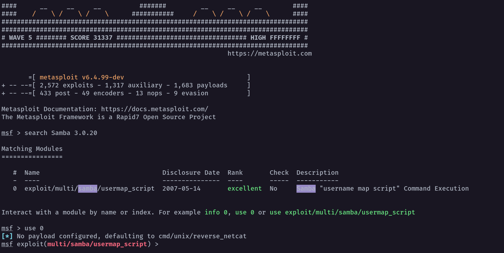

This exploit maps to **CVE-2007-2447** (Samba “username map script” command execution), and on this box it commonly results in instant compromise.

---

## 🚀 Exploitation — Samba usermap_script (Root Shell)

I configured the module with the target host and my callback interface:

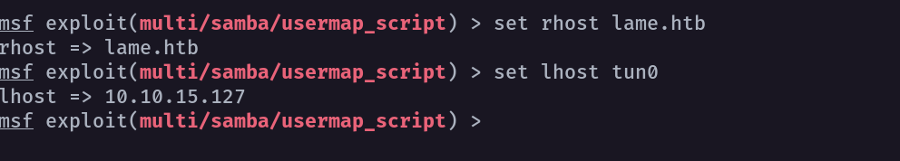

Then executed the exploit.

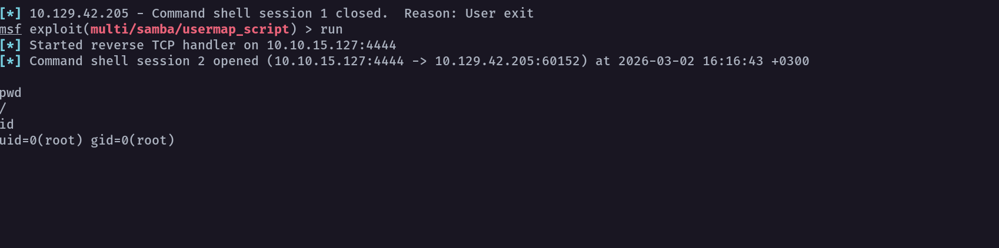

A command shell opened successfully, and validation confirmed it was **root** (`uid=0`).

This box does not require privilege escalation once the Samba RCE lands.

---

## 🗂 Post-Exploitation (Flags)

With root access, I navigated to collect the flags and validate the compromise end-to-end.

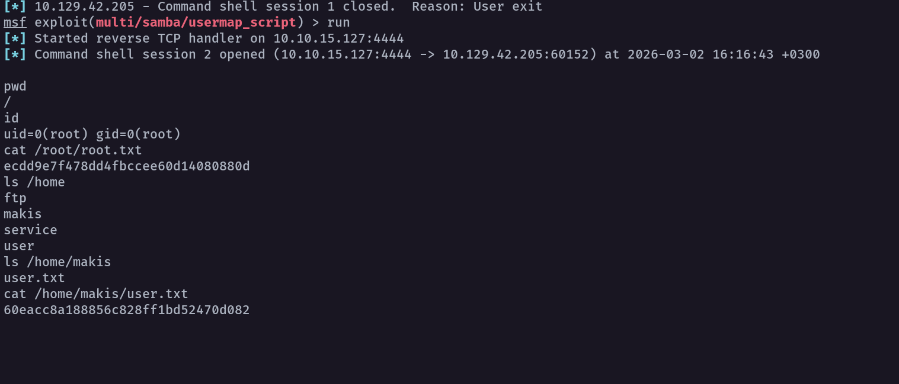

Actions performed:

- confirmed root context
- read `/root/root.txt`
- enumerated `/home` for the user
- read `/home/<user>/user.txt`

> Note: If you publish this write-up publicly, redact the flag values.

---

## 🔗 Attack Flow Summary

- Host mapping → clean targeting (`/etc/hosts`)
- Nmap scan → identify versions and attack surfaces
- FTP anonymous login → validated but provided no useful foothold
- vsftpd exploit attempt → executed but no session
- Pivot to SMB → Samba version exploitation
- usermap_script → session opened as root
- post-exploitation → flags collected

---

## 🧠 What This Box Teaches

- **Versioning wins.** Nmap output often contains the entire solution.
- Anonymous access is not always the exploit—validate value fast.
- “Exploit completed” means nothing until a session is created.
- Legacy Samba can be catastrophic: unauthenticated RCE → root.

---

## 📌 Conclusion

Lame is a clean example of real-world tradecraft:

- enumerate decisively
- try the quick wins
- pivot the moment a vector doesn’t prove itself
- exploit the real weakness with confidence


# Author: Z4B0 [LinkedIn](https://www.linkedin.com/in/mahamud-abdirahman-151493375/)


