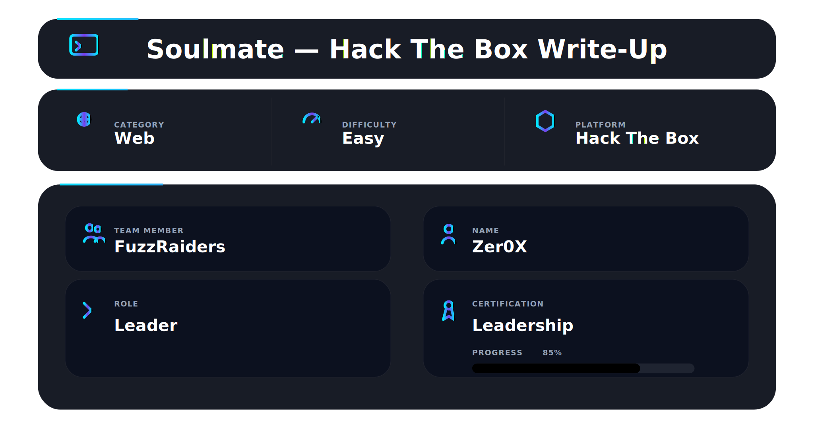

# Overview

Soulmate is an easy Linux machine from HackTheBox. This box requires mainly precise enumeration and good patience, although it’s beginner-friendly.

We start by discovering subdomain which hosts CrushFTP. We exploit known Auth bypass and get into dashboard. Then we reset some user’s password and upload PHP shell script.

Next, we find this user’s SSH creds in running Escript. And finally, we exploit critical vulnerability in Erlang version of SSH and get RCE on the machine with Root privileges.

---

## 🛠 Tools

```
nmap        → service discovery
ffuf        → subdomain fuzzing
burpsuite   → request inspection
python3     → exploit execution
nc          → reverse shell listener
linpeas     → local enumeration
ssh         → lateral movement
netstat     → service discovery
```

---

# Nmap Scan

Starting with the Nmap scan.

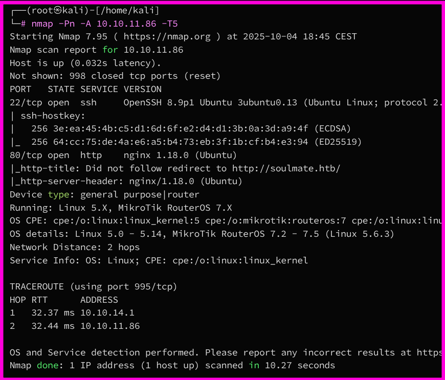

The Nmap scan showed 2 open ports. Port 22 for SSH and port 80 for Nginx HTTP server. Don’t forget to add “soulmate.htb” domain to your “/etc/hosts” file.

---

# Web Enumeration

I visited the website, which hosted Tinder-like app named Soulmate. Wappalyzer also found that PHP is being used as a backend language.


One of the best enumeration techniques is fuzzing, both for directories and subdomains. So I ran FFuF to perform subdomain fuzzing, which yielded one subdomain “ftp.soulmate.htb”.

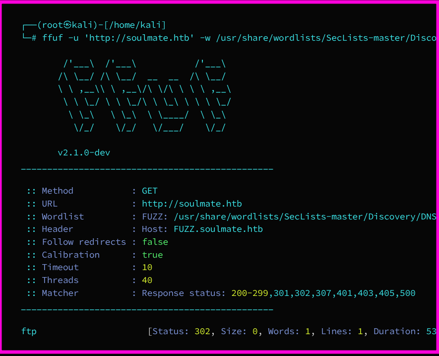

I added it to my “/etc/hosts” and then visited it, but ended up on a login page. Apparently, there was certain “CrushFTP” software running on the website.

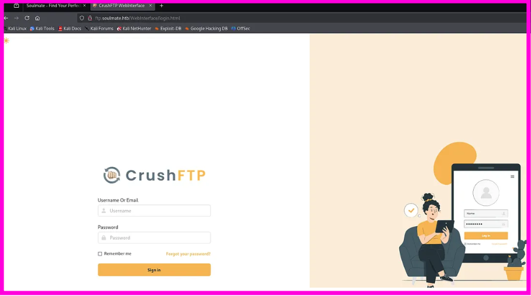

CrushFTP is a proprietary, enterprise-grade file transfer server software that supports multiple platforms and protocols like FTP, SFTP, and FTPS for secure, high-speed data exchange.

---

# Exploiting CrushFTP Auth Bypass & Getting Admin Access

I did a small research on CrushFTP and found couple interesting vulnerabilities. Since we don’t have version disclosure, it’s hard to tell which vulnerability we’re supposed to exploit. With that said, there was this critical flaw described in a Huntress article that allowed Auth bypass and admin access.

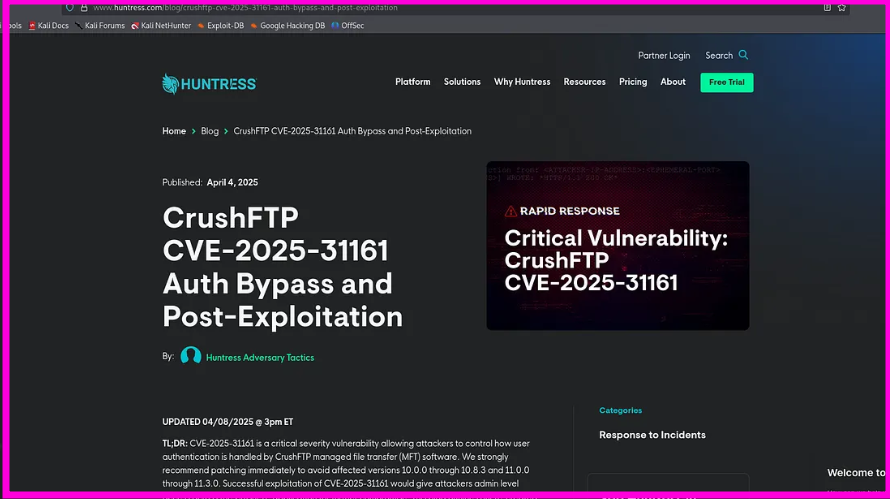

TLDR; we can access administrative functions just by passing the “crushadmin” user (default Admin user in CrushFTP) to the Authorization header. CrushFTP mishandles authentication and lets attackers perform privileged actions like exfiltrate user list and create new users.
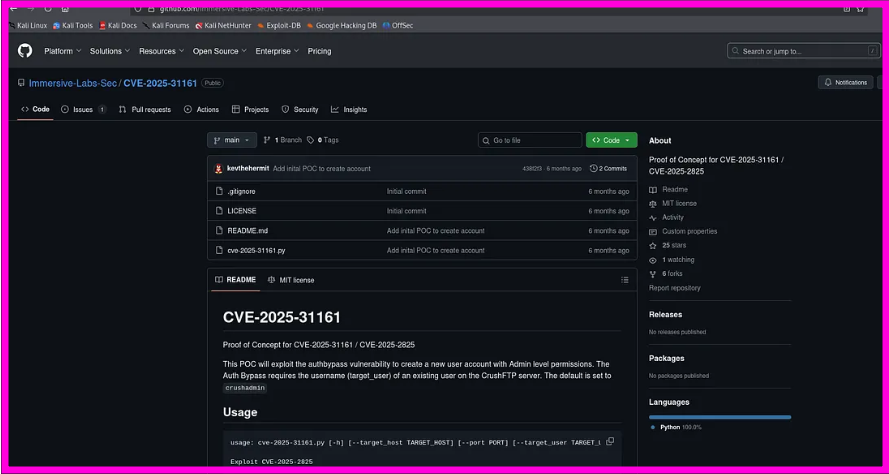

There was also a Github repo with Python PoC exploit.

Our goal was to create a new user account inheriting admin permissions from “crushadmin”.

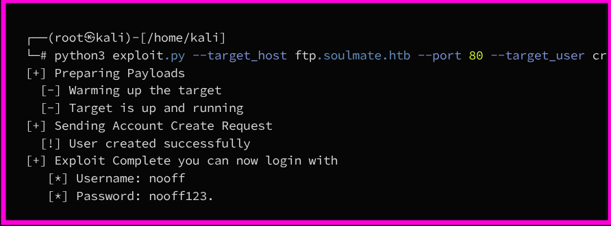

Logged in successfully and accessed the Admin dashboard.
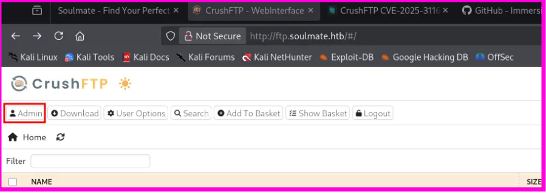
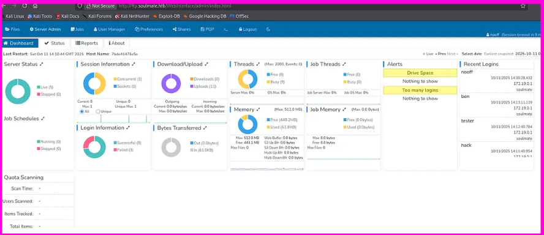

---

# Resetting Ben’s Password & Uploading PHP Shell

Inside User Manager, user “ben” had website root directory mapped in his VFS.

I reset Ben’s password, logged in as Ben, and uploaded a PHP reverse shell (Ivan Sincek’s from revshells.com).

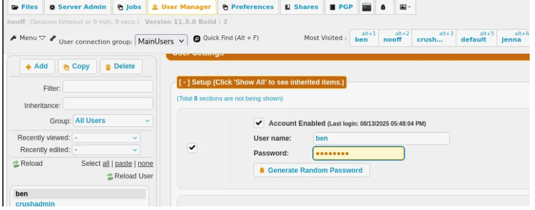

Listener:

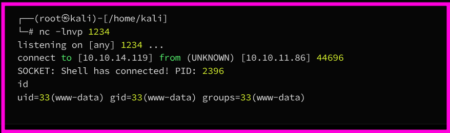

Initial foothold obtained.

---

# Discovering Ben’s Password in Escript & Getting User Flag

The shell was unstable due to background cleanup scripts.

Transferred Linpeas and performed enumeration.

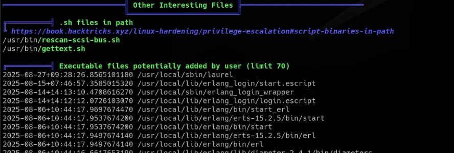

Found suspicious Erlang script:

Upon inspecting it, Ben’s SSH credentials were found inside.

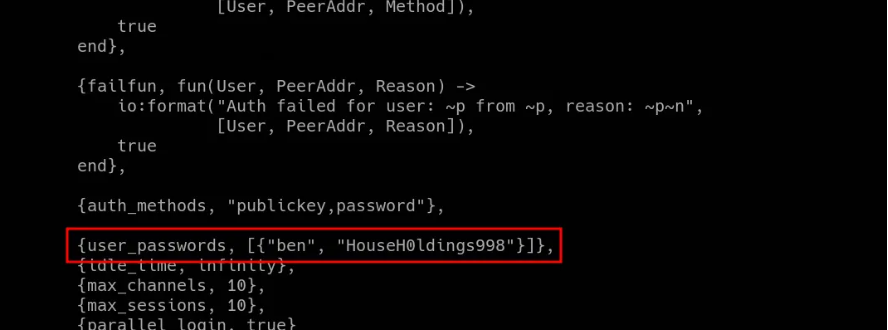

Logged in:

```
ssh ben@soulmate
```

User flag located in `/home/ben/user.txt`.

---

# Exploiting Erlang/OTP SSH to Get RCE & Root Flag

Research revealed a critical vulnerability in Erlang/OTP SSH allowing pre-auth RCE.

Executed PoC:

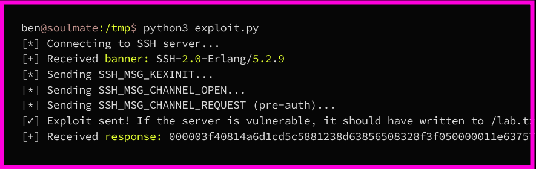

The PoC created `/lab.txt` owned by root, confirming vulnerability.
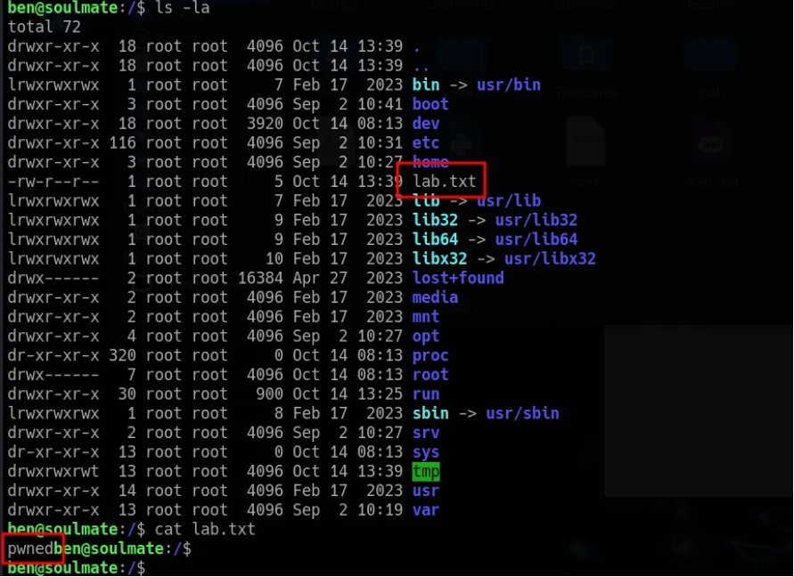

Modified exploit payload:

```
os:cmd("cp /root/root.txt /tmp/root.txt").
```

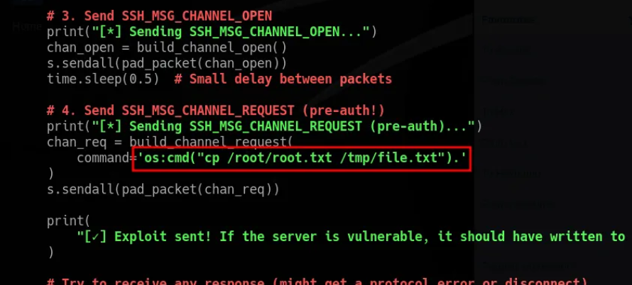

Root flag retrieved successfully.

Full root compromise achieved.
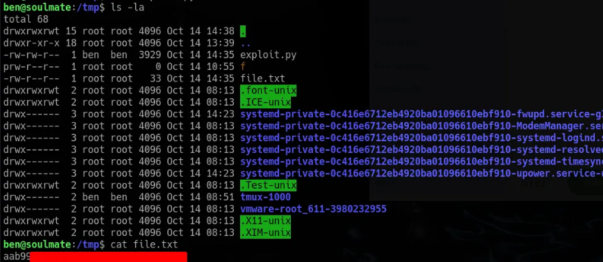

---

## 🧠 What This Box Teaches

- Subdomain fuzzing reveals hidden attack surfaces
- Enterprise software can contain severe auth bypass flaws
- Admin functionality misuse is powerful
- Hardcoded credentials are catastrophic
- Erlang/OTP SSH can be vulnerable to pre-auth RCE
- Enumeration is everything

---

## 📌 Conclusion

Soulmate is simple in theory but demands patience.

The unstable shell and lack of version disclosure can slow beginners down, but the vulnerability chain is logical:

This machine blends web exploitation, credential abuse, and service-level RCE into a realistic attack path.

Good training for controlled persistence and structured enumeration.

---

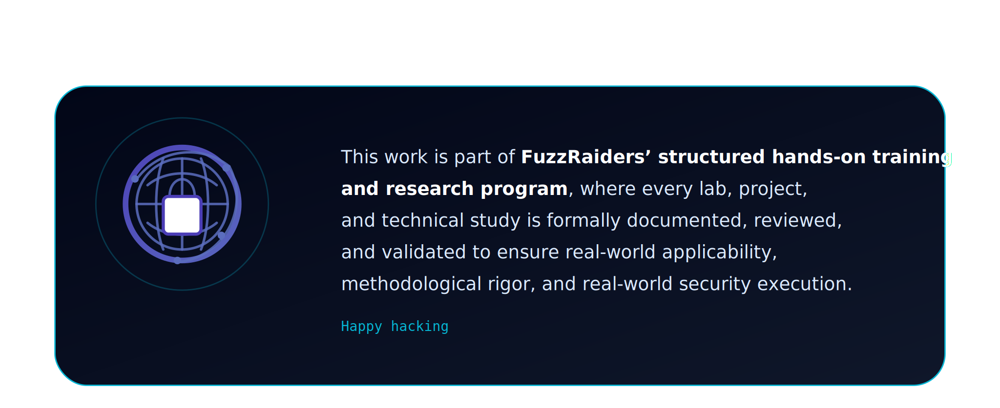

# Author:[Zer0X](https://www.linkedin.com/in/zer0x-fuzzraiders/)


