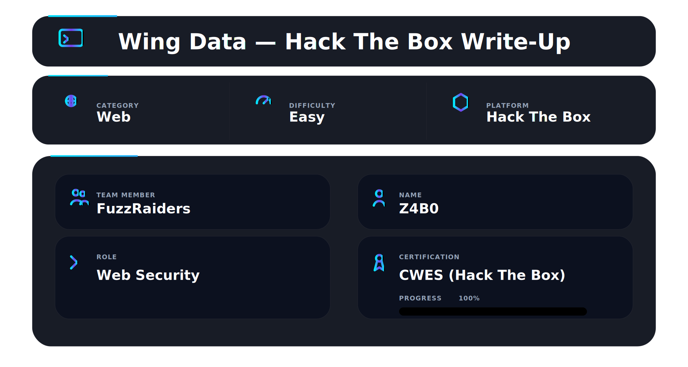

## About

WingData demonstrates how small misconfigurations and outdated services can lead to a full system compromise. The attack path involves identifying a vulnerable FTP service, exploiting it to gain remote code execution, extracting credential data from the system, and finally abusing an insecure backup restoration script that extracts tar archives as root, allowing privilege escalation.

## 🛠 Tools

```
nmap        → service discovery & version detection
netcat (nc) → reverse shell listener
python      → exploit execution & TTY shell spawn
searchsploit / github → exploit discovery
hashcat     → password hash cracking
ssh         → authenticated remote access
sudo        → privilege verification (sudo -l)
tar         → archive manipulation for privilege escalation
```

## Reconnaissance

The first step was performing network reconnaissance to identify open ports and running services on the target machine.

I started by running an Nmap scan with service version detection and default scripts enabled, while saving the output for later reference.

```
nmap -sC -sV -oN nmap_results.txt <target_ip>
```

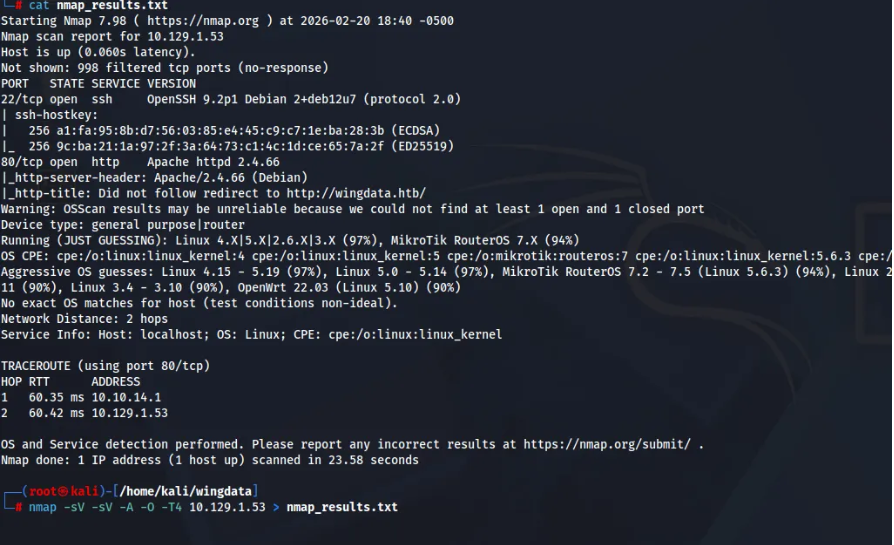

The scan revealed several services and also indicated a redirect to **wingdata.htb**. To properly resolve this domain locally, I added it to the `/etc/hosts` file.

```
sudo nano /etc/hosts
```

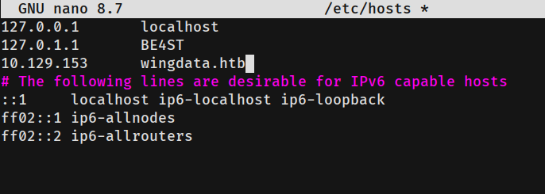

After adding the entry, I navigated to the domain in the web browser.

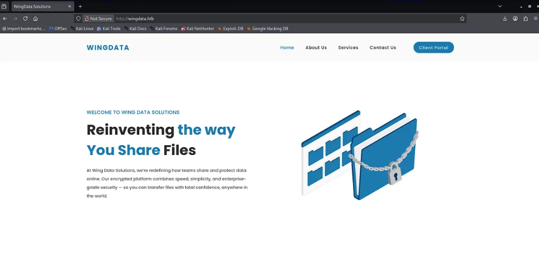

## Web Enumeration

On the website, clicking **Client Portal** in the top-right corner changes the URL to **ftp.wingdata.htb**.

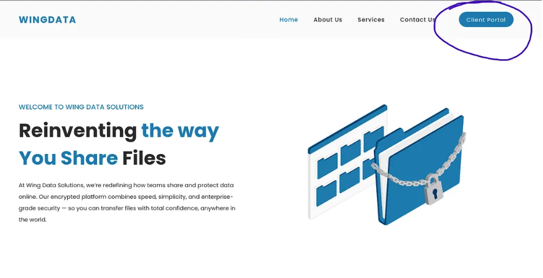

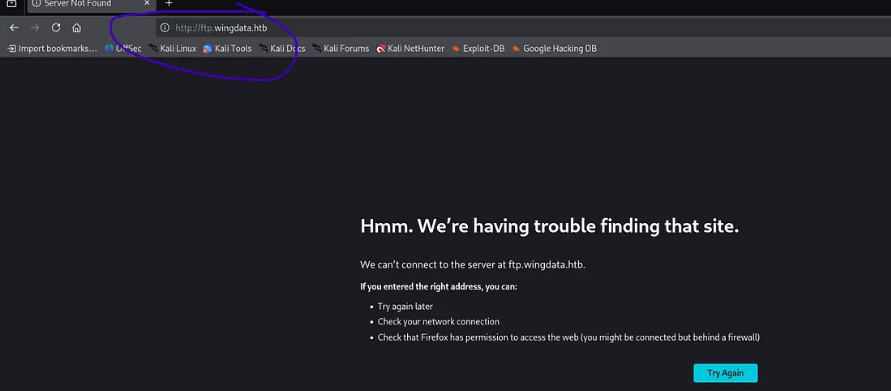
Since this is a new subdomain, it must also be added to the `/etc/hosts` file.

Once added, the page successfully loads.

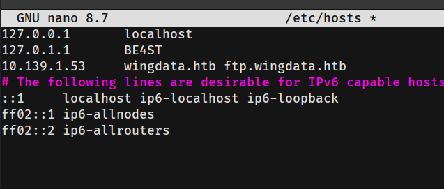

At the bottom of the page, the application reveals the version of the FTP server being used.

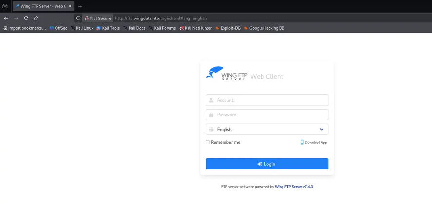

## Vulnerability Research

Using the discovered FTP version, I searched for known vulnerabilities and public exploits.

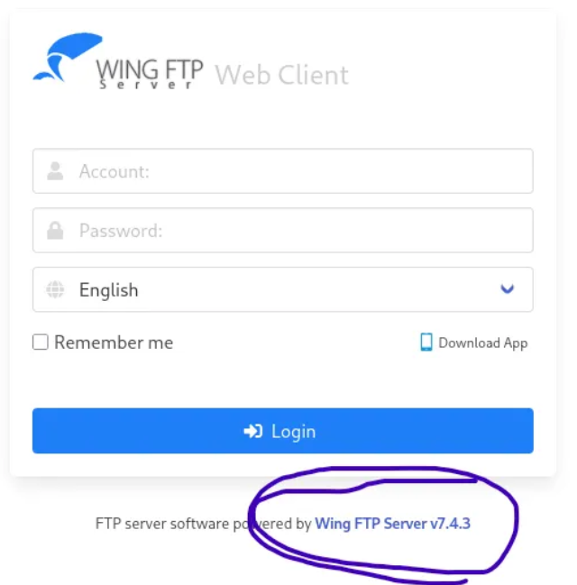

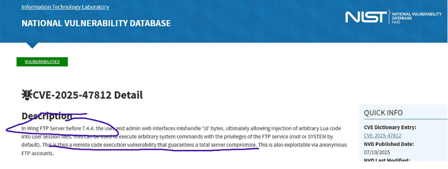

The search results revealed a public exploit available on GitHub.

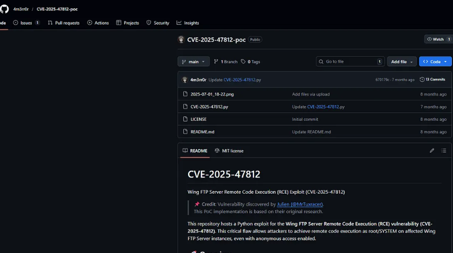

## Exploitation

The exploit is a Python script that allows command execution on the target system. By modifying the payload, it can be used to establish a reverse shell connection back to the attacker machine.

First, I downloaded the exploit to the working directory.

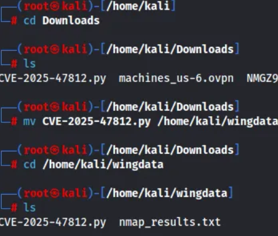

Then I moved the exploit into the **WingData** project directory.

Next, I started a Netcat listener to wait for the incoming reverse shell connection.

```
nc -lvnp 4444
```

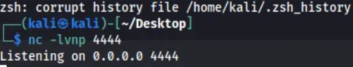

After setting up the listener, I executed the exploit script and provided a payload that connects back to my attacker machine.

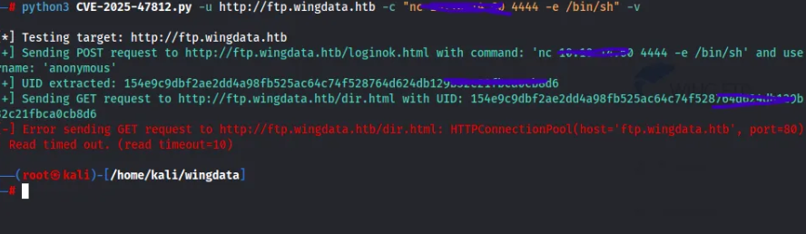

Once the exploit successfully triggered, the listener received a connection and a shell was obtained.

To improve shell usability, I spawned a proper TTY shell using Python.

```
python3 -c 'import pty; pty.spawn("/bin/bash")'
```

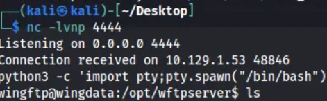

## Initial Enumeration

With shell access established, I began exploring the filesystem.

Starting from the root directory `/`, I navigated to `/home` and attempted to access the directory belonging to the user **wacky**, but permission was denied.

During further enumeration, I discovered an XML file containing a password hash associated with the user.

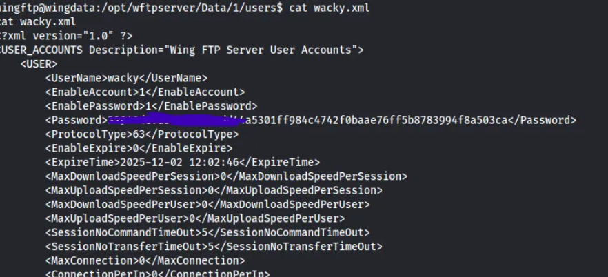

The extracted hash was saved locally for cracking.

## Password Cracking

To crack the hash, I used **Hashcat** with the `rockyou.txt` wordlist.

The correct Hashcat mode for this hash type was **1410**.

```
hashcat -m 1410 hash.txt /usr/share/wordlists/rockyou.txt
```

After running the attack, Hashcat successfully recovered the password.

!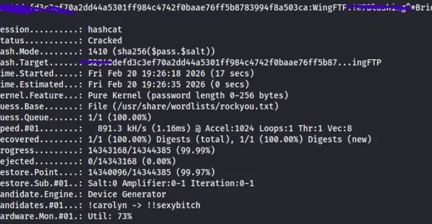

## SSH Access

Using the cracked credentials, I logged in via SSH as the **wacky** user.

```
ssh wacky@<target_ip>
```

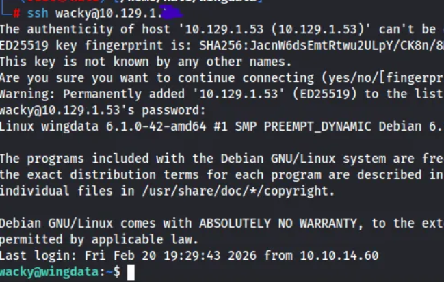
Once logged in, I retrieved the **user flag**.
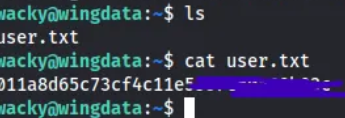

## Privilege Escalation

The next step was checking the sudo privileges available to the **wacky** user.

```
sudo -l
```

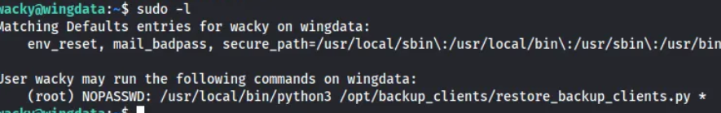
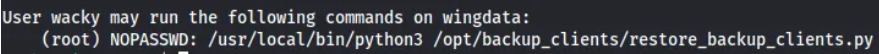

The output showed that the user could run a specific script as root:

```
restore_backups_clients.py
```

To understand its behavior, I inspected the script.

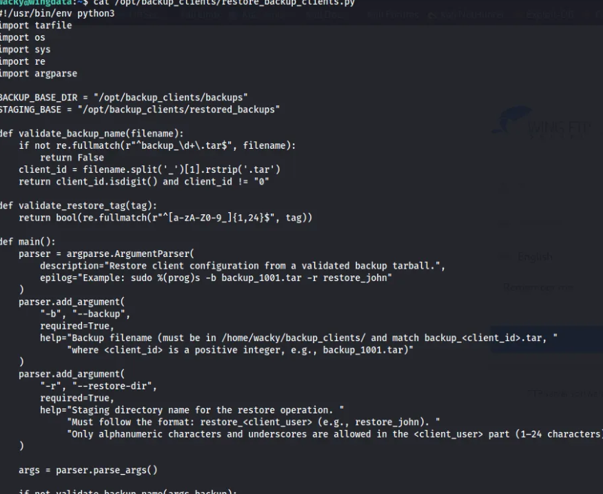

The script extracts a `.tar` archive using Python's `tarfile` module.

```
with tarfile.open(backup_path, "r") as tar:
    tar.extractall(path=staging_dir, filter="data")
```

### Vulnerability

This extraction process runs with **root privileges**.

If the archive contains **malicious paths or symlinks**, it can write files outside the intended extraction directory.

This creates a **privilege escalation opportunity**.

## Exploiting the Tar Extraction

To abuse this behavior, I created a Python script that generates a **malicious tar archive**.

The archive is crafted in a way that causes files to be written outside the expected directory when extracted by the privileged script.

The script was created inside the `/tmp` directory.

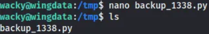

After executing the script, the malicious `.tar` file was generated.
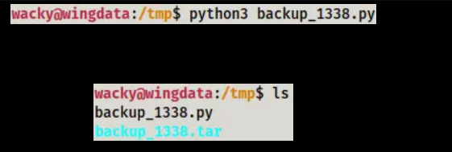
This archive was then moved into the backup directory used by the restore script.

Once the restore script was executed with `sudo`, the crafted archive triggered the vulnerability and allowed privilege escalation.

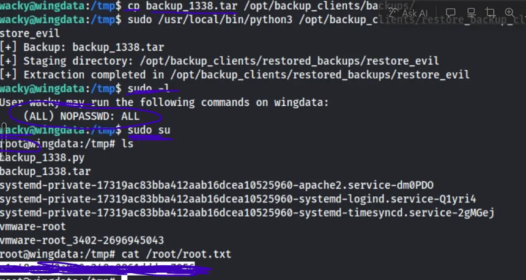

## Conclusion

By exploiting the insecure tar extraction performed by a root-privileged backup restore script, it is possible to escalate privileges from the **wacky** user to **root**.

The attack chain involved:

1. Service enumeration with Nmap
2. Web application exploration
3. Exploiting a vulnerable FTP service
4. Obtaining a reverse shell
5. Cracking a password hash
6. Logging in via SSH
7. Exploiting insecure tar extraction for privilege escalation

With the final step completed, full system compromise is achieved.


# Author: Z4B0 [LinkedIn](https://www.linkedin.com/in/mahamud-abdirahman-151493375/)


