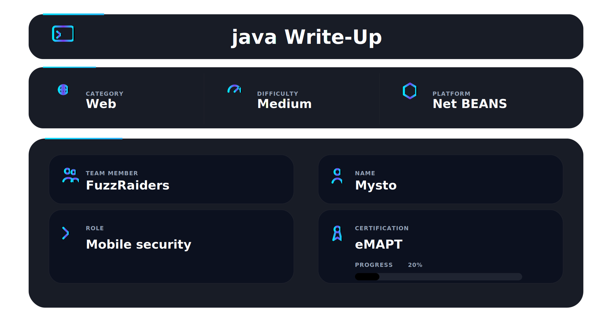

This module is excellent for understanding how automated tools can transform manual SQL injection testing into efficient database exploitation, focusing on:

* SQL Injection discovery and validation
* Automated database enumeration
* Extracting sensitive data from backend databases
* Advanced SQLMap attack techniques
* Practical troubleshooting and tuning of SQLMap attacks

---

## 🛠 Tools

Automated exploitation using industry-standard tooling.

```
sqlmap          → automated SQL injection exploitation
Burp Suite      → capturing and modifying HTTP requests
curl            → request testing
browser devtools → request inspection
```

---

## 📌 Overview

The **SQLMap Essentials** module introduces one of the most powerful tools used in real-world web penetration testing.

SQLMap automates the process of detecting and exploiting SQL injection vulnerabilities, allowing attackers and security professionals to quickly identify vulnerable parameters, enumerate database structures, and extract sensitive data.

This module focuses on understanding **how SQLMap works internally**, when automation should be used, and how to control the exploitation process effectively.

Mastering SQLMap is a core skill for **web penetration testers and offensive security professionals**, especially when dealing with complex injection scenarios.

---

## 🔍 Capturing the Vulnerable Request

Before using SQLMap, the HTTP request must be captured using an interception proxy such as **Burp Suite**. This allows us to inspect parameters that may be vulnerable to SQL injection.

**Figure 1 — Captured HTTP request containing the vulnerable parameter**


The parameter `id=1` is often a common injection point and can be tested automatically with SQLMap.

---

## ⚙️ SQLMap Execution

After capturing the request, SQLMap can be used to test the parameter for SQL injection vulnerabilities.

Example command:

```bash
sqlmap -r request.txt --batch
```

During testing, SQLMap detected a **CSRF token** inside the POST request and asked whether it should automatically refresh the token during further requests.

**Figure 2 — SQLMap detecting an anti‑CSRF token during testing**


Handling CSRF tokens is important when testing modern web applications since tokens change between requests.

---

## 📊 SQLMap Database Configuration

SQLMap includes XML configuration files defining how queries are executed for different database management systems.

These files define how SQLMap retrieves information such as:

* database version
* current user
* database name
* table and column metadata

**Figure 3 — SQLMap query configuration for MySQL enumeration**


Understanding these queries helps security professionals better understand how automated database enumeration works.

---

## 🧠 What This Module Teaches

* Understanding how automated SQL injection exploitation works
* When to rely on automation vs manual testing
* Enumerating databases efficiently
* Extracting sensitive information from vulnerable applications
* Using SQLMap in realistic penetration testing workflows

This module builds a strong foundation for **SQL injection exploitation and web application testing**.

---

## 🎓 Module Completion

After completing all practical labs and theoretical sections, the **SQLMap Essentials module** was successfully finished in Hack The Box Academy.

**Figure 4 — SQLMap Essentials module completion confirmation**


Completion of this module contributes directly to the **CWES (Certified Web Exploitation Specialist)** learning path.

---

## 📌 Conclusion

SQL injection remains one of the most dangerous web vulnerabilities.

Tools like SQLMap dramatically increase the speed and effectiveness of exploitation when used correctly.

However, understanding the underlying attack methodology is critical. Automation is powerful, but it must always be guided by proper enumeration and testing strategy.

This module reinforces a key principle in web security:

**Automation amplifies skill — it does not replace it.**


# Author:[Mysto](https://www.linkedin.com/in/moussa-mohamed-1a15a536b/)


