<div align="left">


</div>

## MetaTwo — Hack The Box Write-Up

<div align="left">

<br>
<br>


</div>

This machine focuses on **real-world WordPress exploitation and post-exploitation techniques**, chaining multiple vulnerabilities together:

- WordPress & plugin enumeration
- SQL Injection via vulnerable plugin
- XXE exploitation through media upload
- Credential reuse across services
- Password manager abuse for privilege escalation

---

## 🛠 Tools

```
nmap              → discovering open ports & services
dirsearch         → directory & endpoint fuzzing
sublist3r         → subdomain enumeration
```

---

## 🔍 Enumeration

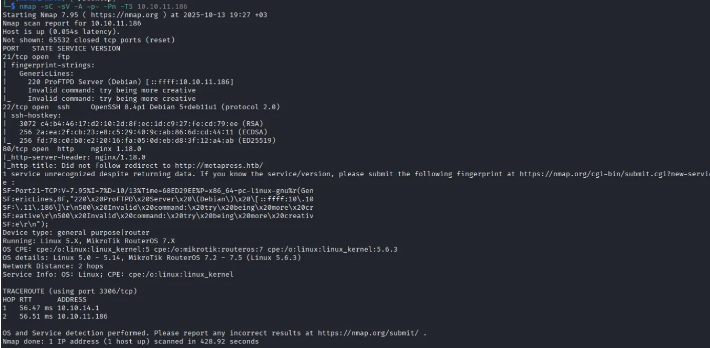

Initial enumeration reveals **ports 21, 22, and 80** open. Accessing port 80 redirects to `http://metapress.htb`, which is added to `/etc/hosts`:

```bash
sudo nano /etc/hosts
```

---

## 🌐 Web Analysis


The target is running **WordPress**. The detected core version did not have a reliable public exploit at the time of testing.

Although the login page exposes **public credentials**, SQL injection attempts against the authentication mechanism were unsuccessful.

---

## 🎯 Identifying an Attack Surface


An **Events** feature allows users to add and view entries — a strong indicator of a third-party plugin.

Inspecting the page source reveals the following:

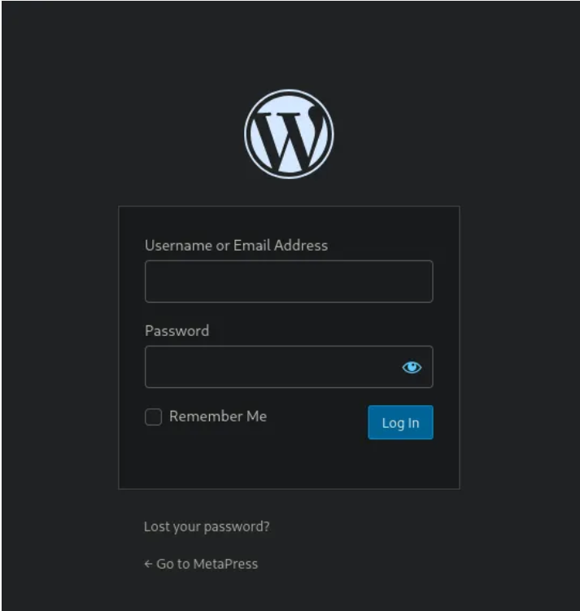

**BookingPress version 1.0.10**

---

## 💥 Exploitation — BookingPress SQL Injection

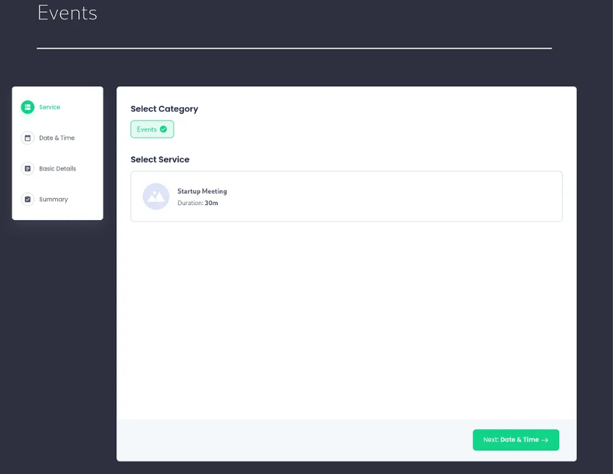

BookingPress **v1.0.10** is vulnerable to **SQL Injection**. Using a public exploit, database access is achieved.

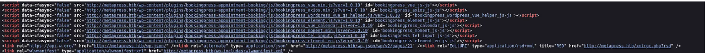

Two password hashes are extracted. Using **Hashcat** with `rockyou.txt`, one credential is cracked:

```
manager : partylikearockstar
```

---

## 💣 Exploitation — WordPress XXE

WordPress **5.6.2** is vulnerable to an **XXE attack via media upload**, allowing malicious XML payloads to be processed when parsing media files.

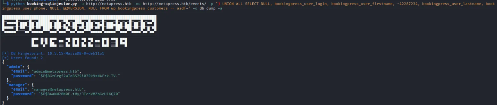

### XXE Execution Flow

1. Craft a malicious `.wav` file
2. Upload it via WordPress media upload
3. XML parser fetches a remote `evil.dtd`
4. Arbitrary file disclosure is achieved

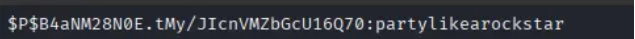

### evil.dtd

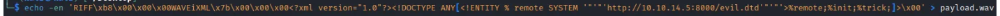

Successful execution leaks sensitive files such as `/etc/passwd` in encoded form:

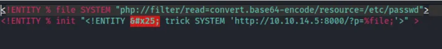

Using the same technique, application configuration files are retrieved:

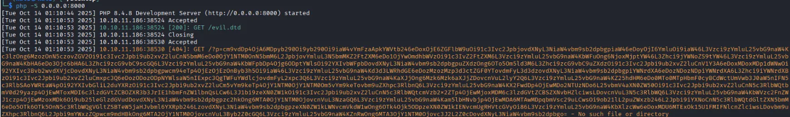

---

## 🔁 Credential Reuse

Recovered credentials fail over **SSH**, but succeed over **FTP**.

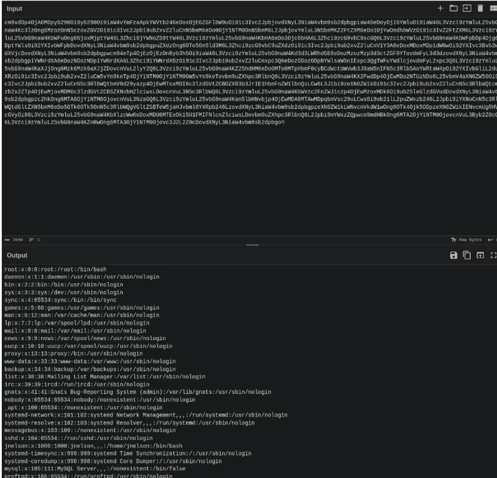

Additional credentials are discovered and reused.

---

## 🔐 SSH Access

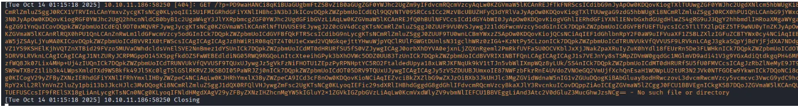

SSH access is obtained. While enumerating the user home directory, a hidden file named **`.passpie`** is discovered.

---

## 🧠 Privilege Escalation — Passpie

### What is Passpie?

Passpie is a **PGP-based password manager** used to store encrypted credentials.

Attempting to export stored passwords prompts for a master password:

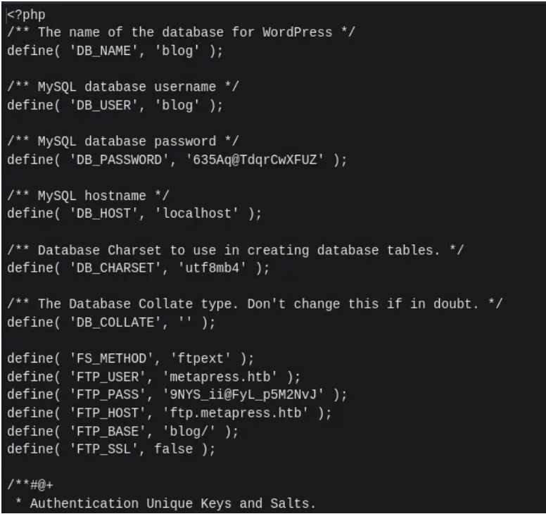

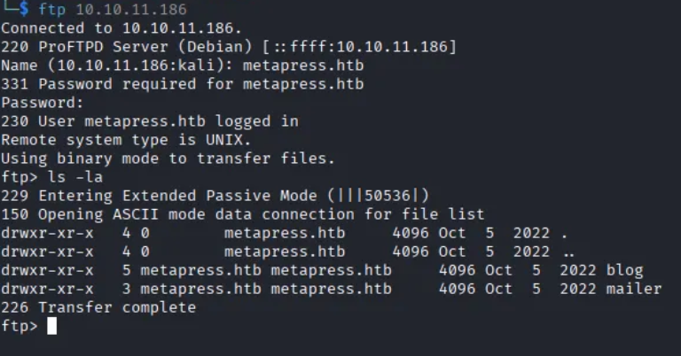

The `.keys` directory is copied locally and converted using **pgp2john**:

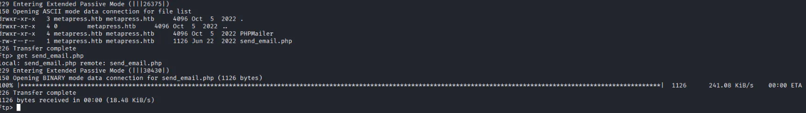

After cracking the key, stored credentials are recovered.

---

## 👑 Root Access

Using the recovered password:

```bash
su root
```

```
REDACTED
```

Root access achieved 🎯 _(flag redacted)_

---

## 🧠 What This Box Teaches

- WordPress plugins significantly expand attack surface
- SQL Injection often leads to credential compromise
- XXE remains dangerous in media-handling features
- Credential reuse across services is common
- Poor secret management enables full system compromise

---

## 📌 Conclusion

MetaTwo is an excellent example of **realistic WordPress exploitation**, requiring enumeration, chaining vulnerabilities, and careful post-exploitation.

> _If credentials exist on the system, assume they can be extracted._

This work is part of **FuzzRaiders’ structured hands-on training and research program**, where every lab, project, and technical study is formally documented, reviewed, and validated to ensure real-world applicability, methodological rigor, and real-world security execution

Happy hacking 🚀

# Author: Z4B0 [LinkedIn](https://www.linkedin.com/in/mahamud-abdirahman-151493375/)
