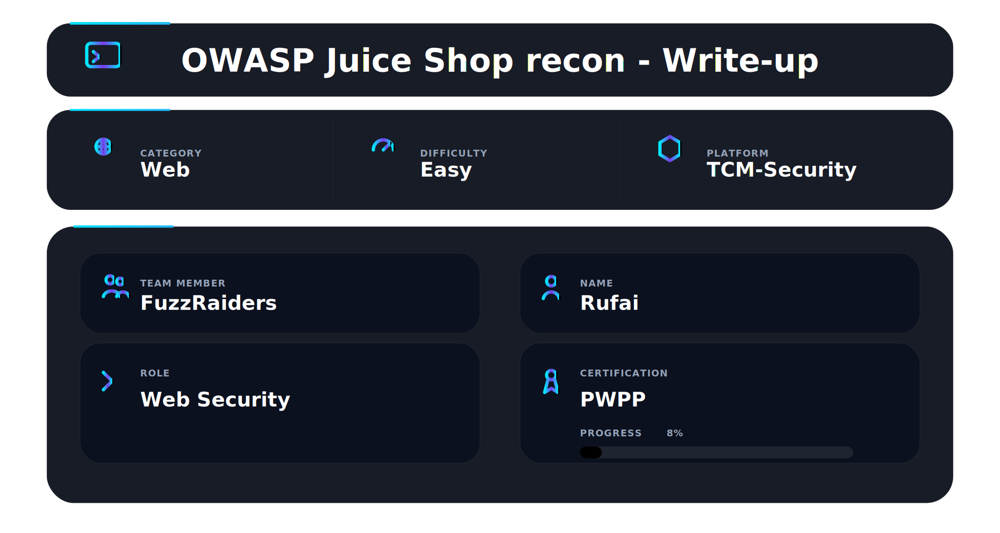
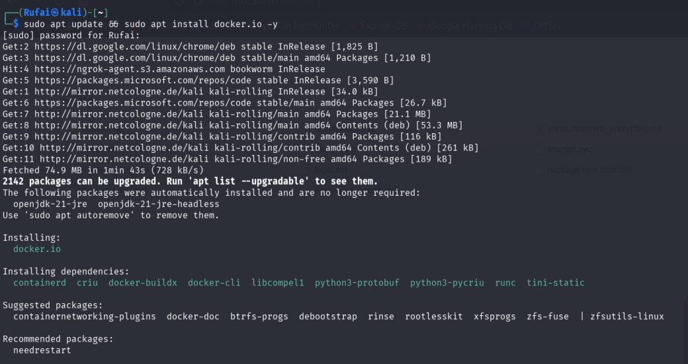
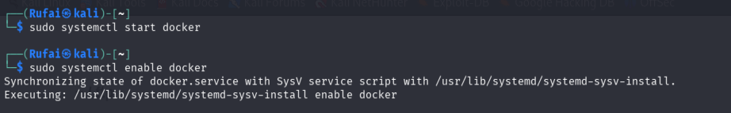
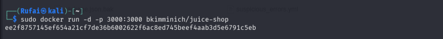
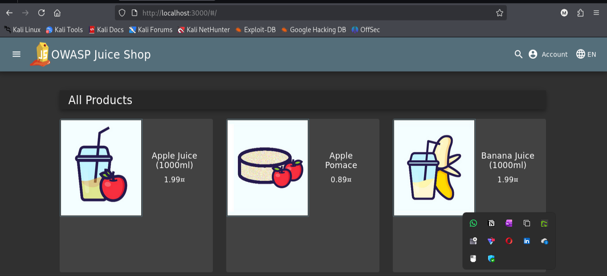
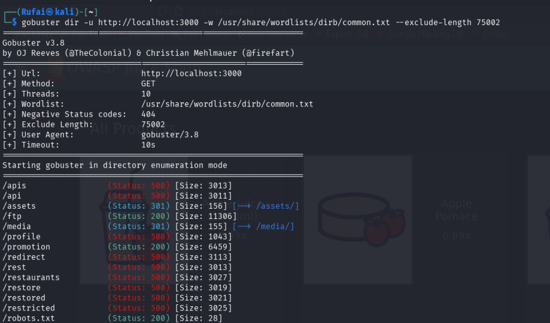
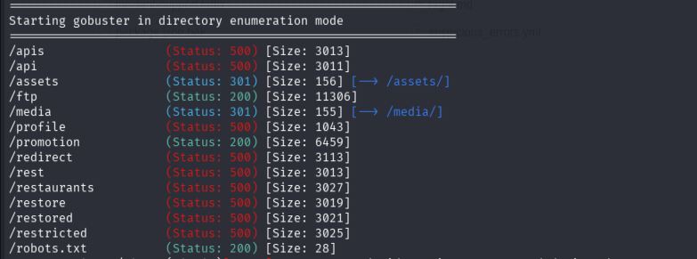
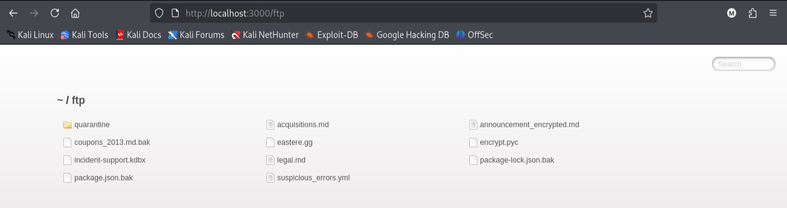
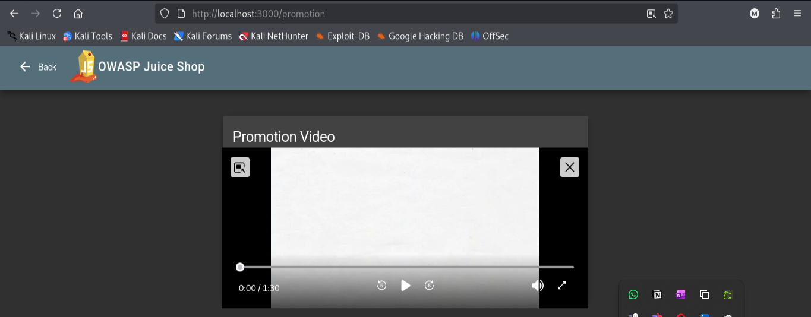
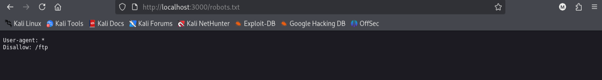

## 📌 Overview

This walkthrough demonstrates the process of performing directory enumeration and reconnaissance against OWASP Juice Shop using Gobuster on Kali Linux, resulting in the discovery of hidden endpoints, publicly accessible sensitive files, backup resources, and internal application directories.

---

## 🎯 Objectives

- Perform reconnaissance against OWASP Juice Shop
- Identify hidden directories and endpoints
- Discover publicly accessible sensitive files
- Analyze exposed application resources
- Understand directory enumeration workflows used in penetration testing

---

## 🛠 Tools Used

| Tool | Purpose |
|---|---|
| Kali Linux | Operating environment |
| Gobuster | Directory enumeration |
| Docker | Containerized deployment |
| OWASP Juice Shop | Vulnerable target application |
| Firefox Browser | Manual validation |

---

# ⚙️ Step 1 - Install Docker

```bash
sudo apt update && sudo apt install docker.io -y
```

✔ Docker installed successfully

### 📸 Evidence



---

# ⚙️ Step 2 - Start Docker Service

```bash
sudo systemctl start docker
sudo systemctl enable docker
```

✔ Docker service initialized

### 📸 Evidence



---

# 📦 Step 3 - Deploy OWASP Juice Shop

```bash
sudo docker run -d -p 3000:3000 bkimminich/juice-shop
```

✔ OWASP Juice Shop deployed successfully

### 📸 Evidence



---

# 🌐 Step 4 - Access the Application

Opened:

```text
http://localhost:3000
```

✔ Application accessible successfully

### 📸 Evidence



---

# 🧪 Step 5 - Perform Directory Enumeration

## Initial Enumeration

```bash
gobuster dir -u http://localhost:3000 -w /usr/share/wordlists/dirb/common.txt
```

The application returned HTTP `200 OK` responses for non-existent paths due to SPA wildcard routing behavior.

To reduce false positives, enumeration was adjusted using:

```bash
gobuster dir -u http://localhost:3000 -w /usr/share/wordlists/dirb/common.txt --exclude-length 75002 
```

✔ False positives filtered successfully  

### 📸 Evidence



---

# 🔍 Step 6 - Analyze Enumeration Results

## Discovered Endpoints

```text
/ftp
/api
/rest
/assets
/media
/promotion
/robots.txt
```

✔ Multiple hidden resources identified

---

## Endpoint Analysis

| Endpoint | Status | Observation |
|---|---|---|
| `/ftp` | 200 | Publicly accessible directory |
| `/api` | 500 | Backend API endpoint |
| `/rest` | 500 | REST functionality exposed |
| `/assets` | 301 | Redirected static content |
| `/media` | 301 | Media directory |
| `/promotion` | 200 | Public promotional page |
| `/robots.txt` | 200 | Hidden directory disclosure |

### 📸 Evidence



---

# 📂 Step 7 - Access Exposed FTP Directory

Opened:

```text
http://localhost:3000/ftp
```

## Discovered Sensitive Files

```text
incident-support.kdbx
package.json.bak
coupons_2013.md.bak
suspicious_errors.yml
announcement_encrypted.md
```

✔ Publicly accessible sensitive resources identified

---

## Sensitive File Analysis

| File | Observation |
|---|---|
| `incident-support.kdbx` | KeePass password database |
| `package.json.bak` | Backup application file |
| `coupons_2013.md.bak` | Backup markdown file |
| `suspicious_errors.yml` | Potential configuration file |
| `announcement_encrypted.md` | Internal encrypted document |

### 📸 Evidence



---

# 🎬 Step 8 - Access Promotion Endpoint

Opened:

```text
http://localhost:3000/promotion
```

✔ Additional application functionality discovered through enumeration

The `/promotion` endpoint exposed publicly accessible promotional content that was not immediately visible from the primary application interface. This demonstrates how directory enumeration can reveal hidden or less accessible application resources.

---

## Security Observation

Although the endpoint did not expose sensitive data directly, it confirmed the existence of additional application functionality outside the main navigation structure, increasing the overall visible attack surface.

### 📸 Evidence



---

# 🤖 Step 9 - Analyze robots.txt

Opened:

```text
http://localhost:3000/robots.txt
```

## Result

```text
User-agent: *
Disallow: /ftp
```

✔ Hidden directory disclosure identified

The application relied on `robots.txt` to discourage indexing of sensitive directories. However, `robots.txt` is not an access control mechanism and may unintentionally assist attackers in discovering hidden resources.

### 📸 Evidence



---

# 📌 Step 10 - Security Impact

The findings identified during reconnaissance may lead to:

- Sensitive file exposure
- Internal information disclosure
- Backup file leakage
- Credential exposure opportunities
- Attack surface expansion

The exposed `.kdbx` KeePass database file is particularly significant because KeePass databases commonly store sensitive credentials and may become targets for offline password-cracking attacks.

---

# 📌 Conclusion

This walkthrough demonstrates a complete reconnaissance workflow:

- Docker lab deployment
- Web application mapping
- Directory brute forcing
- Hidden endpoint discovery
- Sensitive file exposure
- robots.txt analysis
- Manual validation of findings

---

This work is part of FuzzRaiders' structured hands-on training and research program, where every lab, project, and technical study is formally documented, reviewed, and validated to ensure real-world applicability and methodological rigor.

Happy hacking 🚀

---


