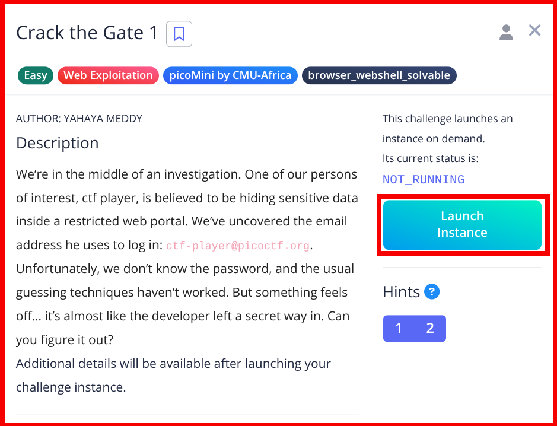
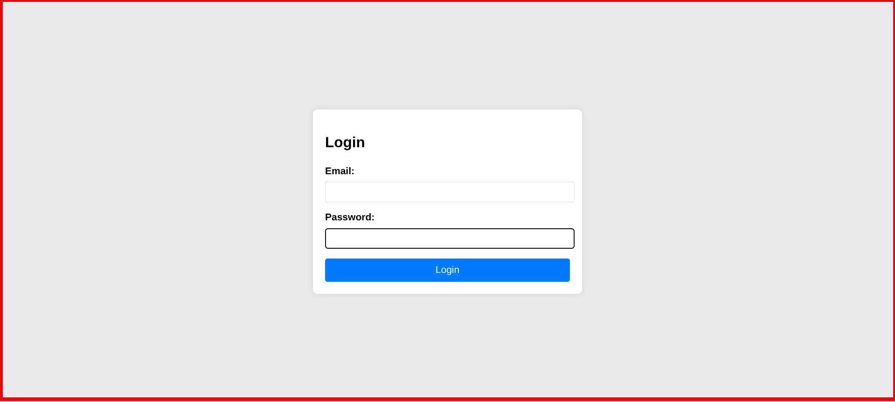
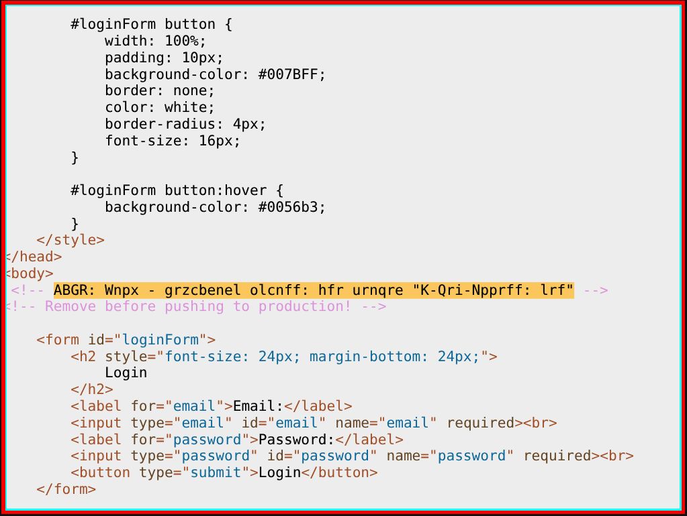

# picoCTF – Crack the Gate 1

##


This challenge demonstrates how insecure **developer backdoors** and **trusting client-side headers** can completely bypass authentication mechanisms. Instead of brute forcing credentials, careful inspection and request manipulation leads directly to the flag.

> _In this report, we will cover_

- Inspecting web pages and source code
- Identifying encoded developer comments
- Decoding ROT13 messages
- Manipulating HTTP headers using Burp Suite
- Bypassing authentication logic

---

## 🛠 Tools

The following tools and techniques were used to solve this challenge:

```
Web Browser            → For interacting with the web application
View Page Source       → To inspect developer comments
ROT13 Decoder          → To decode the hidden message
Burp Suite             → To intercept and modify HTTP requests

```

---

## Walkthrough

### 1. Launch the Instance

The challenge begins by launching the provided picoCTF instance.



---

### 2. Access the Web Application

After launching the instance, click on **"Click Here"** to access the target web application.


---

### 3. Observe the Login Page

We are presented with a login page. The **username is already provided**, but the password is unknown.

Rather than brute forcing the password, we investigate further.

## 

### 4. Inspect Page Source

By viewing the page source, we discover a suspicious **developer comment** that appears to be encoded.



---

### 5. Decode the Comment (ROT13)

The comment is encoded using **ROT13**. Decoding it reveals the following message:

```
NOTE: Jack - temporary bypass: use header "X-Dev-Access: yes"
```

This indicates a hidden authentication bypass using a custom HTTP header.


---

### 6. Intercept Request with Burp Suite

Using Burp Suite, we intercept the login request and manually add the following header:

```
X-Dev-Access: yes
```

After forwarding the modified request, the server accepts it.


---

### 7. Capture the Flag

Upon returning to the browser, authentication is bypassed and the flag is revealed.


**Flag:** `picoCTF{...}`

---

## 🧠 What This Challenge Teaches

- **Source Code Inspection:** Hidden comments often reveal critical information.
- **Encoding Awareness:** Simple ciphers like ROT13 are still commonly used to hide messages.
- **Header Manipulation:** Trusting client-controlled headers is extremely dangerous.
- **Real-World Risk:** Developer backdoors left behind can fully compromise authentication systems.

This challenge is an excellent introduction to **web exploitation fundamentals**.

---

## 📌 Conclusion

Crack the Gate 1 shows how authentication systems can fail when developers rely on insecure shortcuts.

Always remember:

> _Temporary developer bypasses should never reach production environments._

Small mistakes like this can lead to **complete access compromise**.

Happy hacking 🚀

---

## Author: Z4B0

## [LinkedIn:](https://www.linkedin.com/in/mahamud-abdirahman-151493375/)
