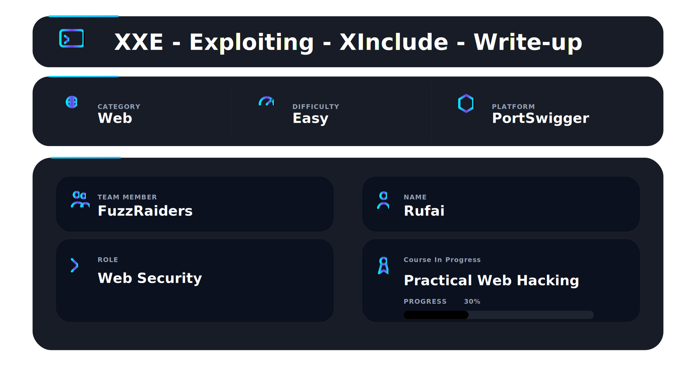
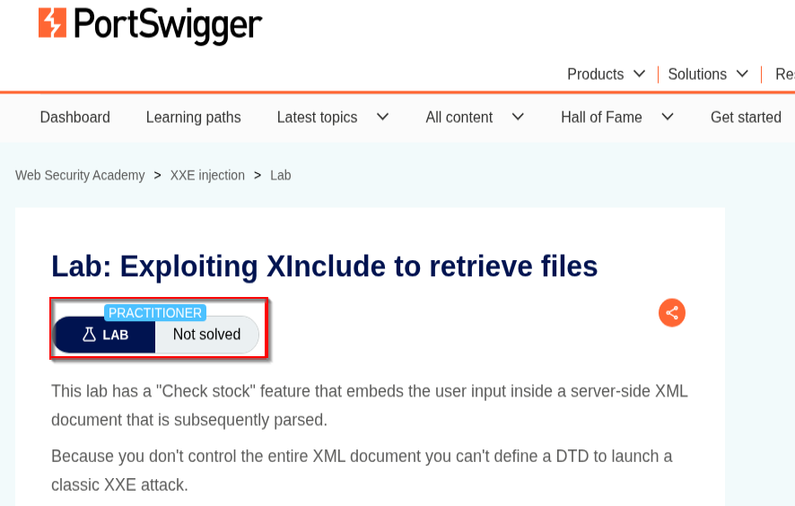
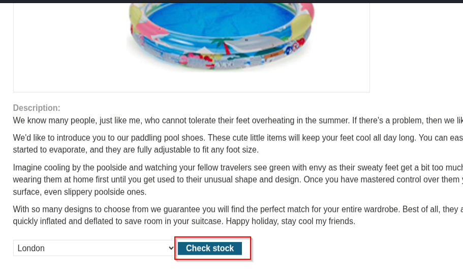
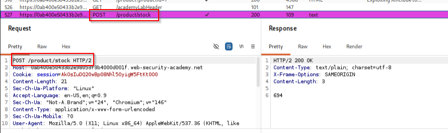
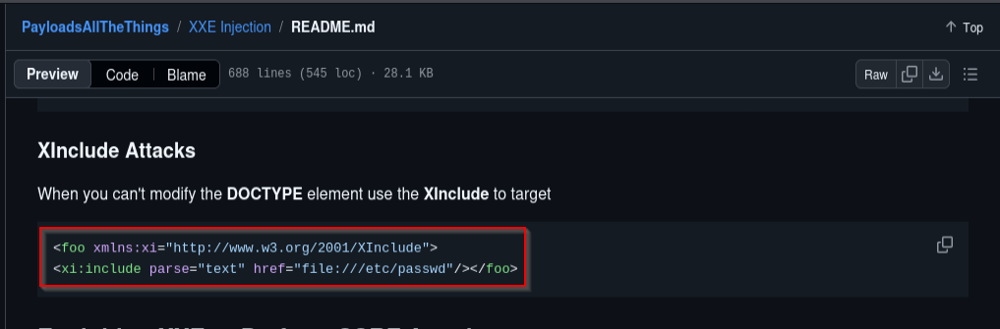
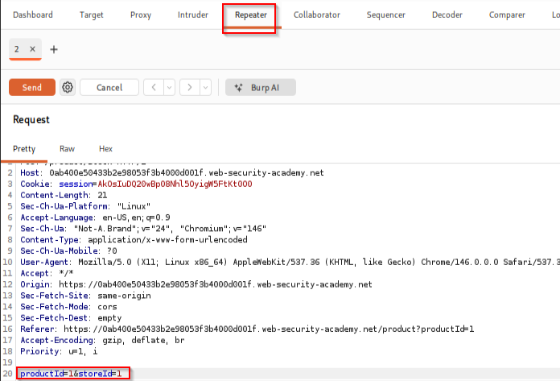
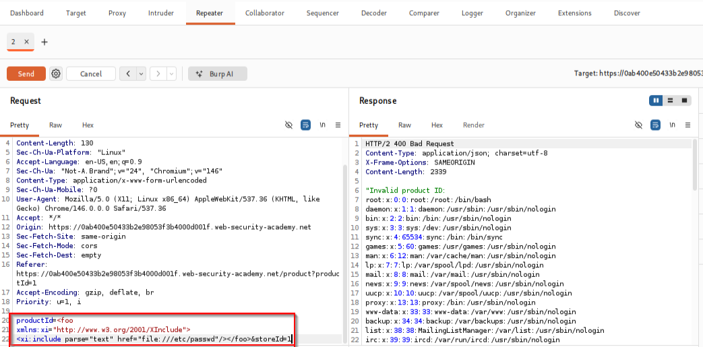
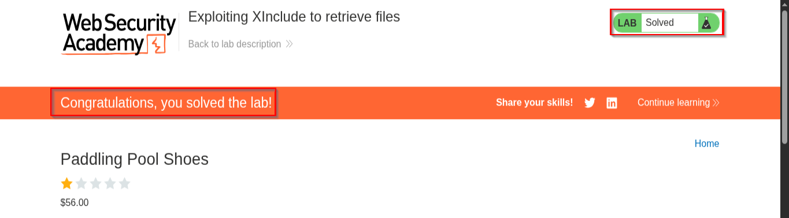

📌 Overview

This walkthrough demonstrates the identification and exploitation of an **XInclude Injection** vulnerability using Burp Suite and PortSwigger Web Security Academy.

The application embeds user-supplied input inside a server-side XML document that is subsequently parsed. Because the attacker does not control the full XML structure, traditional XXE attacks using custom `DOCTYPE` declarations are not possible.

However, the backend XML parser processes **XInclude** directives, allowing local file inclusion through crafted XML payloads. This vulnerability can be abused to retrieve sensitive files such as:

```bash id="1dzjnq"
/etc/passwd
```

from the underlying operating system.

---

# 🛠 Tools Used

| Tool                             | Purpose                             |
| -------------------------------- | ----------------------------------- |
| Kali Linux                       | Operating environment               |
| Burp Suite Community Edition     | Request interception & manipulation |
| Firefox                          | Browser interaction                 |
| Burp Repeater                    | HTTP request modification           |
| GitHub - PayloadsAllTheThings             | XInclude payload reference          |
| PortSwigger Web Security Academy | Vulnerable target application       |

---

# Step 1 — Access the Lab

Opened the PortSwigger lab:

## **Exploiting XInclude to retrieve files**

The lab description explained that user input is embedded into a server-side XML document before being parsed.

The objective was to retrieve:

```bash id="dl3z1u"
/etc/passwd
```

using XInclude injection.

✔ Lab initialized successfully

📸 Evidence 1 — Initial lab interface



---

# Step 2 — Identify Vulnerable Functionality

Navigated to the product page containing the:

## **Check stock**

feature.

The application submits user-controlled values to the backend in order to verify stock availability.

✔ Vulnerable functionality identified

📸 Evidence 2 — Product stock check feature



---

# Step 3 — Capture Original Request

After clicking:

## **Check stock**

Burp Suite captured the following request:

```http id="7m4dzg"
POST /product/stock HTTP/2
```

The request body contained:

```txt id="bg20ev"
productId=1&storeId=1
```

This confirmed:

* User-controlled parameters are processed server-side
* The application uses XML internally
* Input is embedded into an XML document before parsing

✔ Original request successfully captured

📸 Evidence 3 — Original request captured inside Burp Suite



---

# Step 4 — Analyze XXE Restrictions

At this stage, a traditional XXE payload using:

```xml id="cx8d8z"
<!DOCTYPE foo>
```

was not possible because the application only inserts user input inside an existing XML node.

This meant:

* Full XML document control was unavailable
* DOCTYPE injection could not be used
* Classic XXE exploitation was restricted

To bypass this limitation, XInclude injection was selected instead.

✔ XXE restriction identified successfully

📸 Evidence 4 — XInclude payload research



---

# Step 5 — Send Request to Repeater

The captured request was sent to:

## **Burp Repeater**

for manual testing and payload injection.

The original parameter:

```txt id="v6r74u"
productId=1
```

was replaced with the following malicious XML payload:

```xml id="ej9g8o"
<foo xmlns:xi="http://www.w3.org/2001/XInclude">
<xi:include parse="text" href="file:///etc/passwd"/>
</foo>
```

The modified request became:

```http id="fpgb5r"
POST /product/stock HTTP/2

productId=<foo xmlns:xi="http://www.w3.org/2001/XInclude"><xi:include parse="text" href="file:///etc/passwd"/></foo>&storeId=1
```

✔ XInclude payload injected successfully

📸 Evidence 5 — Modified request inside Burp Repeater



---

# Step 6 — Verify File Retrieval

The modified request was sent through Burp Repeater.

The server processed the XInclude directive and returned contents of:

```bash id="6b2l2n"
/etc/passwd
```

Observed response data included:

```txt id="oqt8nd"
root:x:0:0:root:/root:/bin/bash
```

This confirmed:

* XInclude processing is enabled
* Local file inclusion is possible
* Sensitive server-side files can be retrieved

✔ Sensitive file disclosure confirmed

📸 Evidence 6 — Extracted `/etc/passwd` contents



---

#  Step 7 — Lab Solved

PortSwigger confirmed successful exploitation of the vulnerability.

Observed message:

## **Congratulations, you solved the lab!**

✔ Lab marked as solved

📸 Evidence 7 — Lab solved confirmation



---

# 📌 Conclusion

This walkthrough demonstrated the complete exploitation flow of an **XInclude Injection** vulnerability caused by insecure XML parsing.

The attack involved:

* Request interception
* XML injection analysis
* XInclude payload construction
* Local file inclusion
* Sensitive data extraction
* Backend XML parser abuse

Because the application processed user-controlled XML content insecurely and allowed XInclude directives, attackers could retrieve sensitive local files even without access to the full XML document structure.

---

This work is part of FuzzRaiders' structured hands-on training and research program, where every lab, project, and technical study is formally documented, reviewed, and validated to ensure real-world applicability and methodological rigor.

Happy hacking 🚀

---

