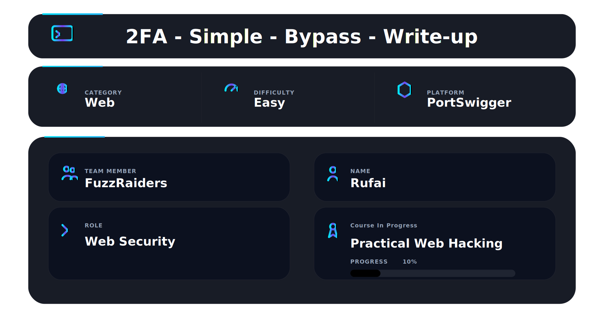

📌 Overview

This walkthrough demonstrates the identification and exploitation of a broken two-factor authentication (2FA) implementation using Burp Suite and PortSwigger.

The application redirects users to a 2FA verification page after login but fails to properly enforce server-side verification checks before granting access to authenticated resources. By directly requesting protected endpoints, it becomes possible to bypass the second authentication factor entirely.

---

# 🛠 Tools Used

| Tool                             | Purpose                         |
| -------------------------------- | ------------------------------- |
| Kali Linux                       | Operating environment           |
| Burp Suite Community Edition     | Request interception & analysis |
| Firefox                          | Browser interaction             |
| Burp HTTP History                | Authentication flow analysis    |
| PortSwigger Web Security Academy | Vulnerable target application   |

---

# Step 1 - Access the Lab

Opened the PortSwigger lab:

```text id="mx2q7k"
2FA simple bypass
```

The lab description provided:

* Attacker credentials
* Victim credentials
* Information about the vulnerable 2FA implementation

✔ Lab initialized successfully

📸 Evidence 1 - Initial lab interface
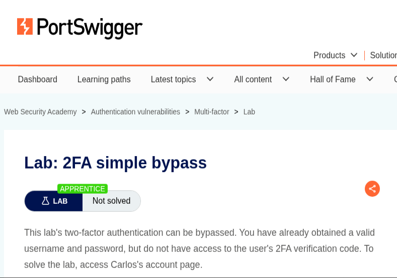

---

# Step 2 - Review Provided Credentials

The application provided two accounts:

```text id="8u0w6x"
Attacker:
wiener:peter

Victim:
carlos:montoya
```

The objective was to access Carlos’s account without possessing the valid 2FA verification code.

✔ Credentials identified successfully

📸 Evidence 2 - Credentials section

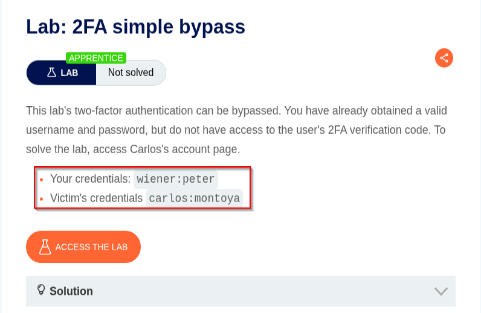

---

# Step 3 - Login as Wiener

Navigated to the login page and authenticated using the attacker account:

```text id="2n7y1s"
Username: wiener
Password: peter
```

After successful authentication, the application redirected to:

```text id="v4m1t9"
/login2
```

This indicated the application required a second authentication step.

✔ Initial authentication completed successfully

📸 Evidence 3 - Login page with attacker credentials

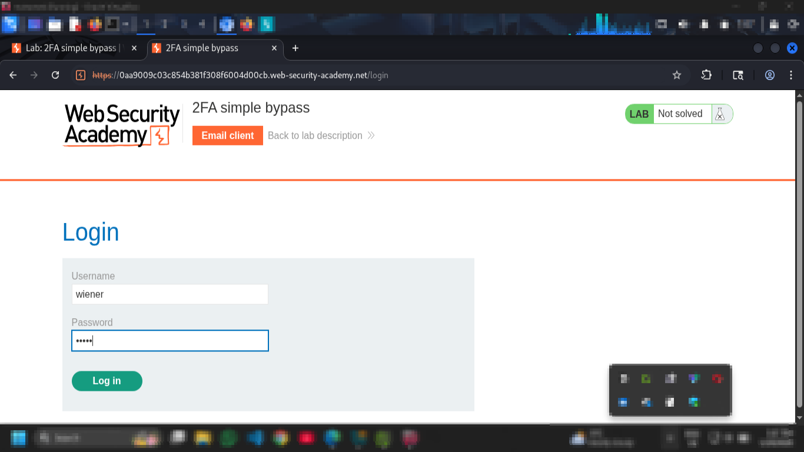

---

# Step 4 - Observe 2FA Verification Process

After login, the application generated a security code and delivered it through the built-in email client.

Observed email:

```text id="w1x9a3"
Your security code is 1418
```

This confirmed:

* The application uses email-based 2FA
* Verification occurs after password authentication

✔ 2FA mechanism identified successfully

📸 Evidence 4 - Email containing 2FA verification code
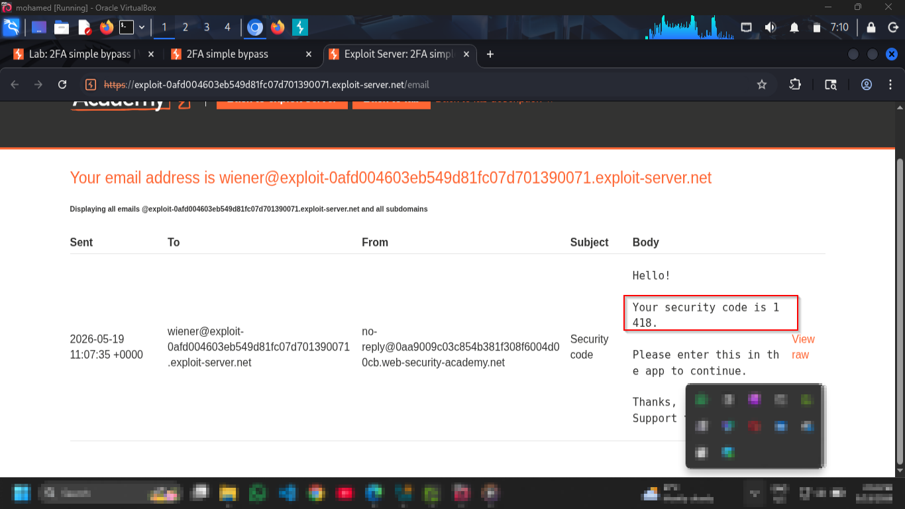

---

# Step 5 - Analyze Authentication Flow in Burp Suite

Opened:

```text id="n7p2x5"
Proxy → HTTP History
```

Burp Suite captured the following request:

```http id="c9r5m8"
POST /login HTTP/2
```

Server response:

```http id="t2b7q1"
HTTP/2 302 Found
Location: /login2
```

This showed:

* Username/password validation succeeded
* The application redirected users to the 2FA verification page

✔ Initial authentication request captured successfully

📸 Evidence 5 - Login request captured inside Burp Suite

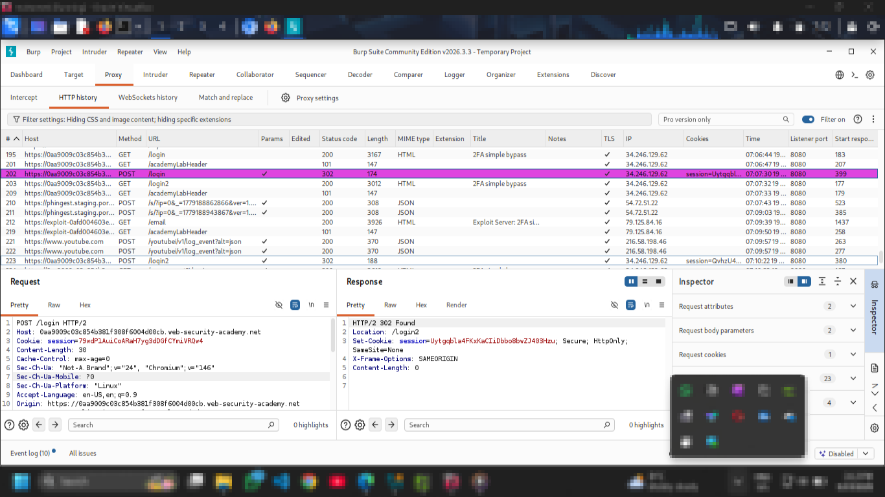

---

# Step 6 - Inspect 2FA Verification Request

After submitting the verification code, Burp Suite captured:

```http id="m3z8p4"
POST /login2 HTTP/2
```

Successful response:

```http id="f6x2w9"
HTTP/2 302 Found
Location: /my-account?id=wiener
```

This indicated:

* Successful 2FA verification redirects users to authenticated pages
* The application relies on session-based authentication state

✔ 2FA verification flow analyzed successfully

📸 Evidence 6 - Successful `/login2` request in Burp Suite

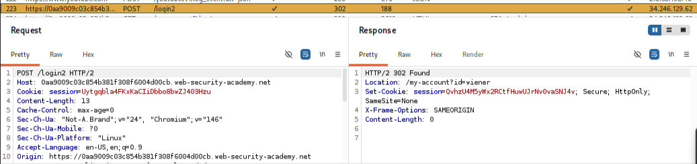

---

# Step 7 - Test for 2FA Bypass

Logged out and attempted authentication using the victim account:

```text id="j9v3x1"
Username: carlos
Password: montoya
```

After login, the application again redirected to:

```text id="d4k8m6"
/login2
```

Instead of entering the verification code, the browser URL was manually modified to:

```text id="s2n6w7"
/my-account
```

Example:

```text id="u5t1r8"
https://LAB-ID.web-security-academy.net/my-account
```

This tested whether the backend properly enforced completion of the second authentication factor.

✔ Direct endpoint access attempt initiated

📸 Evidence 7 - Manual navigation to `/my-account`
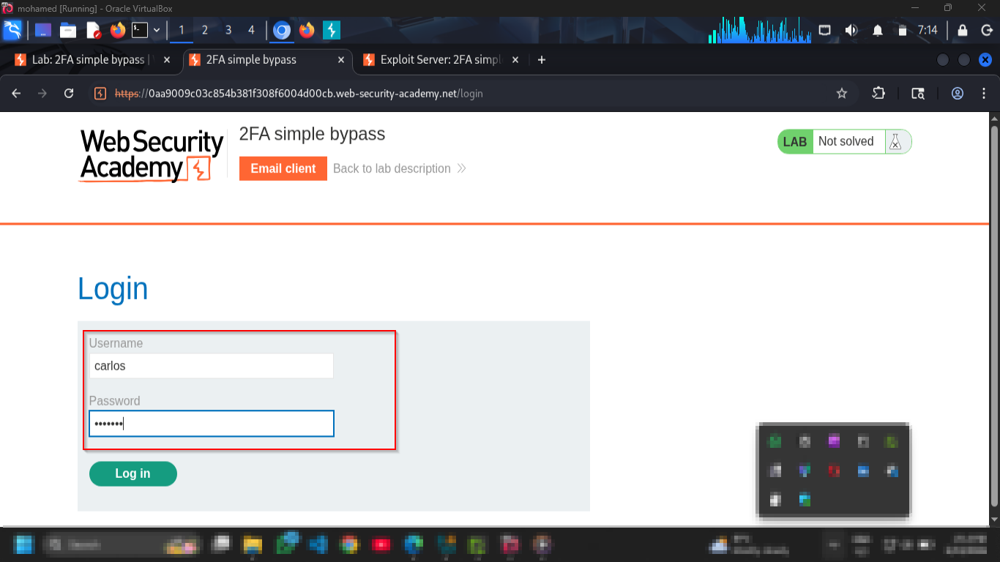

---

# Step 8 - Verify 2FA Bypass

The server granted immediate access to Carlos’s account page without requesting or validating the 2FA code.

Observed result:

```text id="y8m2p5"
Your username is: carlos
```

This confirmed:

* 2FA validation was not enforced server-side
* The session became authenticated immediately after password verification
* Protected endpoints could be accessed directly

✔ 2FA bypass confirmed successfully

📸 Evidence 8 — Successful access to Carlos’s account

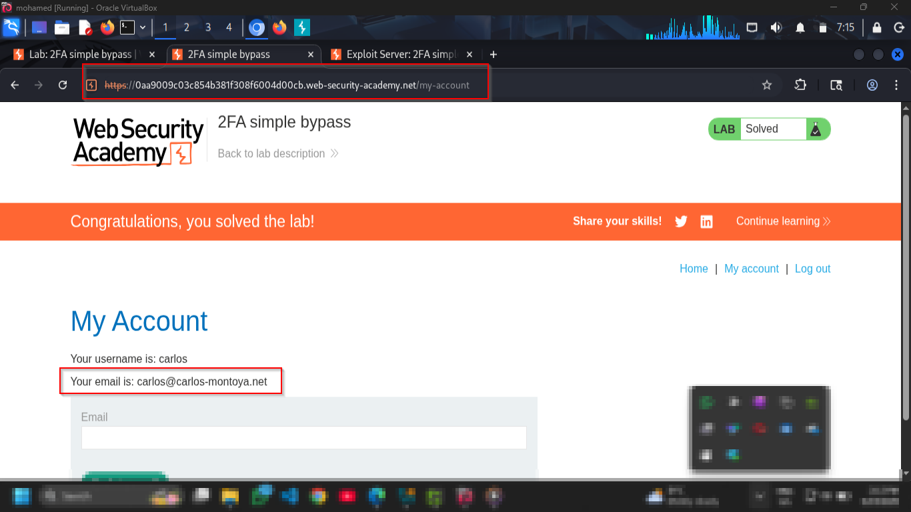

---

# Step 9 - Lab Solved

PortSwigger confirmed successful exploitation of the vulnerability.

✔ Lab marked as solved

📸 Evidence 9 - Lab solved confirmation

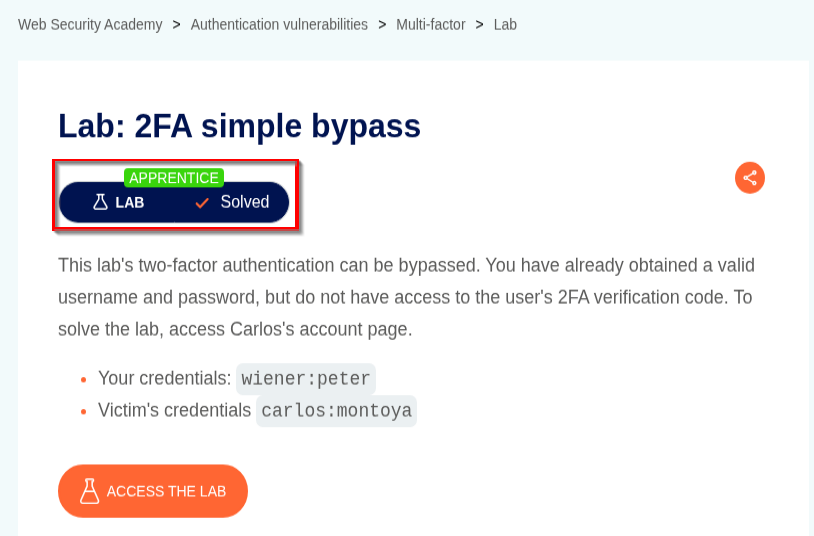

---

# 📌 Conclusion

This walkthrough demonstrated the complete exploitation flow of a broken two-factor authentication implementation where server-side validation was improperly enforced.

The attack involved:

* Authentication flow analysis
* 2FA verification inspection
* Session behavior testing
* Direct endpoint access
* Authentication bypass exploitation

Because the application created authenticated sessions before confirming successful 2FA verification, attackers with valid credentials could bypass the second authentication factor entirely by directly requesting protected resources.

---

This work is part of FuzzRaiders' structured hands-on training and research program, where every lab, project, and technical study is formally documented, reviewed, and validated to ensure real-world applicability and methodological rigor.

Happy hacking 🚀

---

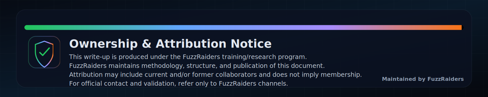