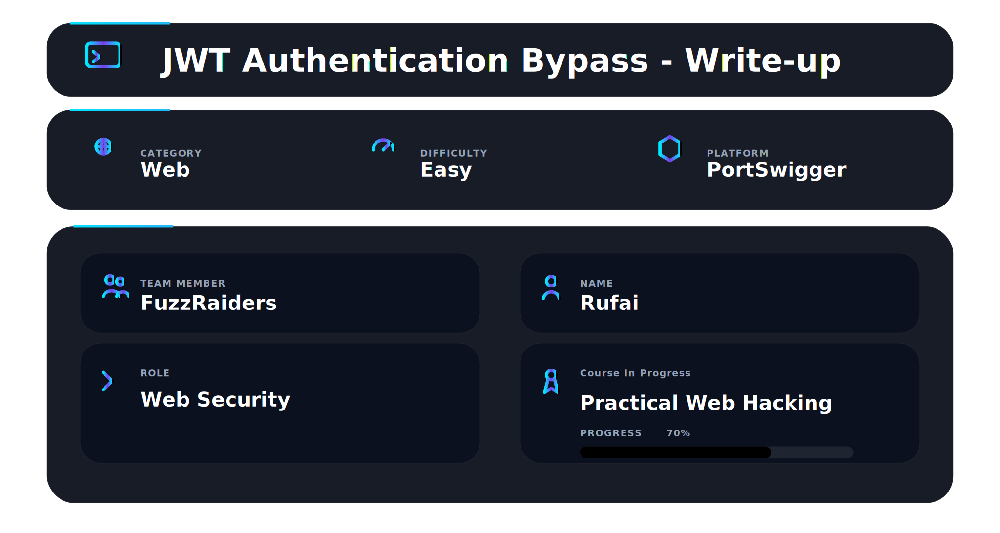
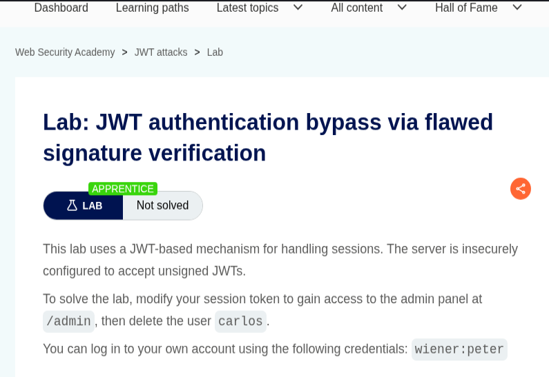
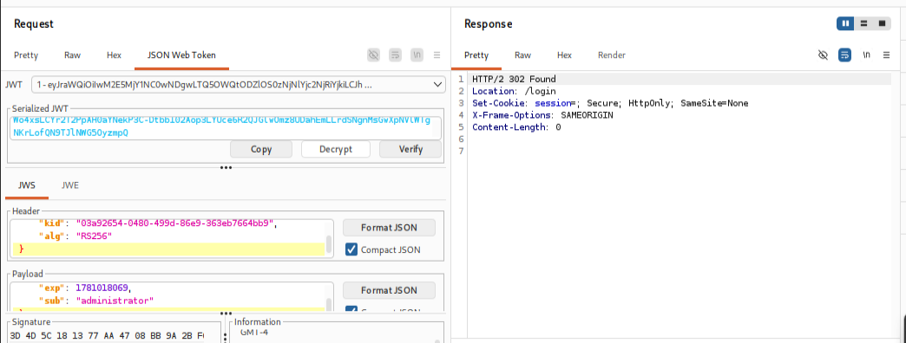
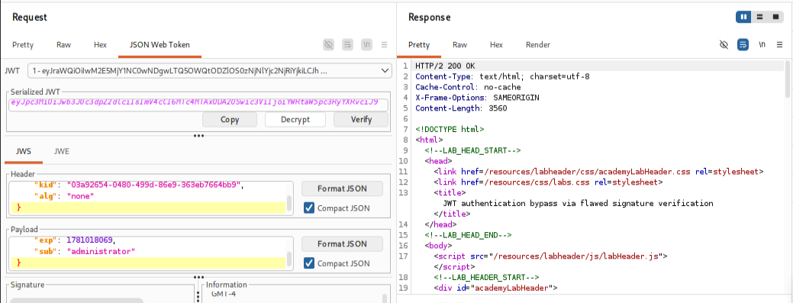
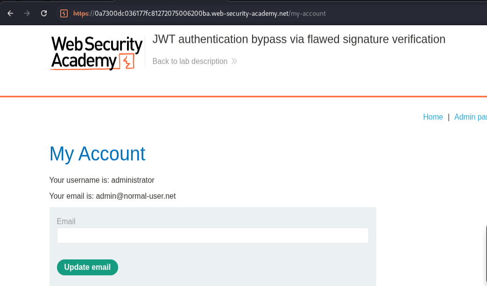
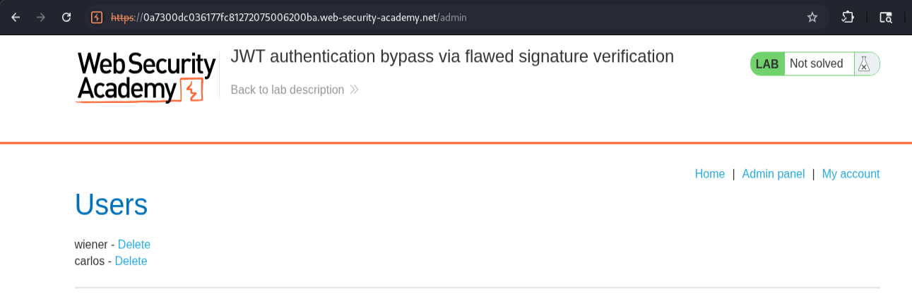
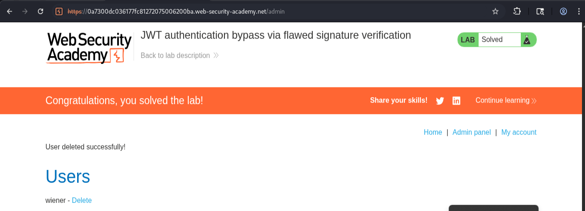

# 📌 Overview

This walkthrough demonstrates the identification and exploitation of a JWT authentication vulnerability caused by flawed signature verification.

The application uses JSON Web Tokens (JWTs) to manage authenticated user sessions. However, the server is configured to accept unsigned JWTs by trusting tokens that specify the `none` algorithm.

By modifying the JWT payload to impersonate the administrator account and removing the signature entirely, it is possible to bypass authentication controls, gain administrative access, and perform privileged actions within the application.

---

# 🛠 Tools Used

| Tool                             | Purpose                             |
| -------------------------------- | ----------------------------------- |
| Kali Linux                       | Operating environment               |
| Firefox Browser                  | Browser interaction                 |
| Burp Suite Community Edition     | Intercepting and modifying requests |
| JWT Editor Extension             | Analyzing and modifying JWTs        |
| PortSwigger Web Security Academy | Vulnerable target application       |

---

# 🧭 Walkthrough

## Step 1 - Access the Lab

Opened the PortSwigger Web Security Academy lab:

**JWT Authentication Bypass via Flawed Signature Verification**

The lab description explained that the application contained a JWT implementation vulnerable to authentication bypass.

The objective was to obtain administrator access and delete the user **carlos**.

✔ Lab initialized successfully

📸 Evidence 1 - Lab description and objective



---

## Step 2 - Capture and Analyze the JWT

Logged into the application using the provided credentials:

```text
Username: wiener
Password: peter
```

After successful authentication, navigated to the account page and intercepted the request using Burp Suite.

The session cookie contained a JWT token:

```http
Cookie: session=<JWT>
```

The token was analyzed using the JWT Editor extension.

The decoded JWT revealed the following information:

### Header

```json
{
    "kid": "03a92654-0480-499d-86e9-363eb7664bb9",
    "alg": "RS256"
}
```

### Payload

```json
{
    "sub": "wiener",
    "exp": 1781018069
}
```

The `sub` claim identified the currently authenticated user.

✔ JWT analyzed successfully

📸 Evidence 2 - JWT decoded within Burp Suite JWT Editor



---

## Step 3 - Exploit Flawed Signature Verification

The objective was to impersonate the administrator account.

Within JWT Editor, the payload was modified by changing the `sub` claim from:

```json
{
    "sub": "wiener"
}
```

to:

```json
{
    "sub": "administrator"
}
```

The JWT header was then modified by changing the algorithm from:

```json
{
    "alg": "RS256"
}
```

to:

```json
{
    "alg": "none"
}
```

The signature component of the JWT was removed entirely, resulting in an unsigned token.

### Modified Header

```json
{
    "kid": "03a92654-0480-499d-86e9-363eb7664bb9",
    "alg": "none"
}
```

### Modified Payload

```json
{
    "sub": "administrator",
    "exp": 1781018069
}
```

The forged JWT was submitted to the application.

Because the server trusted tokens using the `none` algorithm, signature verification was skipped and the modified token was accepted.

✔ Authentication bypass achieved successfully

📸 Evidence 3 - JWT modified with administrator payload and alg:none



---

## Step 4 - Gain Administrative Access

After submitting the modified JWT, the application treated the session as the administrator account.

The account page displayed:

```text
Your username is: administrator
```

Administrative functionality immediately became available.

An administrator panel link was also exposed:

```text
/admin
```

This confirmed successful privilege escalation.

✔ Administrator access obtained

📸 Evidence 4 - Administrator account access



---

## 🏁 Step 5 - Delete the Target User and Solve the Lab

Navigated to the administrator interface:

```text
/admin
```

The panel displayed all application users, including the target account:

```text
carlos
```

Selected the delete option associated with the target user and submitted the request.

The account was successfully removed and the lab status changed to solved.

✔ Target user deleted successfully

✔ Lab marked as solved

📸 Evidence 5 - Administrator panel showing target user



📸 Evidence 6 - Successful lab completion confirmation



---

# 📌 Conclusion

This walkthrough demonstrated the successful exploitation of a JWT authentication vulnerability caused by flawed signature verification. By modifying the JWT payload, changing the algorithm to `none`, and removing the signature entirely, it was possible to bypass authentication controls and impersonate the administrator account.

The attack resulted in successful privilege escalation, access to administrative functionality, and deletion of the target user. This lab highlights the importance of enforcing strict JWT signature validation and rejecting unsigned tokens, as improper JWT verification can completely compromise an application's authentication and authorization mechanisms.

---

This work is part of FuzzRaiders' structured hands-on training and research program, where every lab, project, and technical study is formally documented, reviewed, and validated to ensure real-world applicability and methodological rigor.

Happy hacking 🚀

---

