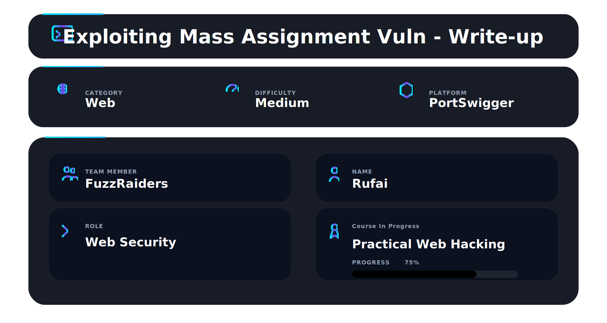

# 📌 Overview

This walkthrough demonstrates the identification and exploitation of a Cross-Site Scripting (XSS) vulnerability within a WebSocket-based live chat application.

The application uses WebSockets to provide real-time communication between customers and support agents. During testing, user-controlled messages transmitted through WebSocket frames were found to be rendered directly within the chat interface without proper output encoding or sanitization.

By intercepting and modifying a WebSocket message using Burp Suite, it was possible to inject malicious HTML containing JavaScript. When the support agent viewed the crafted message, the payload executed within the agent's browser, resulting in a successful Cross-Site Scripting attack.

---

# 🛠 Tools Used

| Tool                             | Purpose                                      |
| -------------------------------- | -------------------------------------------- |
| Kali Linux                       | Operating environment                        |
| Firefox Browser                  | Browser interaction                          |
| Burp Suite Community Edition     | Intercepting and modifying WebSocket traffic |
| Burp Repeater                    | Crafting and replaying WebSocket messages    |
| PortSwigger Web Security Academy | Vulnerable target application                |

---

# 🧭 Walkthrough

## Step 1 - Access the Lab

Opened the PortSwigger Web Security Academy lab:

**Manipulating WebSocket messages to exploit vulnerabilities**

The lab description explained that the application contained a vulnerability within its WebSocket-based live chat functionality.

The objective was to trigger a JavaScript alert popup in the support agent's browser by manipulating WebSocket messages.

```text
Trigger an alert() popup in the support agent's browser.
```

✔ Lab initialized successfully

📸 Evidence 1 - Lab description and objective


---

## Step 2 - Analyze WebSocket Traffic

After opening the live chat feature, Burp Suite was used to inspect WebSocket communications generated by the application.

Navigating to:

```text
Proxy → WebSockets History
```

revealed active WebSocket traffic between the browser and the server.

A test message was submitted through the chat interface:

```text
hello
```

Burp captured the following WebSocket frame:

```json
{
    "message":"hello"
}
```

This confirmed that user-controlled chat messages were transmitted through a JSON parameter named:

```json
"message"
```

✔ WebSocket communication identified

✔ User-controlled parameter discovered

📸 Evidence 2 - WebSocket message captured in Burp Suite


---

## Step 3 - Send the Message to Repeater

To perform further testing, the captured WebSocket message was sent to Burp Repeater.

The original message contained:

```json
{
    "message":"hello"
}
```

Using Repeater allowed direct modification and replay of WebSocket frames without interacting with the browser interface.

✔ Message forwarded to Burp Repeater

📸 Evidence 3 - Original WebSocket message in Burp Repeater


---

## Step 4 - Inject a Cross-Site Scripting Payload

The original chat message was replaced with an XSS payload designed to trigger JavaScript execution when rendered by the support agent's browser.

The modified WebSocket message became:

```json
{
    "message":""
}
```

Payload breakdown:

```html

```

* `src=1` points to a non-existent image.
* The image fails to load.
* The `onerror` event executes automatically.
* `alert(1)` triggers JavaScript execution.

The modified frame was then sent to the server through Burp Repeater.

✔ Malicious WebSocket message crafted

✔ XSS payload successfully delivered

📸 Evidence 4 - Modified WebSocket message containing XSS payload


---

## 🏁 Step 5 - Verify Lab Completion

After the crafted WebSocket message was processed by the application, the support agent received and rendered the malicious content.

Because user input was inserted into the HTML document without proper sanitization or output encoding, the browser executed the JavaScript payload contained within the image tag.

The Web Security Academy interface subsequently displayed:

```text
LAB Solved
```

confirming successful exploitation of the vulnerability.

✔ JavaScript executed in the support agent's browser

✔ Lab marked as solved

📸 Evidence 5 - Successful exploitation and lab completion


---

# 📌 Conclusion

This walkthrough demonstrated the successful exploitation of a Cross-Site Scripting vulnerability within a WebSocket-powered live chat application. By intercepting WebSocket traffic, identifying a user-controlled message parameter, and injecting a malicious HTML payload, it was possible to execute arbitrary JavaScript within the support agent's browser.

The attack highlights the security risks associated with treating WebSocket data as trusted content. Applications should apply strict input validation, context-aware output encoding, and appropriate sanitization controls before rendering user-supplied data within the browser. Failure to do so can result in client-side code execution, session compromise, account takeover, and other high-impact attacks.

---

This work is part of FuzzRaiders' structured hands-on training and research program, where every lab, project, and technical study is formally documented, reviewed, and validated to ensure real-world applicability and methodological rigor.

Happy hacking 🚀

---


