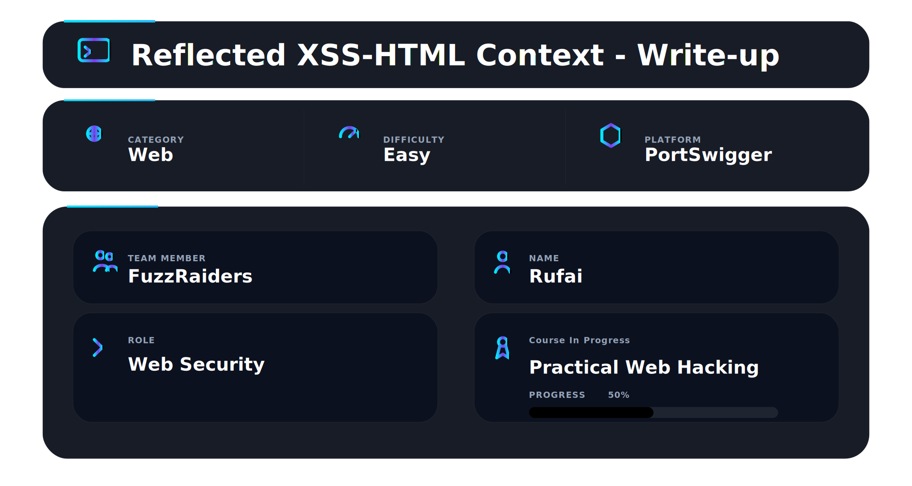
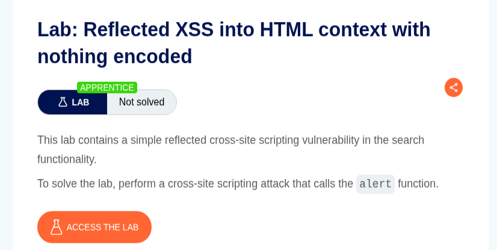
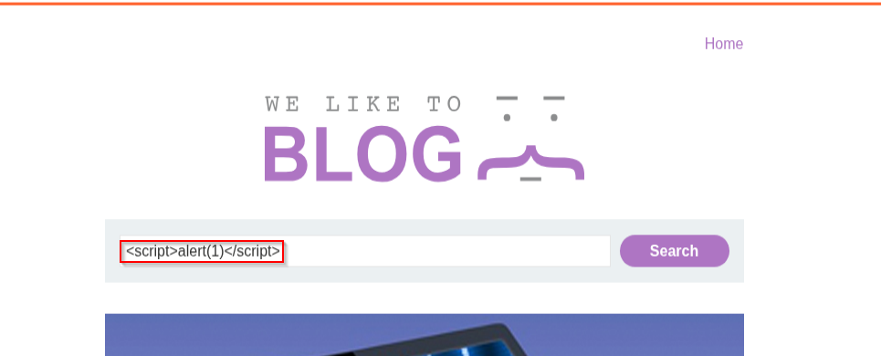
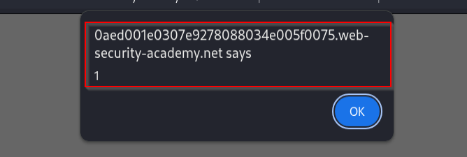
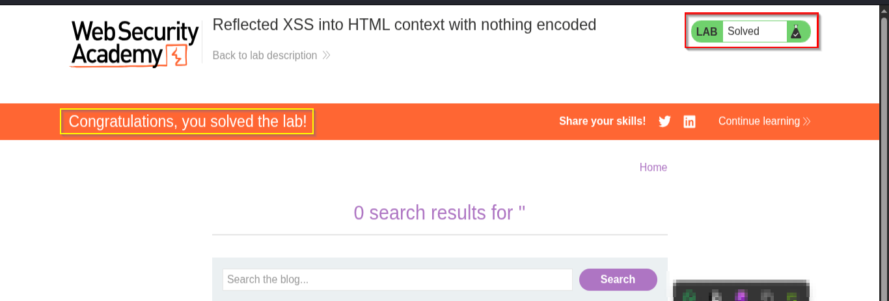

## 📌 Overview

This walkthrough demonstrates the identification and exploitation of a reflected Cross-Site Scripting (XSS) vulnerability inside an HTML context using Burp Suite and PortSwigger Web Security Academy.

The application reflects user-controlled input directly into the page response without sanitization or output encoding, allowing arbitrary JavaScript execution inside the victim’s browser.

---

# 🛠 Tools Used

| Tool | Purpose |
|---|---|
| Kali Linux | Operating environment |
| Firefox Browser | Browser interaction |
| PortSwigger Web Security Academy | Vulnerable target application |

---

## 🧭 Walkthrough

# Step 1 — Access the Lab

Opened the PortSwigger Web Security Academy lab:

```text
Reflected XSS into HTML context with nothing encoded
```

The vulnerable application initialized successfully and was ready for testing.

✔ Lab initialized successfully

## 📸 Evidence 1 — Initial application response



---

# Step 2 — Identify the Vulnerable Input

Navigated to the vulnerable blog application and identified the search functionality available on the page.

Inserted the following payload into the search field:

```html
<script>alert(1)</script>
```

The application reflected user-controlled input directly into the page response without sanitization.

✔ Reflection point identified successfully

## 📸 Evidence 2 — XSS payload injected into search field



---

# Step 3 — Trigger JavaScript Execution

After submitting the malicious payload, the browser interpreted the injected `<script>` tag as executable JavaScript.

Executed payload:

```html
<script>alert(1)</script>
```

This resulted in arbitrary JavaScript execution inside the browser context.

✔ Arbitrary JavaScript execution confirmed

## 📸 Evidence 3 — JavaScript alert popup triggered



---

# 🏁 Step 4 — Lab Solved

After successful exploitation, PortSwigger confirmed completion of the lab.

✔ Lab marked as solved successfully

## 📸 Evidence 4 — Lab solved confirmation



---

# 📌 Conclusion

This walkthrough demonstrated the successful exploitation of a reflected Cross-Site Scripting (XSS) vulnerability inside an HTML context.

The attack flow involved:

- Reflection discovery
- Payload injection
- Arbitrary JavaScript execution
- Successful reflected XSS exploitation

Payload used:

```html
<script>alert(1)</script>
```
---

This work is part of FuzzRaiders' structured hands-on training and research program, where every lab, project, and technical study is formally documented, reviewed, and validated to ensure real-world applicability and methodological rigor.

Happy hacking 🚀

---

