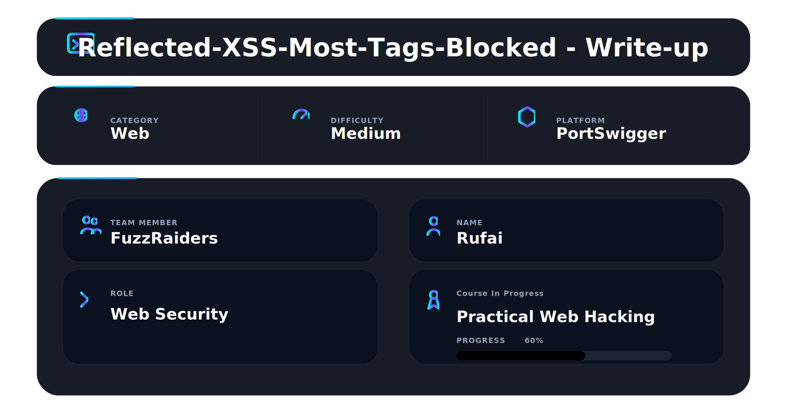
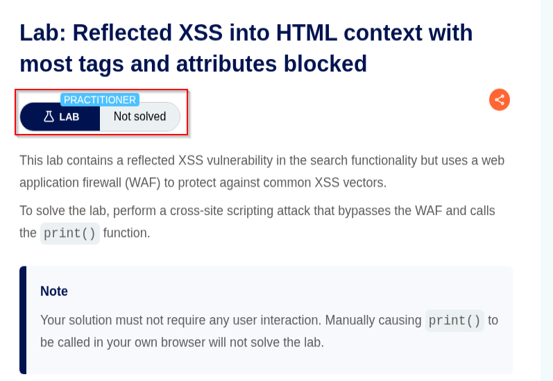
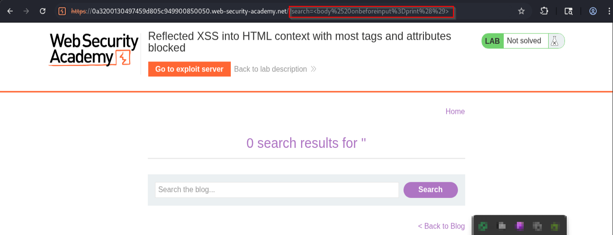
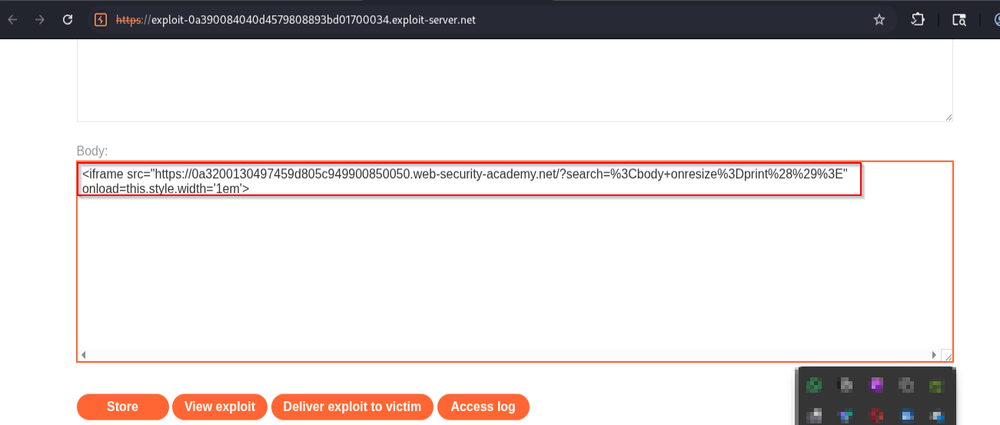
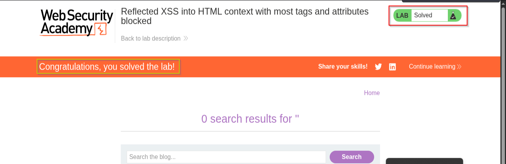

# 📌 Overview

This walkthrough demonstrates the identification and exploitation of a reflected Cross-Site Scripting (XSS) vulnerability in an HTML context where most tags and attributes are blocked by a Web Application Firewall (WAF).

The application reflects user-controlled input into the page response but implements filtering mechanisms designed to block common XSS payloads. By leveraging an allowed HTML element and a less common event handler, it is possible to bypass the WAF and trigger JavaScript execution without requiring any user interaction.

---

# 🛠 Tools Used

| Tool                             | Purpose                       |
| -------------------------------- | ----------------------------- |
| Kali Linux                       | Operating environment         |
| Firefox Browser                  | Browser interaction           |
| PortSwigger Web Security Academy | Vulnerable target application |
| Exploit Server                   | Delivering the attack payload |

---

# 🧭 Walkthrough

## Step 1 - Access the Lab

Opened the PortSwigger Web Security Academy lab:

**Reflected XSS into HTML context with most tags and attributes blocked**

The lab description indicated that the application was protected by a Web Application Firewall (WAF) designed to block common XSS vectors.

The objective was to bypass the filtering mechanism and trigger the `print()` function automatically without requiring any user interaction.

✔ Lab initialized successfully

📸 Evidence 1 - Lab description and objective



---

## Step 2 - Identify the Reflection Point and Craft a WAF Bypass Payload

Navigated to the vulnerable blog application and inspected the search functionality.

Testing confirmed that user-supplied input was reflected back into the page response. However, most commonly used XSS tags and event handlers were filtered by the WAF.

Initial payload testing revealed that traditional vectors such as:

```html
<script>alert(1)</script>
```

and

```html

```

were blocked by the application's filtering mechanism.

Further testing identified that the `<body>` tag and the `onresize` event handler were still permitted.

A payload was created using the allowed HTML element and event handler:

```html
<body onresize=print()>
```

The payload was URL encoded and injected through the search parameter:

```html
?search=%3Cbody+onresize%3Dprint%28%29%3E
```

When reflected by the application, the payload became part of the page structure and attached a JavaScript event handler to the page body.

✔ WAF bypass payload created successfully

📸 Evidence 2 - WAF bypass payload injected through the search parameter



---

## Step 3 - Trigger the Event Automatically

The lab required successful execution without any user interaction.

To achieve this, the payload was delivered through the exploit server using an iframe:

```html
<iframe src="https://LAB-ID.web-security-academy.net/?search=%3Cbody+onresize%3Dprint%28%29%3E"
onload="this.style.width='1em'">
</iframe>
```

The iframe loads the vulnerable page containing the injected payload. Once the page finishes loading, the iframe width is automatically modified.

This action forces the embedded page to resize, which triggers the `onresize` event attached to the `<body>` element.

Execution flow:

1. The iframe loads the vulnerable page.
2. The iframe width changes automatically.
3. The page inside the iframe is resized.
4. The `onresize` event fires.
5. The `print()` function executes automatically.

This satisfies the lab requirement for a fully automated exploit.

✔ Automatic JavaScript execution achieved

📸 Evidence 3 - Exploit payload configured on the exploit server



---

## 🏁 Step 4 - Lab Solved

After storing the exploit and delivering it to the victim, PortSwigger verified successful exploitation.

The application executed the `print()` function automatically, confirming that the Web Application Firewall protections had been bypassed successfully.

✔ Lab marked as solved successfully

📸 Evidence 4 - Successful lab completion confirmation



---

# 📌 Conclusion

This walkthrough demonstrated the successful exploitation of a reflected Cross-Site Scripting (XSS) vulnerability in an HTML context protected by a Web Application Firewall.

Although common XSS vectors were blocked, the application still allowed the use of the `<body>` element together with the `onresize` event handler. By combining this behavior with an iframe-based resize trigger, it was possible to achieve automatic JavaScript execution and bypass the filtering controls.

The attack flow involved:

* Reflection discovery
* WAF behavior analysis
* Identification of allowed tags and attributes
* Event-handler based XSS payload creation
* Automatic event triggering via iframe resizing
* Successful execution of JavaScript without user interaction

### Payload Used

```html
<body onresize=print()>
```

### Exploit Server Payload

```html
<iframe src="https://LAB-ID.web-security-academy.net/?search=%3Cbody+onresize%3Dprint%28%29%3E"
onload="this.style.width='1em'">
</iframe>
```

This lab highlights how filtering common XSS payloads alone is not sufficient to prevent exploitation. Attackers can often leverage overlooked HTML elements and event handlers to achieve JavaScript execution and bypass Web Application Firewall protections.

---

This work is part of FuzzRaiders' structured hands-on training and research program, where every lab, project, and technical study is formally documented, reviewed, and validated to ensure real-world applicability and methodological rigor.

Happy hacking 🚀

---
