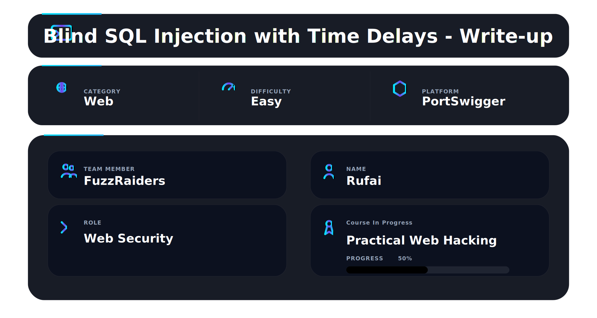
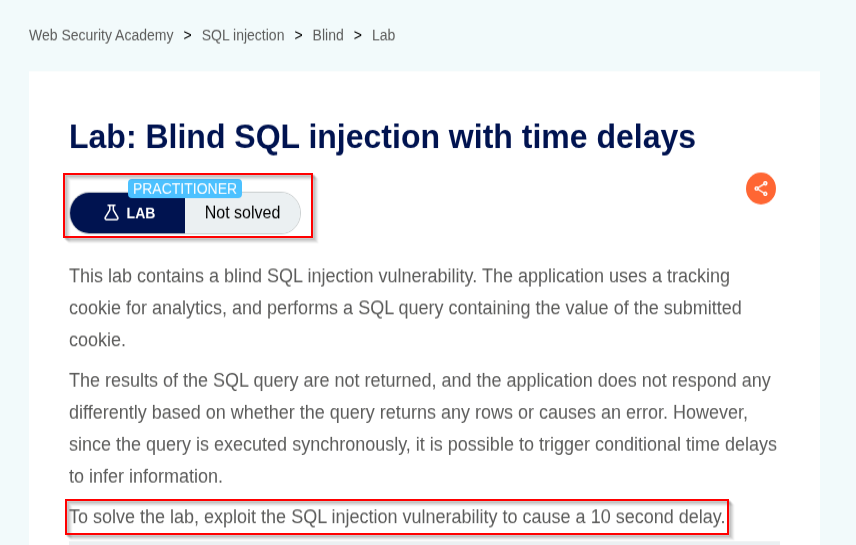
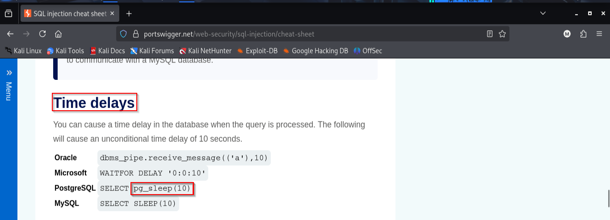
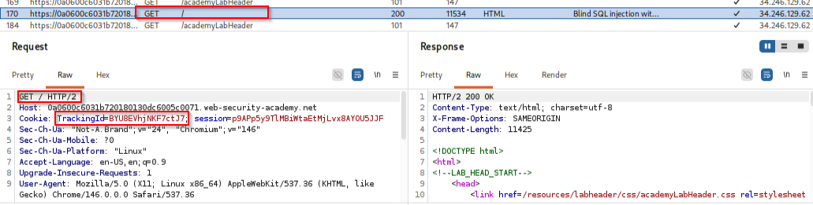
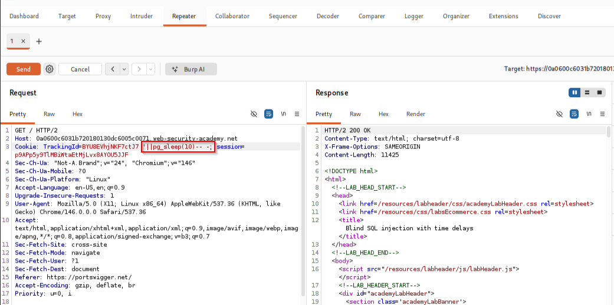
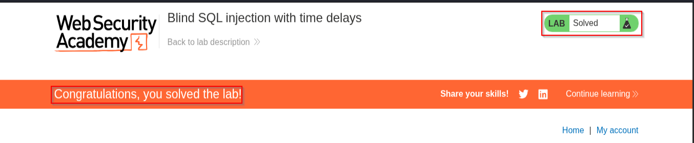

📌 Overview

This walkthrough demonstrates the identification and exploitation of a **Blind SQL Injection with Time Delays** vulnerability using Burp Suite and PortSwigger Web Security Academy.

The application uses a tracking cookie for analytics purposes and performs backend SQL queries containing user-controlled cookie values.

Because:
- no database errors were displayed
- no query results were returned
- page content remained visually identical

traditional SQL Injection techniques were ineffective.

However, the application processed SQL queries synchronously, making it possible to trigger conditional time delays and confirm successful SQL injection through delayed server responses.

The objective of the lab was to trigger a:

```sql
10 second delay
```

using a time-based SQL injection payload.

---

# 🛠 Tools Used

| Tool | Purpose |
|---|---|
| Kali Linux | Operating environment |
| Burp Suite Community Edition | Request interception & manipulation |
| Burp Repeater | Manual payload testing |
| Firefox | Browser interaction |
| PortSwigger Web Security Academy | Vulnerable target application |
| PortSwigger SQLi Cheat Sheet | Database payload reference |

---

# Step 1 — Access the Lab

Opened the PortSwigger lab:

## Blind SQL Injection with Time Delays

The lab description explained:
- the application uses a tracking cookie
- SQL query results are not returned
- responses remain visually identical
- synchronous queries allow timing attacks

The objective was to exploit the vulnerability and trigger a:

```sql
10 second delay
```

✔ Lab initialized successfully

📸 Evidence 1 — Initial lab interface



---

# Step 2 — Research Time Delay Payloads

Opened the PortSwigger SQL Injection Cheat Sheet and reviewed database-specific delay payloads.

Observed payloads included:

| Database | Delay Payload |
|---|---|
| PostgreSQL | `SELECT pg_sleep(10)` |
| MySQL | `SELECT SLEEP(10)` |
| MSSQL | `WAITFOR DELAY '0:0:10'` |
| Oracle | `dbms_pipe.receive_message(('a'),10)` |

The PostgreSQL payload was selected for testing.

✔ Delay payload identified successfully

📸 Evidence 2 — SQL Injection time delay payload research



---

# Step 3 — Capture Original Request

Using Burp Suite, the original request was intercepted.

Observed vulnerable parameter:

```http
TrackingId
```

Captured request:

```http
GET / HTTP/2
```

Cookie header contained:

```http
TrackingId=pA9v5...
```

This confirmed:
- user-controlled cookie input exists
- cookie values are processed server-side
- tracking functionality interacts with backend SQL queries

✔ Original request captured successfully

📸 Evidence 3 — Original request captured inside Burp Suite



---

# Step 4 — Send Request to Repeater

The captured request was forwarded to:

## Burp Repeater

for manual payload testing.

The original cookie value was modified using the following PostgreSQL time-delay payload:

```sql
';pg_sleep(10)--
```

Modified request:

```http
Cookie: TrackingId=xyz';pg_sleep(10)--; session=...
```

✔ Payload injected successfully

📸 Evidence 4 — Modified request with PostgreSQL time delay payload



---

# Step 5 — Verify the Time Delay

After sending the modified request:
- the server response was delayed
- the application paused for approximately 10 seconds

This confirmed:
- Blind SQL Injection vulnerability exists
- backend database is PostgreSQL
- synchronous SQL execution is occurring
- time-based detection is successful

✔ Blind SQL Injection confirmed successfully

📸 Evidence 5 — Successful lab completion confirmation



---

#  Payload Breakdown

| Component | Purpose |
|---|---|
| `'` | Closes the original SQL string |
| `;` | Starts a new SQL statement |
| `pg_sleep(10)` | Delays PostgreSQL response for 10 seconds |
| `--` | Comments out remaining query content |

---

# 📌 Conclusion

This walkthrough demonstrated the successful exploitation of a **Blind SQL Injection with Time Delays** vulnerability through insecure handling of user-controlled tracking cookie values.

The attack involved:
- request interception
- backend parameter analysis
- database fingerprinting
- time-delay payload injection
- response timing analysis
- synchronous SQL query abuse

Even though the application did not expose database errors or query results directly, delayed responses allowed confirmation of successful SQL injection.

This technique is widely used in real-world penetration testing and bug bounty engagements when traditional SQL Injection indicators are unavailable.

---

This work is part of FuzzRaiders' structured hands-on training and research program, where every lab, project, and technical study is formally documented, reviewed, and validated to ensure real-world applicability and methodological rigor.

Happy hacking 🚀

---

