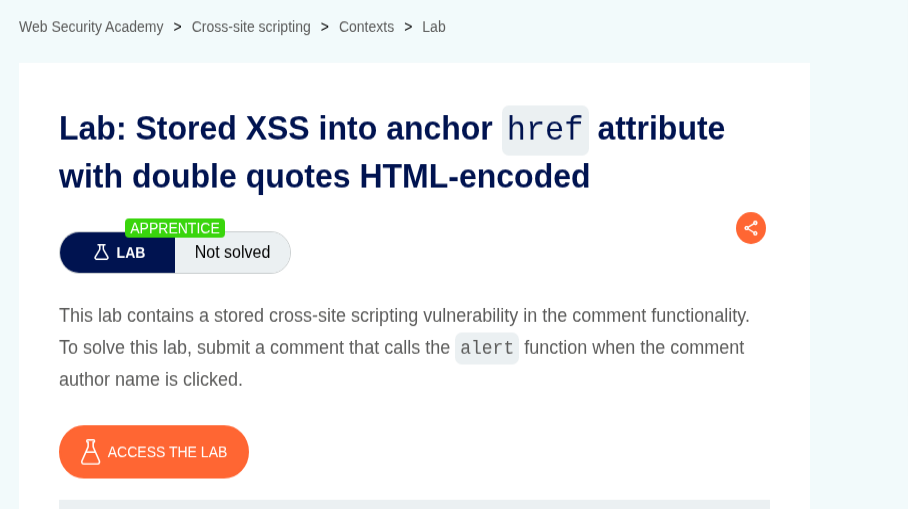
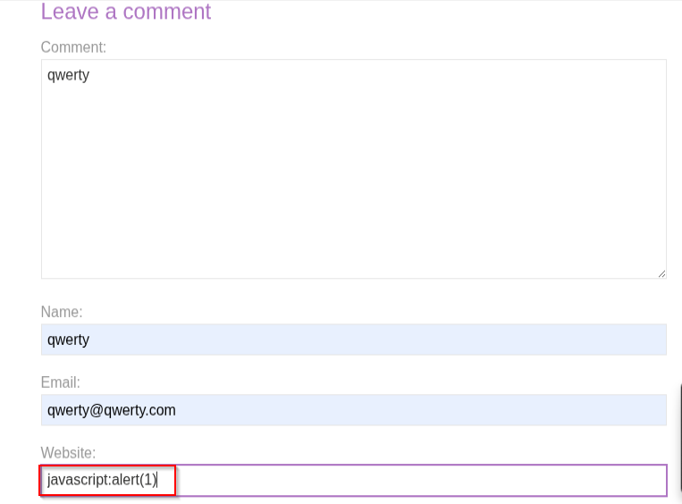
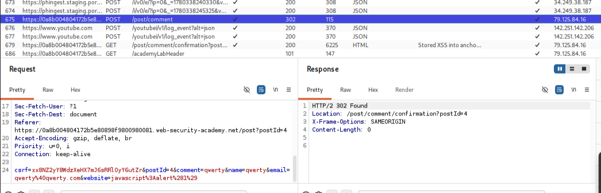
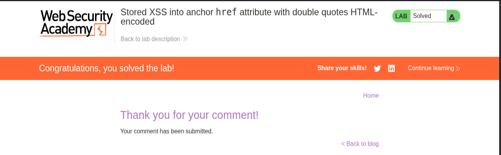

# 📌 Overview

This walkthrough demonstrates the identification and exploitation of a Stored Cross-Site Scripting (XSS) vulnerability within an anchor (`href`) attribute where double quotes are HTML-encoded.

The application stores user-supplied input through the comment functionality and later renders it inside an anchor tag. Although double quotes are properly encoded, the application fails to validate the URL scheme used within the `href` attribute, allowing the use of a malicious `javascript:` URI to execute arbitrary JavaScript when the author name is clicked.

---

# 🛠 Tools Used

| Tool                             | Purpose                             |
| -------------------------------- | ----------------------------------- |
| Kali Linux                       | Operating environment               |
| Firefox Browser                  | Browser interaction                 |
| Burp Suite Community Edition     | Request inspection and verification |
| PortSwigger Web Security Academy | Vulnerable target application       |

---

# 🧭 Walkthrough

## Step 1 — Access the Lab

Opened the PortSwigger Web Security Academy lab:

**Stored XSS into anchor href attribute with double quotes HTML-encoded**

The lab description indicated that the application was vulnerable to Stored Cross-Site Scripting (XSS) through the comment functionality.

The objective was to inject a payload that would execute the `alert()` function when the comment author's name was clicked.

✔ Lab initialized successfully

📸 Evidence 1 — Lab description and objective



---

## Step 2 — Submit the Malicious Payload

Navigated to a blog post and scrolled to the comment section.

The application allows users to provide a Website value that is later rendered inside an anchor (`href`) attribute.

The following payload was supplied in the Website field:

```html
javascript:alert(1)
```

The remainder of the form was populated with standard values and submitted successfully.

✔ Malicious payload submitted successfully

📸 Evidence 2 — Malicious payload submitted through the Website field



---

## Step 3 — Verify Payload Delivery

Burp Suite was used to inspect the outgoing request and confirm that the payload was transmitted to the application.

The Website parameter contained:

```text
website=javascript%3Aalert%281%29
```

which decodes to:

```html
javascript:alert(1)
```

This confirmed that the payload was successfully submitted and stored by the application.

When the comment was rendered, the Website value was placed inside an anchor tag's `href` attribute. Clicking the author name caused the browser to interpret the value as a JavaScript URI and execute the embedded code.

✔ Payload delivery verified successfully

📸 Evidence 3 — Request verification in Burp Suite



---

## 🏁 Step 4 — Lab Solved

After triggering the stored payload through the author's profile link, arbitrary JavaScript execution was achieved within the browser context.

The payload executed successfully:

```html
javascript:alert(1)
```

The application accepted the malicious URI, rendered it inside the anchor element, and executed the JavaScript when the link was followed.

PortSwigger verified successful exploitation and marked the lab as solved.

✔ Stored XSS triggered successfully

✔ Lab marked as solved successfully

📸 Evidence 4 — Successful lab completion confirmation



---

# 📌 Conclusion

This walkthrough demonstrated the successful exploitation of a Stored Cross-Site Scripting (XSS) vulnerability within an anchor `href` attribute.

Although the application HTML-encoded double quotes, it failed to validate dangerous URI schemes such as `javascript:` before rendering user-controlled input inside the `href` attribute.

The attack flow involved:

* Identifying the vulnerable comment functionality
* Supplying a malicious JavaScript URI
* Verifying payload submission
* Triggering execution through the author link
* Achieving Stored XSS exploitation

### Payload Used

```html
javascript:alert(1)
```

### Vulnerable HTML Structure

```html
<a href="javascript:alert(1)">qwerty</a>
```

This lab highlights the importance of validating URL schemes in addition to encoding special characters. Output encoding alone is insufficient when dangerous protocols such as `javascript:` remain permitted within user-controlled links.
