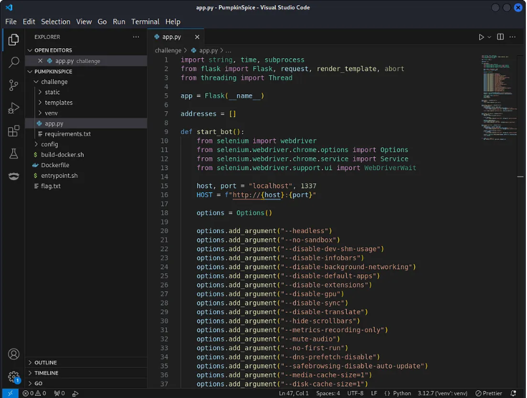
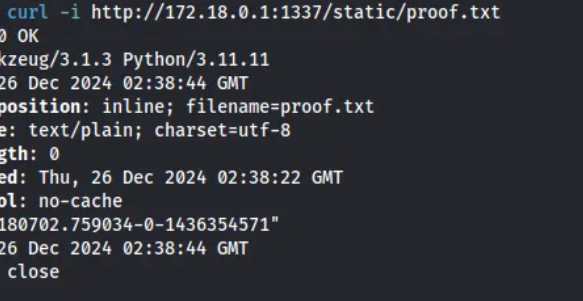
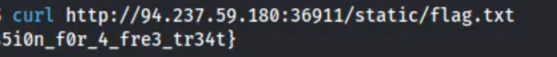

<div align="left">


</div>

## PumpkinSpice

<div align="left">

<br>
<br>


</div>

This challenge / lab is great for **learning vulnerability chaining in web applications**, focusing on:

- Navigating application functionality and admin-only logic
- Inspecting HTML templates and backend routes
- Identifying and exploiting Stored XSS vulnerabilities
- Chaining client-side execution into backend Command Injection

---

## 🛠 Tools

Only minimal tooling was required — the core focus was on logic analysis and exploitation flow.

```
Web Browser       → application interaction & XSS testing
Docker            → local testing and environment replication
curl              → flag retrieval via HTTP
Python            → payload crafting and exploit validation
```

---

## 📌 Overview

PumpkinSpice is a **Flask-based web application** that simulates real‑world scenarios where **administrative functionality is restricted to local access** or trusted hosts.

The application also includes a **bot feature** that mimics an administrator reviewing all user‑submitted addresses. This design choice is a strong indicator of a **client‑side vulnerability being triggered in an administrative context**.

This write‑up documents how a **Stored Cross‑Site Scripting (XSS)** vulnerability can be chained with a **Command Injection** flaw to achieve **Remote Code Execution (RCE)** and retrieve the flag.


---

## 🔍 Initial Analysis & Attack Surface

At a high level, the application provides:

- A form where users can submit “addresses”
- A page that displays all submitted addresses
- A bot that periodically visits and reviews these addresses
- Internal API routes intended for **local or administrative use only**

When an application simulates an admin reviewing user input, it strongly suggests the presence of a **Stored XSS vulnerability**, which is often required to interact with restricted internal functionality.


---

## 🧠 Template Review – Stored XSS Discovery

Inspection of the address rendering logic reveals the core issue.

### `addresses.html`

```html
<h1>Addresses:</h1>

<p>{{ address|safe }}</p>

```

### Why This Is Vulnerable

- User‑supplied input is rendered using the Jinja `safe` filter
- The `safe` filter disables HTML escaping
- Any injected HTML or JavaScript will be executed in the browser

➡️ This results in a **Stored XSS vulnerability**, as payloads are stored and later executed when viewed by another user — in this case, the admin bot.

---

## 🔗 Searching for a Chainable Vulnerability

With Stored XSS confirmed, the next step is identifying a **high‑impact backend vulnerability** that can be triggered through JavaScript execution.

Reviewing the backend routes reveals a critical issue in `app.py`.

---

## ⚠️ Command Injection in Administrative API

### `app.py`

```python
@app.route("/api/stats", methods=["GET"])
def stats():
    # codes omitted for brevity

    command = request.args.get("command")
    if not command:
        return render_template("index.html", message="No command provided")

    results = subprocess.check_output(
        command,
        shell=True,
        universal_newlines=True
    )
    return results
```

### Key Issues

- The `command` parameter is fully user‑controlled
- It is passed directly to `subprocess.check_output()`
- `shell=True` is enabled
- No sanitization or validation is applied

➡️ This results in a **classic Command Injection vulnerability**.

---

## 🔥 Vulnerability Chain

The exploitation path becomes clear:

1. Inject a **Stored XSS payload** via the address submission feature
2. The admin bot renders the malicious JavaScript
3. The JavaScript issues a request to the internal `/api/stats` endpoint
4. Arbitrary system commands are executed on the server

This chain bypasses the intended **local‑only access restriction**.

---

## 🧪 Local Testing – Proof of Concept

Before attacking the remote instance, the vulnerabilities were validated locally.

### Environment Setup

The application was started using the provided Docker script:

```bash
./build-docker.sh
```

---

### XSS → Command Injection Payload

The following payload was submitted via the address input field:

```html
<script>
  fetch("/api/stats?command=touch+/app/static/proof.txt");
</script>
```



### What This Does

- Injects JavaScript into the stored address list
- When rendered by the admin bot, the script executes
- The script triggers a command injection
- A file named `proof.txt` is created inside the static directory

---

### Verification

By visiting the static directory over HTTP, the presence of `proof.txt` confirms:

✅ **Successful Stored XSS → Command Injection → RCE**

---

## ⚔️ Exploitation on the Challenge Instance

With RCE confirmed locally, the same technique is applied to the remote challenge instance to retrieve the flag.

### Payload Modification

Instead of creating a proof file, the payload is modified to copy the flag into the static directory:

```html
<script>
  fetch("/api/stats?command=cp+/flag*+/app/static/flag.txt");
</script>
```

### Why a Wildcard Is Used

- The flag filename is renamed during container startup
- The exact filename is unknown
- It is known to start with `flag`

Using `flag*` ensures the correct file is copied regardless of its full name.

---

## 🏁 Flag Retrieval

Once the admin bot executes the payload:

- The flag is copied into `/app/static/`
- The file becomes publicly accessible

The flag is retrieved using a simple HTTP request:

```bash
curl http://<target>/static/flag.txt
```



🎉 **PumpkinSpice successfully pwned**

---

## 🧠 What This Challenge / Lab Teaches

- Identifying **Stored XSS** through unsafe template rendering (`safe` filter)
- Understanding how admin bots amplify the impact of client‑side vulnerabilities
- Chaining **Stored XSS** into **Command Injection** for full RCE
- Bypassing local‑only or restricted routes via client‑side execution
- Thinking in terms of **attack chains**, not isolated vulnerabilities

This is an excellent challenge for learners moving beyond basic web bugs into **realistic exploitation scenarios**, especially for those preparing for CTFs and practical security certifications.

---

## 📌 Conclusion

Seemingly small frontend issues can become **critical security failures** when combined with dangerous backend logic.

In PumpkinSpice, a single unsafe template decision enabled JavaScript execution, which in turn exposed a powerful internal API — resulting in full system compromise.

Always remember:

> _Client‑side vulnerabilities become dangerous when they can reach server‑side trust boundaries._

This work is part of **FuzzRaiders’ structured hands-on training and research program**, where every lab, project, and technical study is formally documented, reviewed, and validated to ensure real-world applicability, methodological rigor, and real-world security execution

Happy hacking 🚀

# Author: Z4B0 [LinkedIn](https://www.linkedin.com/in/mahamud-abdirahman-151493375/)
