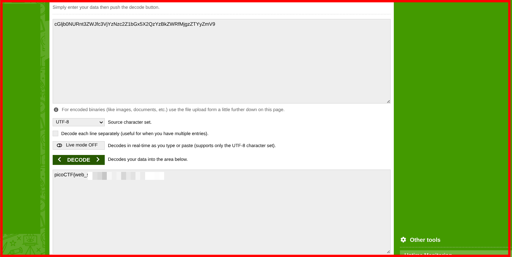

# picoCTF – Web Decode

**Category:** Web Exploitation  
**Difficulty:** Beginner  
**Platform:** picoCTF  

This challenge is a great introduction to **web exploitation fundamentals**, focusing on:
- Navigating a website
- Inspecting HTML source code
- Identifying encoded data

No tools were required — only curiosity and basic web knowledge.

---

## 🚀 Step 1: Launch the Challenge Instance

After launching the challenge instance, a page appears with a **Click Here** option.

Clicking it redirects us to the main website.

---

## 🌐 Step 2: Home Page

The home page displays a simple message:

> **Keep Navigating**

This indicates that the flag is not on the landing page and we should explore further.

---

## 🧭 Step 3: About Page

Navigating to the **About** page reveals another hint:

> **Try inspecting the page!! You might find it there**

This strongly suggests checking the HTML source code.

---

## 🔍 Step 4: Inspect Page Source

Viewing the page source (`Ctrl + U` or right-click → *View Page Source*) reveals a suspicious string of characters.

The string appears unreadable at first glance, but its format resembles **Base64 encoding**.

---

## 🧩 Step 5: Decode the String

I copied the encoded string and pasted it into an online **Base64 decoder**.

After decoding, the hidden message is revealed.

---

## 🏁 Step 6: Flag

The decoded output contains the **flag**, completing the challenge successfully.

✅ **Challenge solved**

---

## 🧠 What This Challenge Teaches

- Following hints logically
- Inspecting HTML source code
- Recognizing common encodings (Base64)
- Thinking like a web attacker

This is an excellent challenge for beginners starting in **CTFs and cybersecurity**.

---

## 📌 Conclusion

Simple challenges like this build strong fundamentals.  
Always remember:

> *If something isn’t visible on the page, check the source.*

Happy hacking 🚀
