This write-up explores my journey into x86-64 assembly, with an emphasis on how CPUs execute instructions and developing a foundation in low-level programming. It functions as both a personal record and a guide for beginners.

---

## 📌 Overview

This tutorial covers the essentials of **x86-64 assembly language**:

* CPU architecture and registers
* Memory layout of programs
* The stack and execution flow
* Basic instructions and calling conventions
* System calls and instruction pointer control

Unlike high-level languages, assembly exposes the **inner workings of computers**, making you understand how instructions are executed step by step.

---

# In this write-up, we cover

* CPU registers
* Memory layout
* The stack
* Basic assembly instructions
* Calling conventions
* System calls
* Instruction pointer control

---

## 🛠 Core Concepts & Tools

The following are key tools and concepts:

```
x86-64 Assembly       → Low-level CPU instructions
NASM / GAS           → Assembler (turns assembly into machine code)
gcc / ld             → Compiler and linker
Terminal             → Program execution
CPU (RIP, RSP, RAX)  → Registers and execution control
Binary (0/1)         → Machine-readable instruction format
```

---

## 🧭 Walkthrough

### 1️⃣ CPU Registers

Registers are **small, fast storage locations inside the CPU**.

| Register | Description                                 |
| -------- | ------------------------------------------- |
| RAX      | Accumulator (return values)                 |
| RBX      | Base register                               |
| RCX      | Counter                                     |
| RDX      | Data register                               |
| RSI      | Source index                                |
| RDI      | Destination index                           |
| RBP      | Base pointer (stack frame)                  |
| RSP      | Stack pointer                               |
| R8-R15   | Additional general-purpose registers        |
| RIP      | Instruction pointer (controls program flow) |

> **Exploit Dev Focus:**
> Controlling **RIP** allows execution hijacking. Stack overflows often manipulate **RSP**.

---

### 2️⃣ Memory Layout of a Program

A typical program layout:

* **Text Segment** – executable instructions
* **Data Segment** – initialized variables
* **BSS Segment** – uninitialized variables
* **Heap** – dynamically allocated memory
* **Stack** – function calls and local variables

```
High Memory
+------------+
|   Stack    |
+------------+
|    Heap    |
+------------+
|    BSS     |
+------------+
|    Data    |
+------------+
|    Text    |
+------------+
Low Memory
```

---

### 3️⃣ The Stack

* LIFO structure for **function calls and local variables**
* RSP points to the **top of the stack**
* RBP marks the **base of the current stack frame**

> Stack-based exploits often target **RSP** and **RIP**.

---

### 4️⃣ Basic Assembly Instructions

| Instruction   | Description          |
| ------------- | -------------------- |
| mov dest, src | Move data            |
| add dest, src | Add values           |
| sub dest, src | Subtract values      |
| push value    | Push onto stack      |
| pop dest      | Pop from stack       |
| call address  | Call function        |
| ret           | Return from function |

Example:

```asm
mov rax, 1      ; set RAX to 1
add rax, 2      ; RAX = 3
```

---
### 5️⃣ Calling Conventions

Defines how **function arguments** are passed and **return values** retrieved:

* Linux x86-64 (System V):

  1. RDI – 1st arg
  2. RSI – 2nd arg
  3. RDX – 3rd arg
  4. RCX – 4th arg
  5. R8  – 5th arg
  6. R9  – 6th arg

* Return value → **RAX**

---

### 6️⃣ System Calls

Interface with the OS. Example: exit program in Linux

```asm
mov rax, 60   ; syscall number for exit
mov rdi, 0    ; exit code 0
syscall
```

---

### 7️⃣ Instruction Pointer Control

* **RIP** stores the **address of the next instruction**
* Controlling RIP allows manipulation of program flow (used in exploits)

---

## 🧩 Example: Hello World (Linux)

```asm
section .data
msg db "Hello, world!", 0xA
len equ $ - msg

section .text
global _start

_start:
    mov rax, 1        ; syscall: write
    mov rdi, 1        ; stdout
    mov rsi, msg      ; message address
    mov rdx, len      ; message length
    syscall

    mov rax, 60       ; syscall: exit
    xor rdi, rdi      ; status 0
    syscall
```

---

## What You Learn

* How CPUs execute instructions
* How memory and registers work
* How to control program flow with RIP and RSP
* Low-level view of computation and function calls

---

##  Conclusion

x86-64 Assembly exposes the **inner workings of computers**:

* Registers and memory
* Stack and execution flow
* Instructions and system calls

Mastering these concepts lays the foundation for **reverse engineering, exploit development, and systems programming**.

**“Good exploits come from careful observation, not rushing.”**


# Author: [QQQ](#)


